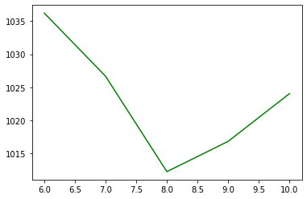

# Chapter 7. 토픽 모델링으로 주제 찾기

## 1. 토픽 모델링의 이해

### 1.1 LDA(Latent Dirichlet Allocation)

LDA(Blei et al. 2003)는 토픽 모델링을 위해 사용하는 가장 기본적이고 널리 사용되는 알고리즘으로 기본 가정은 문서들이 쓰여질 때 그 문서를 구성하는 몇 개의 토픽들이 존재하고 있으며 그 토픽들은 단어들의 집합으로 구성되어 있다는 것으로 내가 문서를 작성하는 작가라하면 내가 이 문서 안에 넣고 싶은 주제들을 먼저 구상하고 문서를 쓰게 된다. 각 주제는 내가 하고 싶은 말을 표현하는 단어들의 집합으로 표현 가능

### 1.2 모형의 평가와 적절한 토픽 수의 결정

## 2. 사이킷런을 이용한 토픽 모델링

### 2.1 데이터 준비


```python
from sklearn.datasets import fetch_20newsgroups

categories = ['alt.atheism', 'talk.religion.misc', 'comp.graphics', 'sci.space', 
              'comp.sys.ibm.pc.hardware', 'sci.crypt']

#학습 데이터셋을 가져옴
newsgroups_train = fetch_20newsgroups(subset='train', categories=categories)

print('#Train set size:', len(newsgroups_train.data))
print('#Selected categories:', newsgroups_train.target_names)

```

    #Train set size: 3219
    #Selected categories: ['alt.atheism', 'comp.graphics', 'comp.sys.ibm.pc.hardware', 'sci.crypt', 'sci.space', 'talk.religion.misc']
    


```python
from sklearn.feature_extraction.text import CountVectorizer

cv = CountVectorizer(token_pattern="[\w']{3,}", stop_words='english', 
                     max_features=2000, min_df=5, max_df=0.5)
review_cv = cv.fit_transform(newsgroups_train.data) 
```

### 2.2 LDA 토픽 모델링 실행


```python
from sklearn.decomposition import LatentDirichletAllocation
import numpy as np
np.set_printoptions(precision=3)

lda = LatentDirichletAllocation(n_components = 10, #추출할 topic의 수
                                max_iter=5, 
                                topic_word_prior=0.1, doc_topic_prior=1.0,
                                learning_method='online', 
                                n_jobs= -1, #사용 processor 수
                                random_state=0)

review_topics = lda.fit_transform(review_cv)
print('#shape of review_topics:', review_topics.shape)
print('#Sample of review_topics:', review_topics[0])

gross_topic_weights = np.mean(review_topics, axis=0)
print('#Sum of topic weights of documents:', gross_topic_weights)

print('#shape of topic word distribution:', lda.components_.shape)
```

    #shape of review_topics: (3219, 10)
    #Sample of review_topics: [0.018 0.006 0.026 0.901 0.01  0.008 0.008 0.007 0.007 0.008]
    #Sum of topic weights of documents: [0.106 0.09  0.095 0.127 0.083 0.119 0.093 0.068 0.088 0.129]
    #shape of topic word distribution: (10, 2000)
    


```python
def print_top_words(model, feature_names, n_top_words):
    for topic_idx, topic in enumerate(model.components_):
        print("Topic #%d: " % topic_idx, end='')
        print(", ".join([feature_names[i] for i in topic.argsort()[:-n_top_words - 1:-1]]))
        #print(", ".join([feature_names[i]+'('+str(topic[i])+')' for i in topic.argsort()[:-n_top_words - 1:-1]]))
        # 위 slicing에서 맨 뒤 -1은 역순을 의미, 역순으로 했을 때 처음부터 n_top_words까지
    print()

print_top_words(lda,cv.get_feature_names(), 10)
```

    Topic #0: com, article, posting, nntp, host, university, science, org, computer, uucp
    Topic #1: image, graphics, file, ftp, mail, software, files, available, email, pub
    Topic #2: space, nasa, gov, launch, earth, orbit, moon, shuttle, research, lunar
    Topic #3: god, people, don't, say, think, does, believe, christian, keith, moral
    Topic #4: com, article, sandvik, just, university, apple, posting, cwru, kent, nntp
    Topic #5: scsi, bit, bus, windows, thanks, university, just, card, know, like
    Topic #6: com, netcom, phone, distribution, clipper, article, right, posting, david, host
    Topic #7: drive, disk, hard, controller, com, drives, dos, problem, tape, floppy
    Topic #8: key, encryption, chip, clipper, keys, public, government, security, use, privacy
    Topic #9: people, just, like, don't, jesus, think, know, did, com, time
    
    

### 2.3 최적의 토픽 수 선택하기


```python
import matplotlib.pyplot as plt
%matplotlib inline

def show_perplexity(cv, start=10, end=30, max_iter=5, topic_word_prior= 0.1, 
                    doc_topic_prior=1.0):
    iter_num = []
    per_value = []

    for i in range(start, end + 1):
        lda = LatentDirichletAllocation(n_components = i, max_iter=max_iter, 
                                        topic_word_prior= topic_word_prior, 
                                        doc_topic_prior=doc_topic_prior,
                                        learning_method='batch', n_jobs= -1,
                                        random_state=7)    
        lda.fit(cv)
        iter_num.append(i)
        pv = lda.perplexity(cv)
        per_value.append(pv)
        print(f'n_components: {i}, perplexity: {pv:0.3f}')

    plt.plot(iter_num, per_value, 'g-')
    plt.show()
    return start + per_value.index(min(per_value))

show_perplexity(review_cv, start=6, end=10)
```

    n_components: 6, perplexity: 1036.231
    n_components: 7, perplexity: 1026.665
    n_components: 8, perplexity: 1012.214
    n_components: 9, perplexity: 1016.801
    n_components: 10, perplexity: 1024.029
    





    8


토픽의 수가 8일때 다른 값에 비해 perplexity가 낮은 것을 볼 수 있다. 따라서 토픽의 수 8로 두고 LDA결과 살펴보기로 해보자 


```python
lda = LatentDirichletAllocation(n_components = 8, #추출할 topic의 수를 지정
                                max_iter=20, 
                                topic_word_prior= 0.1, 
                                doc_topic_prior=1.0,
                                learning_method='batch',
                                n_jobs= -1, 
                                random_state=7)

review_topics = lda.fit_transform(review_cv)

print_top_words(lda, cv.get_feature_names(), 10)
```

    Topic #0: image, graphics, file, available, ftp, mail, data, files, information, software
    Topic #1: com, posting, host, nntp, university, article, distribution, reply, ___, ibm
    Topic #2: com, keith, morality, think, caltech, article, sgi, objective, don't, posting
    Topic #3: com, don't, people, just, jesus, know, article, think, like, good
    Topic #4: god, people, does, say, don't, believe, think, evidence, way, atheism
    Topic #5: drive, scsi, card, disk, ide, controller, hard, bus, use, com
    Topic #6: space, nasa, access, launch, earth, moon, year, orbit, gov, digex
    Topic #7: key, encryption, clipper, chip, government, com, use, keys, security, public
    
    

## 3. Gensim을 이용한 토픽 모델링

### 3.1 Gensim 사용법과 시각화


```python
pip install --upgrade gensim
```

    Collecting gensimNote: you may need to restart the kernel to use updated packages.
      Downloading gensim-4.0.1-cp38-cp38-win_amd64.whl (23.9 MB)
    Collecting smart-open>=1.8.1
      Downloading smart_open-5.0.0-py3-none-any.whl (56 kB)
    Requirement already satisfied, skipping upgrade: numpy>=1.11.3 in c:\users\juhee\anaconda3\lib\site-packages (from gensim) (1.18.5)
    Requirement already satisfied, skipping upgrade: scipy>=0.18.1 in c:\users\juhee\anaconda3\lib\site-packages (from gensim) (1.5.0)
    Requirement already satisfied, skipping upgrade: Cython==0.29.21 in c:\users\juhee\anaconda3\lib\site-packages (from gensim) (0.29.21)
    
    Installing collected packages: smart-open, gensim
    Successfully installed gensim-4.0.1 smart-open-5.0.0
    

20 뉴스그룹의 문서들 토큰화 실시


```python
# 필요한 library들을 import
from nltk.corpus import stopwords
cachedStopWords = stopwords.words("english")

from nltk.tokenize import RegexpTokenizer

RegTok = RegexpTokenizer("[\w']{3,}") # 정규포현식으로 토크나이저를 정의
english_stops = set(stopwords.words('english')) #영어 불용어를 가져옴

def tokenizer(text):
    tokens = RegTok.tokenize(text.lower()) 
    # stopwords 제외
    words = [word for word in tokens if (word not in english_stops) and len(word) > 2]
    return words

texts = [tokenizer(news) for news in newsgroups_train.data]
```


```python
from gensim.corpora.dictionary import Dictionary

# 토큰화 결과(=text)로부터 dictionay 생성
dictionary = Dictionary(texts)
print('#Number of initial unique words in documents:', len(dictionary))

# 문서 빈도수가 너무 적거나 높은 단어를 필터링하고 특성을 단어의 빈도 순으로 선택
dictionary.filter_extremes(keep_n = 2000, no_below=5, no_above=0.5)
print('#Number of unique words after removing rare and common words:', len(dictionary))

# 카운트 벡터로 변환
corpus = [dictionary.doc2bow(text) for text in texts]
print('#Number of unique tokens: %d' % len(dictionary))
print('#Number of documents: %d' % len(corpus))
```

    C:\Users\juhee\anaconda3\lib\site-packages\gensim\similarities\__init__.py:15: UserWarning: The gensim.similarities.levenshtein submodule is disabled, because the optional Levenshtein package <https://pypi.org/project/python-Levenshtein/> is unavailable. Install Levenhstein (e.g. `pip install python-Levenshtein`) to suppress this warning.
      warnings.warn(msg)
    

    #Number of initial unique words in documents: 46466
    #Number of unique words after removing rare and common words: 2000
    #Number of unique tokens: 2000
    #Number of documents: 3219
    


```python
from gensim.models import LdaModel

num_topics = 10
passes = 5
%time model = LdaModel(corpus=corpus, id2word=dictionary,\
                       passes=passes, num_topics=num_topics, \
                       random_state=7)
```

    Wall time: 55.5 s
    


```python
model.print_topics(num_words=10)
```


    [(0,
      '0.023*"com" + 0.018*"keith" + 0.016*"caltech" + 0.013*"sgi" + 0.013*"nntp" + 0.013*"posting" + 0.013*"host" + 0.012*"would" + 0.012*"system" + 0.011*"livesey"'),
     (1,
      '0.020*"morality" + 0.018*"objective" + 0.015*"one" + 0.015*"say" + 0.014*"uiuc" + 0.012*"frank" + 0.012*"values" + 0.010*"faq" + 0.010*"article" + 0.008*"cso"'),
     (2,
      '0.026*"com" + 0.025*"access" + 0.025*"posting" + 0.023*"host" + 0.023*"nntp" + 0.017*"digex" + 0.015*"article" + 0.013*"cwru" + 0.013*"___" + 0.013*"net"'),
     (3,
      '0.021*"university" + 0.017*"posting" + 0.015*"host" + 0.015*"nntp" + 0.013*"article" + 0.010*"com" + 0.009*"know" + 0.009*"i\'m" + 0.009*"would" + 0.009*"thanks"'),
     (4,
      '0.032*"com" + 0.015*"would" + 0.011*"article" + 0.010*"one" + 0.010*"get" + 0.009*"people" + 0.009*"ibm" + 0.008*"government" + 0.007*"good" + 0.007*"i\'m"'),
     (5,
      '0.025*"key" + 0.017*"encryption" + 0.014*"clipper" + 0.014*"chip" + 0.009*"keys" + 0.009*"use" + 0.008*"security" + 0.008*"government" + 0.008*"public" + 0.007*"escrow"'),
     (6,
      '0.024*"scsi" + 0.024*"drive" + 0.013*"com" + 0.012*"ide" + 0.011*"controller" + 0.010*"bus" + 0.010*"card" + 0.010*"disk" + 0.009*"one" + 0.009*"drives"'),
     (7,
      '0.017*"graphics" + 0.012*"image" + 0.012*"ftp" + 0.011*"file" + 0.010*"files" + 0.009*"available" + 0.009*"data" + 0.009*"pub" + 0.008*"software" + 0.008*"use"'),
     (8,
      '0.014*"god" + 0.013*"people" + 0.012*"one" + 0.009*"would" + 0.007*"jesus" + 0.007*"com" + 0.007*"think" + 0.006*"many" + 0.006*"even" + 0.006*"say"'),
     (9,
      '0.033*"space" + 0.019*"nasa" + 0.009*"gov" + 0.007*"first" + 0.007*"launch" + 0.006*"moon" + 0.006*"earth" + 0.006*"orbit" + 0.006*"shuttle" + 0.006*"would"')]


```python
print("#topic distribution of the first document: ", model.get_document_topics(corpus)[0])
```

    #topic distribution of the first document:  [(0, 0.72577244), (8, 0.26994747)]
    


```python
pip install pyLDAvis --user
```

    Processing c:\users\juhee\appdata\local\pip\cache\wheels\90\61\ec\9dbe9efc3acf9c4e37ba70fbbcc3f3a0ebd121060aa593181a\pyldavis-3.3.1-py2.py3-none-any.whlNote: you may need to restart the kernel to use updated packages.
    
    Requirement already satisfied: scipy in c:\users\juhee\anaconda3\lib\site-packages (from pyLDAvis) (1.5.0)
    Requirement already satisfied: gensim in c:\users\juhee\anaconda3\lib\site-packages (from pyLDAvis) (4.0.1)
    Collecting pandas>=1.2.0
      Using cached pandas-1.2.4-cp38-cp38-win_amd64.whl (9.3 MB)
    Requirement already satisfied: setuptools in c:\users\juhee\anaconda3\lib\site-packages (from pyLDAvis) (49.2.0.post20200714)
    Collecting funcy
      Using cached funcy-1.16-py2.py3-none-any.whl (32 kB)
    Requirement already satisfied: joblib in c:\users\juhee\anaconda3\lib\site-packages (from pyLDAvis) (0.16.0)
    Requirement already satisfied: numpy>=1.20.0 in c:\users\juhee\anaconda3\lib\site-packages (from pyLDAvis) (1.20.3)
    Requirement already satisfied: future in c:\users\juhee\anaconda3\lib\site-packages (from pyLDAvis) (0.18.2)
    Requirement already satisfied: scikit-learn in c:\users\juhee\anaconda3\lib\site-packages (from pyLDAvis) (0.23.1)
    Requirement already satisfied: jinja2 in c:\users\juhee\anaconda3\lib\site-packages (from pyLDAvis) (2.11.2)
    Processing c:\users\juhee\appdata\local\pip\cache\wheels\22\0b\40\fd3f795caaa1fb4c6cb738bc1f56100be1e57da95849bfc897\sklearn-0.0-py2.py3-none-any.whl
    Requirement already satisfied: numexpr in c:\users\juhee\anaconda3\lib\site-packages (from pyLDAvis) (2.7.1)
    Requirement already satisfied: Cython==0.29.21 in c:\users\juhee\anaconda3\lib\site-packages (from gensim->pyLDAvis) (0.29.21)
    Requirement already satisfied: smart-open>=1.8.1 in c:\users\juhee\anaconda3\lib\site-packages (from gensim->pyLDAvis) (5.0.0)
    Requirement already satisfied: python-dateutil>=2.7.3 in c:\users\juhee\anaconda3\lib\site-packages (from pandas>=1.2.0->pyLDAvis) (2.8.1)
    Requirement already satisfied: pytz>=2017.3 in c:\users\juhee\anaconda3\lib\site-packages (from pandas>=1.2.0->pyLDAvis) (2020.1)
    Requirement already satisfied: threadpoolctl>=2.0.0 in c:\users\juhee\anaconda3\lib\site-packages (from scikit-learn->pyLDAvis) (2.1.0)
    Requirement already satisfied: MarkupSafe>=0.23 in c:\users\juhee\anaconda3\lib\site-packages (from jinja2->pyLDAvis) (1.1.1)
    Requirement already satisfied: six>=1.5 in c:\users\juhee\anaconda3\lib\site-packages (from python-dateutil>=2.7.3->pandas>=1.2.0->pyLDAvis) (1.15.0)
    Installing collected packages: pandas, funcy, sklearn, pyLDAvis
    Successfully installed funcy-1.16 pandas-1.2.4 pyLDAvis-3.3.1 sklearn-0.0
    


```python
import pyLDAvis
import pyLDAvis.gensim_models as gensimvis
pyLDAvis.enable_notebook()

# feed the LDA model into the pyLDAvis instance
lda_viz = gensimvis.prepare(model, corpus, dictionary)
lda_viz
```


<link rel="stylesheet" type="text/css" href="https://cdn.jsdelivr.net/gh/bmabey/pyLDAvis@3.3.1/pyLDAvis/js/ldavis.v1.0.0.css">


<div id="ldavis_el2156430322105433284936546598"></div>
<script type="text/javascript">

var ldavis_el2156430322105433284936546598_data = {"mdsDat": {"x": [-0.13719967818301923, 0.06598972014611482, 0.07213309769814091, 0.13831992365405388, -0.021828017908479283, 0.07278326585424011, 0.027374451318769824, -0.0407880352008322, 0.005360173172274037, -0.18214490055126323], "y": [0.04024911953243596, 0.12361867590278254, 0.09287251407972076, 0.043608227642750574, 0.007493782069367044, -0.09470962137419238, -0.054948531480271366, -0.12997472861297413, -0.0919710985337443, 0.06376166077412519], "topics": [1, 2, 3, 4, 5, 6, 7, 8, 9, 10], "cluster": [1, 1, 1, 1, 1, 1, 1, 1, 1, 1], "Freq": [22.655410264490193, 14.522818425533949, 12.987421497923272, 11.020424753674662, 9.298368905096881, 9.118883081858058, 8.494188472212983, 4.524045160162953, 4.051842780819104, 3.326596658227949]}, "tinfo": {"Term": ["space", "com", "key", "scsi", "posting", "drive", "nntp", "host", "nasa", "encryption", "access", "god", "article", "university", "graphics", "clipper", "say", "morality", "chip", "image", "keith", "ide", "ftp", "keys", "one", "controller", "objective", "caltech", "card", "sgi", "sandvik", "christ", "religious", "koresh", "religions", "christians", "jaeger", "jesus", "gregg", "bible", "followers", "alink", "ksand", "jews", "faith", "rushdie", "tourist", "cookamunga", "newton", "buphy", "islamic", "jewish", "children", "muslim", "christianity", "church", "muslims", "god", "father", "beliefs", "religion", "atheist", "islam", "biblical", "belief", "kent", "argument", "evidence", "christian", "conclusion", "atheism", "atheists", "life", "people", "believe", "therefore", "true", "say", "one", "many", "think", "even", "would", "said", "see", "way", "good", "know", "com", "well", "like", "article", "things", "may", "time", "also", "enforcement", "encrypted", "wiretap", "rsa", "denning", "decrypt", "encryption", "keys", "escrow", "privacy", "encrypt", "nist", "toal", "gtoal", "9760", "conversations", "key", "hamburg", "dorothy", "pgp", "security", "ensure", "eff", "241", "secure", "strnlght", "des", "manufacturers", "sternlight", "clipper", "cryptography", "crypto", "chip", "agencies", "protect", "secret", "proposal", "algorithm", "administration", "public", "government", "law", "technology", "use", "information", "netcom", "communications", "system", "used", "would", "com", "two", "data", "one", "new", "bit", "henry", "zoo", "shuttle", "spencer", "satellites", "zoology", "propulsion", "toronto", "satellite", "utzoo", "launch", "missions", "flight", "fuel", "astronomy", "orbital", "mars", "mission", "vehicle", "rocket", "solar", "spacecraft", "nasa", "lunar", "rockets", "space", "baalke", "jet", "kelvin", "russian", "moon", "jpl", "orbit", "jsc", "planetary", "station", "gov", "earth", "year", "center", "first", "research", "cost", "sci", "1993", "also", "would", "data", "one", "new", "program", "system", "article", "packages", "package", "formats", "byte", "gif", "routines", "128", "ftp", "pub", "directory", "format", "image", "graphics", "drawing", "dec", "display", "files", "amiga", "comp", "contact", "processing", "functions", "file", "sites", "color", "objects", "animation", "256", "database", "images", "library", "server", "machines", "available", "version", "program", "software", "anonymous", "data", "mail", "send", "bits", "line", "code", "type", "use", "also", "unix", "system", "com", "get", "information", "one", "vnet", "tapped", "amendment", "brad", "dseg", "police", "bear", "warrant", "labs", "bet", "instruments", "constitution", "fred", "craig", "nuclear", "we're", "reverse", "trade", "phones", "trust", "ibm", "expressed", "concern", "governments", "represents", "rob", "measures", "they'll", "classified", "1993apr20", "berkeley", "let's", "money", "nsa", "buy", "monitor", "com", "market", "government", "uucp", "business", "right", "get", "would", "care", "i'd", "going", "article", "phone", "enough", "people", "i'm", "good", "even", "one", "can't", "think", "like", "sure", "state", "could", "know", "posting", "years", "time", "distribution", "nntp", "host", "may", "want", "scsi", "ide", "eisa", "isa", "controller", "drives", "cache", "motherboard", "bus", "drive", "boot", "vlb", "bios", "uwo", "sec", "cpu", "floppy", "486", "port", "pin", "mouse", "settings", "sys", "ports", "boards", "rom", "setup", "cards", "tape", "mhz", "disk", "drivers", "card", "modem", "board", "hard", "speed", "dos", "driver", "com", "bit", "problem", "system", "work", "use", "one", "get", "know", "like", "would", "two", "article", "thanks", "cis", "simon", "jeff", "tiff", "washington", "significance", "colorado", "thomas", "daniel", "umich", "michigan", "spot", "navy", "jupiter", "hello", "wondering", "univ", "appreciate", "diego", "print", "southern", "rice", "martin", "screen", "dan", "looking", "electrical", "visible", "mark", "los", "thanks", "university", "advance", "book", "dept", "posting", "nntp", "host", "anyone", "sun", "keywords", "i'm", "please", "science", "article", "reply", "post", "distribution", "mail", "know", "computer", "help", "i've", "like", "read", "would", "com", "one", "world", "get", "think", "allan", "schneider", "ico", "bobbe", "punisher", "beauchaine", "cco", "caltech", "livesey", "solntze", "wpd", "tek", "gap", "acad3", "keith", "vice", "eng", "fido", "jon", "van", "umd", "pasadena", "diamond", "adams", "sgi", "alaska", "vga", "nsmca", "animals", "goal", "points", "murder", "video", "political", "card", "moral", "com", "nntp", "host", "posting", "system", "would", "article", "know", "think", "one", "i'm", "prb", "digex", "cwru", "kmr4", "cleveland", "freenet", "ryan", "ins", "express", "reserve", "conner", "greenbelt", "pat", "___", "____", "split", "rit", "western", "ultb", "isc", "chris", "vnews", "access", "aspects", "vax", "forum", "mozumder", "student", "online", "mary", "net", "steve", "utexas", "nntp", "host", "posting", "usa", "com", "article", "university", "bill", "group", "case", "like", "news", "think", "would", "distribution", "one", "reply", "john", "d012s658", "o'dwyer", "rosenau", "benedikt", "i3150101", "frank", "dbstu1", "urbana", "cso", "uiuc", "objective", "values", "illinois", "morality", "psu", "2000", "psuvm", "attack", "mathematical", "absolute", "value", "mantis", "accurate", "depends", "mathew", "readers", "pad", "defined", "attacks", "faq", "alt", "crypt", "eric", "basis", "say", "atheism", "uucp", "exist", "one", "science", "news", "article", "christian", "years", "com", "would", "see", "people", "sci", "university", "time", "better"], "Freq": [1487.0, 3752.0, 1316.0, 741.0, 1723.0, 796.0, 1433.0, 1471.0, 845.0, 847.0, 700.0, 1143.0, 2031.0, 1487.0, 781.0, 793.0, 868.0, 347.0, 857.0, 545.0, 338.0, 367.0, 494.0, 478.0, 2768.0, 347.0, 274.0, 258.0, 442.0, 344.0, 276.7058013930151, 157.48503910638019, 221.30944947594182, 148.40433802256194, 93.911722158515, 217.02147281166629, 82.58058210468351, 548.4447452203217, 65.52188732303401, 407.90509162176147, 52.23531382743629, 48.313711494991324, 48.312196214954966, 111.56127868018771, 204.57767414681373, 80.92604694686122, 38.2398418214982, 36.72579128868368, 135.45463077387632, 40.86021292997705, 136.57007182894074, 76.95069647955954, 180.67617853059056, 79.45698738226058, 134.5449576587192, 126.67521343997616, 71.68909922420677, 1100.1280426362334, 61.483160932808374, 110.14610460038858, 304.84701510580635, 135.34475081802384, 155.53064686580854, 103.71350159132841, 176.1385439730741, 174.8743219132707, 250.2862470852706, 323.5743522138037, 352.66503508060157, 123.9683561726973, 281.45004571268134, 269.73122436299934, 322.9504467354439, 952.020353910613, 430.1974661748191, 178.12169995047617, 312.5260289882777, 437.7426746271798, 922.8858608420624, 444.7220721971943, 504.3017489818804, 440.6385785862455, 719.2017411297851, 308.66846274462046, 355.153603409778, 340.55509425580533, 366.01116085388526, 390.54671698309784, 540.1388839122855, 320.96743253863, 385.5128680894663, 393.3922888333537, 275.0820946518389, 309.7579756746184, 303.3542781829768, 305.596892636779, 228.3633061073611, 186.844314087656, 183.6782752345287, 152.7103678817043, 79.82534352283189, 66.11728585544068, 815.3780582925776, 459.8608978622557, 361.864575105289, 340.9941416884156, 43.97915256819568, 119.2300605608467, 55.55123912352709, 105.99360900100787, 32.82215539071087, 80.19962804336491, 1227.783830157444, 98.94228426572217, 41.89659670994646, 222.8408612990837, 406.3807289115198, 67.77000328426473, 149.60798312909293, 33.519354107128024, 259.91672212204315, 51.79289789943839, 244.27303675666906, 65.78417825572149, 74.85020128324152, 697.3981878961557, 157.12599478122542, 230.53870174955034, 665.8976901038907, 146.32843934677516, 144.6149477593379, 214.5299510859471, 136.34607220119125, 290.46044300243096, 142.08986923050233, 367.51201052821494, 372.0000165593418, 316.02682902473833, 287.6167645102065, 424.40827908639824, 287.1998943398816, 202.61485322535933, 179.8841818322634, 340.344354086576, 258.2197262965101, 346.1077142715338, 355.22725763950183, 241.72660007881157, 238.973284734098, 297.6878588599719, 220.56696823560716, 213.8483534749259, 240.25607334317232, 119.86236240871568, 257.06292184156007, 107.4343134245602, 103.32918380015363, 64.06163370066517, 102.62618836538032, 219.26065419854416, 199.43751384915774, 37.19063265982436, 289.36757113576067, 111.49252588851033, 167.21701675072606, 59.375129544002384, 96.72842292220868, 105.15656554545853, 166.81552858552087, 203.53789892745493, 90.03597140478358, 108.32556675956258, 128.4603130483945, 150.21253301579455, 808.4815481606435, 223.00963807591728, 67.65502796049604, 1422.212625089057, 106.26547874308949, 64.55053530211269, 82.52020906222019, 64.12028523104954, 282.02691505544215, 168.87447872369793, 257.17112187596047, 99.09199933564035, 121.43874039346694, 157.32466859153385, 405.5931424351674, 259.344733571719, 204.00548563010696, 189.26343921541877, 291.9213154594183, 209.91528007240817, 166.31645719680247, 156.27745481258023, 165.33018086445296, 220.0001328561843, 252.91340480398023, 192.80142794589727, 230.7539564817566, 182.0345390391758, 170.68995338540498, 173.64768514266805, 167.82310965703826, 73.97862826512292, 252.17219752701635, 107.65662440944035, 142.44597674503066, 171.3033057073155, 78.83255492390691, 140.07483812836645, 427.47534756516393, 324.9222252038163, 149.32767111353007, 235.74892998288288, 455.8775268813712, 637.3485425700374, 53.97910918951426, 73.72725972621221, 128.45970296087506, 372.54148535309827, 94.70184269197884, 229.41904292073497, 183.2483200551834, 93.9599442859984, 73.55436734512111, 389.46867966084676, 103.31474541294939, 152.7132582547584, 87.61574651068113, 69.63642598444892, 91.04840382896043, 45.25885025703898, 234.0371962695982, 107.30961547781837, 126.03827856715253, 125.71152015675634, 346.5503336112869, 280.565066258752, 294.70313705344125, 313.04840234351013, 164.77146517124885, 331.7329522284542, 280.43892508098463, 191.7346419318976, 148.32100727209365, 187.7624534853109, 198.96003480198465, 152.71024093571666, 301.3357560455016, 277.3909328359681, 160.20941671473867, 231.25824543216538, 297.4513802039408, 176.99329698891654, 167.21385562185563, 164.44100838979864, 83.60011255398621, 88.88302589213095, 76.44392540986264, 108.10294156019705, 87.10671917479377, 117.4924340147999, 74.01891170629663, 69.02687781266314, 40.17277890446385, 35.88343453763034, 49.2893654856329, 41.63131855871924, 86.92893284364239, 40.539236815296526, 33.64176798880483, 67.96569519102796, 33.689647807346844, 23.68023262962574, 60.742767253128136, 94.00307874608947, 274.78568639007835, 36.37512190473779, 32.11672030251921, 25.216807477694033, 23.37184695598027, 40.79182331568101, 19.99013519643754, 20.579091515076037, 51.36374180329277, 48.89123379282662, 62.466029750682914, 59.422237129766316, 110.30774810439489, 122.90483562179159, 98.0251798963422, 78.2541280564677, 1000.9662850766508, 62.11052982642578, 247.31642531139053, 111.0964612808701, 68.40210891725417, 199.55486428397296, 300.6943381519676, 468.274852310151, 74.48271858051056, 107.44469861618491, 134.58598384708552, 334.6858452118149, 129.75715230645272, 116.41556907052491, 280.9660926519518, 214.42777249952508, 214.69405193700112, 193.25480393702304, 311.3584630231339, 135.73883822763977, 188.78007575017114, 179.80022942099924, 123.05904027854673, 121.64462715967838, 154.4782245447995, 161.072728500497, 165.92218855087305, 124.963031361199, 137.85624273619754, 128.99863996652692, 134.9249576873734, 132.67608643512733, 123.98003486482143, 118.76262941057938, 736.6187259659948, 363.2860806311986, 105.63251043836463, 170.56156211738806, 337.00795208092535, 266.77282158897503, 74.68446671152469, 130.58548176457265, 310.1078196908648, 725.3920688358676, 86.26165192417069, 101.42914094203104, 141.8930459036323, 67.74531751630951, 80.7221611698511, 89.36528673120114, 165.03648796199744, 137.8744599692264, 164.15591268332992, 75.18734992512944, 90.43153724664354, 62.20081198264947, 90.99262186087246, 49.204683185513396, 42.57193486798046, 122.84922518978337, 52.448952949438706, 121.06768737874272, 154.5371664380033, 45.37657683195891, 293.9363190618942, 138.81290137877556, 296.8906589659141, 97.77940165820407, 146.60033295639334, 250.78984242289138, 162.19845099164297, 198.43553184173078, 108.08780489732199, 386.2911204864862, 201.23686034197718, 173.6682856860891, 232.6242714997086, 182.5365555796489, 230.12478563532576, 285.5994873772447, 206.3894997472039, 175.86584331382306, 178.876979338908, 191.23449417720386, 162.28149802020855, 160.59932845413596, 143.1791263691954, 50.33337929707182, 44.62669026169052, 44.97079378198499, 77.98510322450022, 156.04732508061008, 26.12985690415719, 80.86566285811499, 73.9843898187424, 36.65971632841855, 62.718544487737596, 25.259888504899603, 31.414868624247738, 45.20548200438178, 53.143704230004694, 34.11686799352247, 33.39875638619571, 46.61161792247072, 43.86214534420623, 24.42948775785446, 26.048347773164796, 29.08354833679796, 37.60111049459239, 31.216550282095255, 89.24706139373596, 54.44656125001429, 150.11715082239203, 20.7021464788165, 20.463728906773753, 136.44303269035214, 22.55111318141292, 245.9777628027878, 604.3392861506104, 73.9026265271728, 119.35451139702631, 67.04066969166797, 490.7968457412326, 417.0347284837494, 418.8992106098172, 229.06745292595096, 113.88735458563093, 115.04825378677886, 266.5261105699692, 188.09199697045685, 159.78435602400654, 367.0281265970356, 179.18785823591017, 126.94771313086052, 194.20237606145568, 178.7160165996357, 270.7320594724121, 186.09127148556394, 157.36372404196214, 140.90715558147002, 234.3502453092366, 139.59934159961475, 258.7081179256271, 274.5773063415707, 195.84107056886964, 136.40248660297644, 136.06842990079278, 125.1710742160524, 84.52727855470333, 92.73040640664995, 79.50494209069855, 64.83542722138256, 36.68703014862729, 63.37332063911071, 113.71960925173117, 245.11570982466532, 164.30994799242796, 114.47318480236648, 117.5903235568457, 86.37860545434522, 53.43751827505144, 40.04604607905644, 273.6714434068675, 82.24258572722701, 79.01507940757683, 40.23084964109268, 128.37057970876293, 59.285219107093354, 108.28615307661306, 60.48024368435263, 37.18710995355521, 26.822289335419363, 200.1941077204377, 89.09728707541207, 80.43728011333782, 41.68421840772908, 32.7516758262663, 37.28153073976573, 95.49387773799718, 52.59680522074014, 95.70892921831458, 66.72840826846439, 111.64558661021961, 91.52001544806662, 344.8342240996274, 198.52648375072894, 194.06917146375662, 198.30247857516744, 176.0841067845601, 184.31250316774899, 154.6120414180935, 115.63008716414376, 111.31215524614127, 89.28072811860682, 84.74026325319363, 79.99403308816328, 226.16075433933693, 179.567022708287, 81.88793914920845, 89.30173518427625, 74.22284916093459, 65.39389941551985, 38.977697878917546, 66.86235982480248, 64.06840796581584, 42.28574020172134, 26.40013155422604, 159.89609643103472, 176.678926743474, 51.02451420776633, 48.47753293789084, 41.77855317412026, 96.3633862406453, 35.069684190425825, 40.345880964247954, 49.19918608334695, 29.141337737330357, 341.6454417637487, 28.481932793824427, 46.21249586374183, 20.99421008539317, 24.615317535276755, 41.89937598638865, 57.62978410389309, 27.864626766673823, 174.70142507785457, 64.94930290902015, 60.07150857401495, 314.87451200670466, 316.4783406225604, 336.57660798539393, 117.67291822381883, 355.7327116162001, 197.95590037182131, 160.67251430144094, 74.77300041163433, 80.47927682424742, 78.0233714663245, 101.3506149368976, 77.1647336071924, 90.65356619089282, 104.16780012346176, 82.52285876453753, 99.77520514983591, 67.52953985051137, 66.21814053919886, 53.65532996256205, 56.90157748579079, 41.059834403974236, 70.97217878607951, 47.56342039278177, 137.85766539732458, 47.11287102752619, 44.61724245246832, 94.05503210240956, 156.33124069629238, 199.3930760698852, 133.5386307314572, 52.156283190917335, 221.0840031098539, 46.22094795696957, 65.22237612505282, 39.74667932069975, 67.91518510455658, 36.29098421746476, 35.3189003331702, 91.82936986739851, 46.97452310188133, 21.19119056846497, 20.151434240291195, 42.59367373761338, 18.941366109211714, 21.330160440431193, 36.65261087248014, 21.906396309462984, 112.65476622003777, 59.94182806006823, 36.30529939199965, 32.01689623303102, 34.89164142639256, 164.090528501081, 71.66103508156708, 61.505244974831434, 57.8195078012668, 171.22213454646018, 76.30774437878931, 76.30222232818706, 109.9258947630382, 65.75390342180746, 65.46230167709187, 81.93215329319945, 73.11340725396482, 60.94990676242614, 64.4447558587627, 53.26418037442575, 56.86263167555828, 55.7669808493233, 54.19269678879431], "Total": [1487.0, 3752.0, 1316.0, 741.0, 1723.0, 796.0, 1433.0, 1471.0, 845.0, 847.0, 700.0, 1143.0, 2031.0, 1487.0, 781.0, 793.0, 868.0, 347.0, 857.0, 545.0, 338.0, 367.0, 494.0, 478.0, 2768.0, 347.0, 274.0, 258.0, 442.0, 344.0, 278.19076720551135, 158.8699976365116, 223.3816313114362, 150.01595616839197, 95.40709808000327, 220.64645096641812, 83.97144146906713, 557.9917842740635, 66.77311041562972, 415.77452431807853, 53.262249109556954, 49.27004681128276, 49.27016109121323, 113.8889847789723, 208.93784450101782, 82.8543502788226, 39.236116940526436, 37.683317347238294, 138.99365203703834, 41.978694811653035, 140.55451442623715, 79.19626387352497, 186.30145836868564, 82.17451411176636, 139.18100644442558, 131.21628095313451, 74.50334277631957, 1143.3386671401129, 63.89867298131397, 115.20987260955633, 321.5934909666228, 141.6472237404671, 163.36396775935518, 108.51856023855443, 187.1769791425803, 186.10372534974744, 285.5120461592719, 386.90130224598255, 426.686674846678, 136.79670285288472, 357.1783188831585, 342.5543224416009, 436.0849471295732, 1672.5707292918653, 637.9567279402572, 220.41350344696272, 479.56233910158636, 868.663414902248, 2768.845773357741, 956.3223966174718, 1309.600749214158, 1048.7470041828235, 2737.272593146218, 629.1173226377404, 927.3582829903286, 870.6883312096479, 1137.6778687156213, 1488.4209344390138, 3752.0286809017302, 923.8669090919086, 1658.5212762816902, 2031.041203463356, 608.3146199823402, 1085.1006598099107, 1187.715455998701, 1381.223342673562, 231.90075634745898, 190.31683328363724, 188.18221713606133, 157.5525317892944, 82.37381642747826, 68.51549982529136, 847.9799582715624, 478.49862016796607, 376.9715494619998, 355.86287234762517, 45.91233343226294, 124.60951264668832, 58.4575708359274, 112.08886353176024, 34.74047649120166, 85.07611927060731, 1316.392108014619, 106.31651263740123, 45.15404745221939, 240.24895140888805, 438.2019099951177, 73.61482942250508, 164.84086790626517, 37.055385723563475, 290.4279047496235, 57.967053948753296, 274.1535875654844, 74.19296931410945, 84.65009232887871, 793.041074835896, 178.71867196905177, 276.5123805004034, 857.0560268040081, 174.71217194775613, 177.3363377946498, 276.42137669525033, 167.76325816989785, 423.18937238118224, 182.4627748050414, 616.1562394876644, 732.2641396770797, 605.4125732447621, 601.4314659937593, 1397.1329818986244, 787.6200446072464, 383.84636485937244, 302.56490462893635, 1370.8385337542657, 819.7390801276401, 2737.272593146218, 3752.0286809017302, 928.2200346461536, 963.1890424956042, 2768.845773357741, 963.5611489902655, 795.8945559097036, 242.24488683095183, 121.03038373865463, 259.7597395325484, 108.58651184001941, 104.50323234394968, 65.03830629979306, 104.48666095641887, 223.70860071343256, 203.98033266092617, 38.15755346429387, 296.9165811782583, 114.58535078443177, 171.91658909342215, 61.05407047847406, 99.97175465971782, 109.12500460306015, 173.30412057662073, 211.56990798193038, 93.71778148536829, 113.00597563128673, 134.16819647583372, 157.04174713591448, 845.2395747558435, 233.15130366140704, 70.75644644316873, 1487.769962361172, 112.11698471628603, 68.61568202742725, 88.57213790552842, 68.94765443078394, 310.3163884625045, 185.31984510944497, 296.28109940103394, 107.62024708828004, 137.88934656236754, 192.11787252643975, 634.7872180801858, 388.14125978032644, 329.93468508195747, 364.2165890230737, 902.4474317789881, 486.0479924057331, 297.0153988436356, 309.47401222166627, 400.25459563757283, 1381.223342673562, 2737.272593146218, 963.1890424956042, 2768.845773357741, 963.5611489902655, 664.5599858391038, 1370.8385337542657, 2031.041203463356, 78.02719507176951, 274.43197876950154, 117.39167633762072, 159.110669850247, 191.36545913373428, 88.32037362492795, 159.39121285486416, 494.43458772749347, 376.40461625485295, 176.51971842160273, 279.2927645549841, 545.2373758676309, 781.5927245280918, 66.88522250860747, 93.19400178551201, 162.70565465127558, 472.3502333592506, 120.59532078400045, 295.92722242084795, 237.16235299537902, 122.65652677370235, 99.87214972112577, 541.043147435067, 144.80742390937306, 215.0913867535301, 123.55738308610141, 98.36639307489747, 128.82047839580352, 65.69029625070081, 341.74150753502323, 157.5285548229486, 185.6776483046692, 191.9973006264257, 682.5569693067869, 615.4220812333389, 664.5599858391038, 730.7889216112275, 297.16763004835434, 963.1890424956042, 745.8178110465096, 396.6430514529343, 260.84458608521203, 400.89321032422527, 488.2932356410785, 286.4443101783279, 1397.1329818986244, 1381.223342673562, 332.2901504760822, 1370.8385337542657, 3752.0286809017302, 1328.292135862513, 787.6200446072464, 2768.845773357741, 90.0904662404049, 100.69918105967838, 90.41723927242397, 130.0473766567066, 106.82808743665717, 153.82829026843308, 113.36889829101852, 110.99435005242543, 65.3567409843845, 59.46191293858831, 81.91716635669152, 69.48022840176381, 145.62608912551445, 69.87344102493817, 58.51463474583863, 118.84593109422444, 59.90267578890769, 42.39024692178843, 109.18951340762258, 169.21938218426612, 495.1076783071169, 67.24320650376147, 60.719522363782055, 47.80897614148732, 44.66028299482383, 79.31541133789787, 41.135621554845336, 42.86705842008285, 108.7204475871566, 103.84955581306633, 132.98276788912247, 128.112622809091, 250.51347662328925, 292.21349527762777, 229.15837180774915, 176.9076863117524, 3752.0286809017302, 135.38156674405727, 732.2641396770797, 291.2382902721339, 156.52573866990863, 707.8771584052563, 1328.292135862513, 2737.272593146218, 177.65700594776814, 310.2974158999596, 463.41865094450736, 2031.041203463356, 442.84198997550595, 374.96463598375607, 1672.5707292918653, 1115.5576806188728, 1137.6778687156213, 1048.7470041828235, 2768.845773357741, 570.4465803350963, 1309.600749214158, 1658.5212762816902, 486.93215702509764, 472.29560282669127, 1145.5421641695364, 1488.4209344390138, 1723.3554938880047, 535.8503032573295, 1187.715455998701, 838.3341293817693, 1433.8686829327667, 1471.5056290745733, 1085.1006598099107, 673.5757723242327, 741.3431025226654, 367.0343433663159, 108.25064158933037, 175.4573683035107, 347.18990188634945, 281.40198028866575, 79.94160780123005, 141.3099306550644, 336.9814864432792, 796.5158195432775, 95.79470012605786, 112.83614207135874, 160.25054142383405, 77.30797625792883, 92.88280567452848, 103.3055887324782, 191.64394357063426, 160.8246455184048, 191.76297208765374, 89.16922159680612, 107.84175052409606, 74.46379022468882, 109.16672976031293, 61.622757027518105, 54.913551422263524, 158.7758513043081, 71.09354090113696, 164.1866507911473, 213.09500080112338, 62.717741921607946, 409.10059448065596, 192.78684099574636, 442.07186151201927, 136.10027738734746, 223.78813587876962, 459.9960488358895, 281.3887228576633, 390.45831544180356, 158.51587276530685, 3752.0286809017302, 795.8945559097036, 562.700436760326, 1370.8385337542657, 727.322719207141, 1397.1329818986244, 2768.845773357741, 1328.292135862513, 1488.4209344390138, 1658.5212762816902, 2737.272593146218, 928.2200346461536, 2031.041203463356, 546.2701244097794, 69.3711577916561, 62.575560284191035, 63.214513314266675, 116.10748835914175, 246.23361061144186, 42.01996942944198, 130.0482301716215, 119.98783104056128, 59.496949777465794, 105.0606008036683, 42.37162472049792, 55.910008523203494, 82.48355149247234, 98.17835095909219, 63.70583520748347, 63.60557944175963, 89.14301182294359, 83.943516744951, 47.5362107559478, 50.883213300662895, 57.66314329104477, 75.01736327860417, 62.551995017364355, 179.77052070158845, 111.83893386671862, 310.3796432599626, 42.99724652060272, 42.730314278348814, 296.79581962762467, 49.80047359066665, 546.2701244097794, 1487.2193187490109, 172.54094830949913, 293.26525999784644, 156.08106862969547, 1723.3554938880047, 1433.8686829327667, 1471.5056290745733, 755.6399157053137, 316.822192301895, 321.85469753003287, 1115.5576806188728, 694.6255908632332, 551.5468727493286, 2031.041203463356, 692.1694166741092, 420.66453701796405, 838.3341293817693, 745.8178110465096, 1488.4209344390138, 829.669899063984, 629.2096914311746, 527.5632657321316, 1658.5212762816902, 608.07939505032, 2737.272593146218, 3752.0286809017302, 2768.845773357741, 825.3517020671076, 1328.292135862513, 1309.600749214158, 86.25918622341278, 94.97087493590405, 81.70585974996355, 66.68368269648445, 37.7357060473581, 65.2166470589358, 117.09047127649005, 258.4052427721615, 177.44898357400587, 123.74618250373221, 127.57497408202403, 102.42313752486473, 65.51402961483481, 49.36615904225241, 338.36916886039944, 102.69408950917631, 101.65602149137673, 54.02716070034974, 175.50492553636906, 92.05619224595534, 169.32674272539327, 95.89838349256122, 61.32433199877628, 45.33669663136276, 344.30022540156307, 157.15067837003747, 145.3056064789973, 76.23169402940577, 61.77071536795914, 72.16479560998623, 187.51210929052726, 106.10718609709163, 265.7401424466495, 175.35519218741575, 442.07186151201927, 312.2667206919392, 3752.0286809017302, 1433.8686829327667, 1471.5056290745733, 1723.3554938880047, 1370.8385337542657, 2737.272593146218, 2031.041203463356, 1488.4209344390138, 1309.600749214158, 2768.845773357741, 1115.5576806188728, 81.27016279321353, 230.33563462864413, 184.6539651436412, 85.92907259173637, 99.69986277424346, 83.55857512182027, 76.05056955290347, 46.19865815491089, 84.30479102146695, 81.55259781625381, 58.01749429008164, 38.65925430932187, 234.2802487242692, 260.4668752037192, 78.50298450755432, 74.96912048859575, 69.05055089201454, 169.93361196755413, 61.987059358057955, 73.01453847809591, 95.9972202686472, 58.713717951002366, 700.0794687589785, 60.04180637653554, 99.36563628463698, 45.52196254456381, 53.64048967679029, 91.62246646037354, 127.98645513671082, 62.49037114730441, 492.0708105343023, 163.70699798240298, 153.32732750871781, 1433.8686829327667, 1471.5056290745733, 1723.3554938880047, 400.4636326888025, 3752.0286809017302, 2031.041203463356, 1487.2193187490109, 292.79273377800115, 418.6213112163607, 505.06800191916795, 1658.5212762816902, 576.1305899094287, 1309.600749214158, 2737.272593146218, 838.3341293817693, 2768.845773357741, 692.1694166741092, 454.7531070428532, 55.023398199566415, 58.51054364655456, 43.877993652897054, 75.98682728622633, 52.341944603600574, 152.5914405556606, 52.32808620498063, 51.83836000851113, 112.72062920546188, 190.0871487291806, 274.0021982038633, 196.56321338905738, 80.49741925285082, 347.11570742358674, 78.40364086511663, 110.78765752795289, 68.50409951540094, 129.6985559222745, 69.97989086455078, 75.74052234232303, 202.84586793050585, 108.06152010628222, 54.44307842926942, 60.46477213197563, 129.111630954171, 58.3687984348071, 65.89118012810033, 114.38549842159861, 70.26463440943778, 372.3148948233446, 207.04632520087807, 121.45676657070575, 107.15647243348893, 119.1354864396198, 868.663414902248, 357.1783188831585, 291.2382902721339, 267.2494523524584, 2768.845773357741, 551.5468727493286, 576.1305899094287, 2031.041203463356, 426.686674846678, 535.8503032573295, 3752.0286809017302, 2737.272593146218, 927.3582829903286, 1672.5707292918653, 309.47401222166627, 1487.2193187490109, 1187.715455998701, 564.5436128726524], "Category": ["Default", "Default", "Default", "Default", "Default", "Default", "Default", "Default", "Default", "Default", "Default", "Default", "Default", "Default", "Default", "Default", "Default", "Default", "Default", "Default", "Default", "Default", "Default", "Default", "Default", "Default", "Default", "Default", "Default", "Default", "Topic1", "Topic1", "Topic1", "Topic1", "Topic1", "Topic1", "Topic1", "Topic1", "Topic1", "Topic1", "Topic1", "Topic1", "Topic1", "Topic1", "Topic1", "Topic1", "Topic1", "Topic1", "Topic1", "Topic1", "Topic1", "Topic1", "Topic1", "Topic1", "Topic1", "Topic1", "Topic1", "Topic1", "Topic1", "Topic1", "Topic1", "Topic1", "Topic1", "Topic1", "Topic1", "Topic1", "Topic1", "Topic1", "Topic1", "Topic1", "Topic1", "Topic1", "Topic1", "Topic1", "Topic1", "Topic1", "Topic1", "Topic1", "Topic1", "Topic1", "Topic1", "Topic1", "Topic1", "Topic1", "Topic1", "Topic1", "Topic1", "Topic1", "Topic1", "Topic1", "Topic1", "Topic1", "Topic1", "Topic1", "Topic1", "Topic1", "Topic2", "Topic2", "Topic2", "Topic2", "Topic2", "Topic2", "Topic2", "Topic2", "Topic2", "Topic2", "Topic2", "Topic2", "Topic2", "Topic2", "Topic2", "Topic2", "Topic2", "Topic2", "Topic2", "Topic2", "Topic2", "Topic2", "Topic2", "Topic2", "Topic2", "Topic2", "Topic2", "Topic2", "Topic2", "Topic2", "Topic2", "Topic2", "Topic2", "Topic2", "Topic2", "Topic2", "Topic2", "Topic2", "Topic2", "Topic2", "Topic2", "Topic2", "Topic2", "Topic2", "Topic2", "Topic2", "Topic2", "Topic2", "Topic2", "Topic2", "Topic2", "Topic2", "Topic2", "Topic2", "Topic2", "Topic2", "Topic3", "Topic3", "Topic3", "Topic3", "Topic3", "Topic3", "Topic3", "Topic3", "Topic3", "Topic3", "Topic3", "Topic3", "Topic3", "Topic3", "Topic3", "Topic3", "Topic3", "Topic3", "Topic3", "Topic3", "Topic3", "Topic3", "Topic3", "Topic3", "Topic3", "Topic3", "Topic3", "Topic3", "Topic3", "Topic3", "Topic3", "Topic3", "Topic3", "Topic3", "Topic3", "Topic3", "Topic3", "Topic3", "Topic3", "Topic3", "Topic3", "Topic3", "Topic3", "Topic3", "Topic3", "Topic3", "Topic3", "Topic3", "Topic3", "Topic3", "Topic3", "Topic3", "Topic3", "Topic4", "Topic4", "Topic4", "Topic4", "Topic4", "Topic4", "Topic4", "Topic4", "Topic4", "Topic4", "Topic4", "Topic4", "Topic4", "Topic4", "Topic4", "Topic4", "Topic4", "Topic4", "Topic4", "Topic4", "Topic4", "Topic4", "Topic4", "Topic4", "Topic4", "Topic4", "Topic4", "Topic4", "Topic4", "Topic4", "Topic4", "Topic4", "Topic4", "Topic4", "Topic4", "Topic4", "Topic4", "Topic4", "Topic4", "Topic4", "Topic4", "Topic4", "Topic4", "Topic4", "Topic4", "Topic4", "Topic4", "Topic4", "Topic4", "Topic4", "Topic4", "Topic4", "Topic4", "Topic5", "Topic5", "Topic5", "Topic5", "Topic5", "Topic5", "Topic5", "Topic5", "Topic5", "Topic5", "Topic5", "Topic5", "Topic5", "Topic5", "Topic5", "Topic5", "Topic5", "Topic5", "Topic5", "Topic5", "Topic5", "Topic5", "Topic5", "Topic5", "Topic5", "Topic5", "Topic5", "Topic5", "Topic5", "Topic5", "Topic5", "Topic5", "Topic5", "Topic5", "Topic5", "Topic5", "Topic5", "Topic5", "Topic5", "Topic5", "Topic5", "Topic5", "Topic5", "Topic5", "Topic5", "Topic5", "Topic5", "Topic5", "Topic5", "Topic5", "Topic5", "Topic5", "Topic5", "Topic5", "Topic5", "Topic5", "Topic5", "Topic5", "Topic5", "Topic5", "Topic5", "Topic5", "Topic5", "Topic5", "Topic5", "Topic5", "Topic5", "Topic5", "Topic5", "Topic5", "Topic6", "Topic6", "Topic6", "Topic6", "Topic6", "Topic6", "Topic6", "Topic6", "Topic6", "Topic6", "Topic6", "Topic6", "Topic6", "Topic6", "Topic6", "Topic6", "Topic6", "Topic6", "Topic6", "Topic6", "Topic6", "Topic6", "Topic6", "Topic6", "Topic6", "Topic6", "Topic6", "Topic6", "Topic6", "Topic6", "Topic6", "Topic6", "Topic6", "Topic6", "Topic6", "Topic6", "Topic6", "Topic6", "Topic6", "Topic6", "Topic6", "Topic6", "Topic6", "Topic6", "Topic6", "Topic6", "Topic6", "Topic6", "Topic6", "Topic6", "Topic6", "Topic6", "Topic6", "Topic7", "Topic7", "Topic7", "Topic7", "Topic7", "Topic7", "Topic7", "Topic7", "Topic7", "Topic7", "Topic7", "Topic7", "Topic7", "Topic7", "Topic7", "Topic7", "Topic7", "Topic7", "Topic7", "Topic7", "Topic7", "Topic7", "Topic7", "Topic7", "Topic7", "Topic7", "Topic7", "Topic7", "Topic7", "Topic7", "Topic7", "Topic7", "Topic7", "Topic7", "Topic7", "Topic7", "Topic7", "Topic7", "Topic7", "Topic7", "Topic7", "Topic7", "Topic7", "Topic7", "Topic7", "Topic7", "Topic7", "Topic7", "Topic7", "Topic7", "Topic7", "Topic7", "Topic7", "Topic7", "Topic7", "Topic7", "Topic7", "Topic7", "Topic7", "Topic7", "Topic7", "Topic8", "Topic8", "Topic8", "Topic8", "Topic8", "Topic8", "Topic8", "Topic8", "Topic8", "Topic8", "Topic8", "Topic8", "Topic8", "Topic8", "Topic8", "Topic8", "Topic8", "Topic8", "Topic8", "Topic8", "Topic8", "Topic8", "Topic8", "Topic8", "Topic8", "Topic8", "Topic8", "Topic8", "Topic8", "Topic8", "Topic8", "Topic8", "Topic8", "Topic8", "Topic8", "Topic8", "Topic8", "Topic8", "Topic8", "Topic8", "Topic8", "Topic8", "Topic8", "Topic8", "Topic8", "Topic8", "Topic8", "Topic9", "Topic9", "Topic9", "Topic9", "Topic9", "Topic9", "Topic9", "Topic9", "Topic9", "Topic9", "Topic9", "Topic9", "Topic9", "Topic9", "Topic9", "Topic9", "Topic9", "Topic9", "Topic9", "Topic9", "Topic9", "Topic9", "Topic9", "Topic9", "Topic9", "Topic9", "Topic9", "Topic9", "Topic9", "Topic9", "Topic9", "Topic9", "Topic9", "Topic9", "Topic9", "Topic9", "Topic9", "Topic9", "Topic9", "Topic9", "Topic9", "Topic9", "Topic9", "Topic9", "Topic9", "Topic9", "Topic9", "Topic9", "Topic9", "Topic9", "Topic9", "Topic10", "Topic10", "Topic10", "Topic10", "Topic10", "Topic10", "Topic10", "Topic10", "Topic10", "Topic10", "Topic10", "Topic10", "Topic10", "Topic10", "Topic10", "Topic10", "Topic10", "Topic10", "Topic10", "Topic10", "Topic10", "Topic10", "Topic10", "Topic10", "Topic10", "Topic10", "Topic10", "Topic10", "Topic10", "Topic10", "Topic10", "Topic10", "Topic10", "Topic10", "Topic10", "Topic10", "Topic10", "Topic10", "Topic10", "Topic10", "Topic10", "Topic10", "Topic10", "Topic10", "Topic10", "Topic10", "Topic10", "Topic10", "Topic10", "Topic10", "Topic10", "Topic10"], "logprob": [30.0, 29.0, 28.0, 27.0, 26.0, 25.0, 24.0, 23.0, 22.0, 21.0, 20.0, 19.0, 18.0, 17.0, 16.0, 15.0, 14.0, 13.0, 12.0, 11.0, 10.0, 9.0, 8.0, 7.0, 6.0, 5.0, 4.0, 3.0, 2.0, 1.0, -5.6171, -6.1807, -5.8405, -6.2401, -6.6977, -5.86, -6.8263, -4.933, -7.0577, -5.229, -7.2843, -7.3623, -7.3624, -6.5255, -5.9191, -6.8465, -7.5962, -7.6366, -6.3314, -7.5299, -6.3232, -6.8969, -6.0433, -6.8648, -6.3381, -6.3984, -6.9677, -4.2369, -7.1213, -6.5382, -5.5202, -6.3322, -6.1932, -6.5984, -6.0688, -6.076, -5.7174, -5.4606, -5.3745, -6.42, -5.6001, -5.6426, -5.4625, -4.3815, -5.1758, -6.0576, -5.4954, -5.1584, -4.4125, -5.1426, -5.0169, -5.1518, -4.6619, -5.5078, -5.3675, -5.4095, -5.3374, -5.2725, -4.9482, -5.4687, -5.2855, -5.2652, -5.623, -5.5042, -5.5251, -5.5178, -5.3644, -5.5651, -5.5822, -5.7668, -6.4155, -6.6039, -4.0917, -4.6644, -4.9041, -4.9635, -7.0116, -6.0143, -6.7781, -6.132, -7.3043, -6.4108, -3.6824, -6.2008, -7.0602, -5.3889, -4.7881, -6.5792, -5.7873, -7.2832, -5.235, -6.8481, -5.2971, -6.609, -6.4799, -4.248, -5.7383, -5.3549, -4.2942, -5.8095, -5.8213, -5.4269, -5.8802, -5.1239, -5.8389, -4.8886, -4.8765, -5.0395, -5.1337, -4.7447, -5.1352, -5.4841, -5.603, -4.9654, -5.2415, -4.9486, -4.9226, -5.3076, -5.319, -5.0993, -5.3992, -5.4301, -5.2019, -5.8973, -5.1343, -6.0067, -6.0457, -6.5238, -6.0525, -5.2934, -5.3881, -7.0676, -5.0159, -5.9697, -5.5643, -6.5997, -6.1117, -6.0282, -5.5667, -5.3678, -6.1834, -5.9985, -5.828, -5.6716, -3.9885, -5.2764, -6.4692, -3.4237, -6.0177, -6.5162, -6.2706, -6.5229, -5.0416, -5.5545, -5.1339, -6.0876, -5.8842, -5.6253, -4.6783, -5.1255, -5.3655, -5.4405, -5.0071, -5.3369, -5.5697, -5.632, -5.5757, -5.29, -5.1506, -5.422, -5.2423, -5.4794, -5.5438, -5.5266, -5.5607, -6.2156, -4.9893, -5.8404, -5.5604, -5.376, -6.1521, -5.5772, -4.4615, -4.7358, -5.5132, -5.0566, -4.3972, -4.0621, -6.5308, -6.219, -5.6638, -4.599, -5.9687, -5.0838, -5.3085, -5.9765, -6.2214, -4.5546, -5.8816, -5.4908, -6.0464, -6.2761, -6.008, -6.707, -5.0639, -5.8437, -5.6828, -5.6854, -4.6714, -4.8826, -4.8334, -4.773, -5.4148, -4.7151, -4.883, -5.2633, -5.52, -5.2842, -5.2263, -5.4908, -4.8112, -4.894, -5.4429, -5.0759, -4.8241, -5.3433, -5.4001, -5.4168, -5.9234, -5.8622, -6.0129, -5.6664, -5.8823, -5.5831, -6.0452, -6.115, -6.6563, -6.7692, -6.4518, -6.6206, -5.8844, -6.6472, -6.8337, -6.1305, -6.8323, -7.1848, -6.2428, -5.8062, -4.7335, -6.7556, -6.8801, -7.122, -7.1979, -6.641, -7.3542, -7.3252, -6.4105, -6.4599, -6.2149, -6.2648, -5.6462, -5.5381, -5.7643, -5.9895, -3.4408, -6.2206, -4.8388, -5.6391, -6.1241, -5.0534, -4.6434, -4.2004, -6.0389, -5.6725, -5.4473, -4.5363, -5.4838, -5.5923, -4.7112, -4.9815, -4.9803, -5.0855, -4.6085, -5.4387, -5.1089, -5.1576, -5.5368, -5.5484, -5.3094, -5.2676, -5.238, -5.5215, -5.4233, -5.4897, -5.4448, -5.4616, -5.5294, -5.5724, -3.7279, -4.4348, -5.67, -5.1909, -4.5099, -4.7436, -6.0167, -5.458, -4.5931, -3.7433, -5.8726, -5.7106, -5.3749, -6.1142, -5.939, -5.8373, -5.2238, -5.4036, -5.2292, -6.01, -5.8254, -6.1996, -5.8192, -6.434, -6.5788, -5.519, -6.3701, -5.5336, -5.2896, -6.515, -4.6466, -5.3969, -4.6366, -5.7473, -5.3423, -4.8054, -5.2412, -5.0395, -5.647, -4.3734, -5.0255, -5.1728, -4.8806, -5.123, -4.8914, -4.6754, -5.0002, -5.1603, -5.1433, -5.0765, -5.2407, -5.2511, -5.3659, -6.3404, -6.4607, -6.453, -5.9025, -5.2089, -6.9959, -5.8662, -5.9552, -6.6573, -6.1204, -7.0298, -6.8117, -6.4478, -6.286, -6.7292, -6.7505, -6.4172, -6.478, -7.0632, -6.9991, -6.8888, -6.632, -6.8181, -5.7676, -6.2618, -5.2476, -7.2288, -7.2404, -5.3431, -7.1432, -4.7538, -3.8549, -5.9563, -5.4769, -6.0537, -4.063, -4.2259, -4.2214, -4.825, -5.5238, -5.5137, -4.6735, -5.0221, -5.1852, -4.3536, -5.0706, -5.4152, -4.9901, -5.0732, -4.6579, -5.0328, -5.2005, -5.3109, -4.8022, -5.3202, -4.7033, -4.6438, -4.9817, -5.3434, -5.3459, -5.4293, -5.192, -5.0993, -5.2532, -5.4572, -6.0266, -5.48, -4.8953, -4.1273, -4.5273, -4.8887, -4.8618, -5.1703, -5.6505, -5.939, -4.0171, -5.2194, -5.2594, -5.9344, -4.7741, -5.5467, -4.9443, -5.5267, -6.0131, -6.3398, -4.3298, -5.1393, -5.2416, -5.8989, -6.1401, -6.0105, -5.07, -5.6664, -5.0677, -5.4284, -4.9137, -5.1125, -3.786, -4.3381, -4.3608, -4.3393, -4.4581, -4.4124, -4.5881, -4.8787, -4.9167, -5.1373, -5.1895, -5.1369, -4.0976, -4.3283, -5.1135, -5.0268, -5.2117, -5.3384, -5.8558, -5.3162, -5.3589, -5.7744, -6.2454, -4.4443, -4.3445, -5.5865, -5.6377, -5.7864, -4.9507, -5.9615, -5.8213, -5.6229, -6.1467, -3.685, -6.1695, -5.6856, -6.4746, -6.3154, -5.7835, -5.4648, -6.1915, -4.3557, -5.3452, -5.4233, -3.7666, -3.7616, -3.7, -4.7509, -3.6446, -4.2308, -4.4394, -5.2044, -5.1308, -5.1618, -4.9002, -5.1729, -5.0118, -4.8728, -5.1057, -4.9159, -5.3062, -5.3259, -5.339, -5.2803, -5.6066, -5.0593, -5.4595, -4.3954, -5.469, -5.5235, -4.7777, -4.2696, -4.0263, -4.4272, -5.3673, -3.923, -5.4882, -5.1438, -5.6391, -5.1033, -5.73, -5.7572, -4.8017, -5.472, -6.268, -6.3183, -5.5699, -6.3802, -6.2615, -5.7201, -6.2348, -4.5973, -5.2282, -5.7296, -5.8553, -5.7693, -4.2212, -5.0496, -5.2025, -5.2643, -4.1786, -4.9868, -4.9869, -4.6218, -5.1357, -5.1401, -4.9157, -5.0296, -5.2115, -5.1558, -5.3463, -5.281, -5.3004, -5.329], "loglift": [30.0, 29.0, 28.0, 27.0, 26.0, 25.0, 24.0, 23.0, 22.0, 21.0, 20.0, 19.0, 18.0, 17.0, 16.0, 15.0, 14.0, 13.0, 12.0, 11.0, 10.0, 9.0, 8.0, 7.0, 6.0, 5.0, 4.0, 3.0, 2.0, 1.0, 1.4794, 1.476, 1.4755, 1.474, 1.469, 1.4682, 1.4681, 1.4675, 1.4659, 1.4657, 1.4653, 1.4652, 1.4651, 1.4641, 1.4637, 1.4612, 1.4591, 1.459, 1.459, 1.4578, 1.456, 1.456, 1.4541, 1.4511, 1.4509, 1.4496, 1.4463, 1.4462, 1.4462, 1.4398, 1.4313, 1.4393, 1.4356, 1.4395, 1.424, 1.4225, 1.3531, 1.306, 1.2942, 1.3863, 1.2465, 1.2458, 1.1844, 0.9212, 1.0907, 1.2717, 1.0566, 0.7994, 0.3861, 0.7191, 0.5305, 0.6176, 0.1482, 0.7727, 0.525, 0.5461, 0.3507, 0.1468, -0.4535, 0.4275, 0.0257, -0.1567, 0.6911, 0.2311, 0.1199, -0.0237, 1.9141, 1.911, 1.9052, 1.8982, 1.898, 1.8938, 1.8902, 1.8897, 1.8885, 1.8868, 1.8864, 1.8853, 1.8785, 1.8735, 1.8726, 1.8704, 1.8598, 1.8576, 1.8546, 1.8542, 1.8541, 1.8467, 1.8325, 1.8292, 1.8185, 1.8168, 1.814, 1.8092, 1.8064, 1.8009, 1.8007, 1.7476, 1.6771, 1.7522, 1.7255, 1.676, 1.7221, 1.5531, 1.6794, 1.4127, 1.2522, 1.2794, 1.1918, 0.738, 0.9206, 1.2905, 1.4095, 0.5362, 0.7743, -0.1385, -0.4278, 0.584, 0.5356, -0.3007, 0.455, 0.6152, 2.0329, 2.0315, 2.0308, 2.0305, 2.0299, 2.0261, 2.0232, 2.0211, 2.0187, 2.0155, 2.0154, 2.0138, 2.0135, 2.0133, 2.0082, 2.0041, 2.003, 2.0025, 2.0011, 1.9989, 1.9977, 1.9967, 1.9967, 1.9967, 1.9964, 1.9961, 1.9876, 1.9801, 1.9704, 1.9686, 1.9456, 1.9483, 1.8996, 1.9586, 1.9141, 1.8414, 1.5932, 1.638, 1.5604, 1.3866, 0.9126, 1.2016, 1.4613, 1.3579, 1.157, 0.2041, -0.3405, 0.4326, -0.4436, 0.3747, 0.6819, -0.025, -0.4522, 2.1521, 2.1208, 2.1189, 2.0948, 2.0947, 2.0918, 2.0762, 2.0599, 2.0583, 2.0381, 2.0359, 2.0264, 2.0014, 1.991, 1.9711, 1.9691, 1.968, 1.9637, 1.9509, 1.9475, 1.9389, 1.8996, 1.8767, 1.8678, 1.8629, 1.8617, 1.86, 1.8584, 1.8329, 1.8268, 1.8215, 1.818, 1.7819, 1.5276, 1.4199, 1.3923, 1.3577, 1.6157, 1.1395, 1.2273, 1.4785, 1.6409, 1.4469, 1.3076, 1.5764, 0.6715, 0.6001, 1.4759, 0.4258, -0.3294, 0.1899, 0.6557, -0.6182, 2.3006, 2.2505, 2.2075, 2.1905, 2.1712, 2.1059, 1.949, 1.9003, 1.8887, 1.8703, 1.8673, 1.8631, 1.8594, 1.8309, 1.8218, 1.8165, 1.7998, 1.7931, 1.7889, 1.7875, 1.7865, 1.7609, 1.7384, 1.7356, 1.7278, 1.7104, 1.6537, 1.6415, 1.6255, 1.622, 1.6197, 1.6071, 1.5551, 1.5093, 1.5261, 1.5597, 1.054, 1.5961, 1.2899, 1.4116, 1.5475, 1.1091, 0.8898, 0.6097, 1.506, 1.3148, 1.1389, 0.5722, 1.1478, 1.2057, 0.5914, 0.7262, 0.7078, 0.684, 0.1901, 0.9396, 0.4384, 0.1535, 0.9999, 1.0188, 0.3718, 0.1517, 0.0348, 0.9195, 0.2218, 0.5037, 0.0119, -0.0308, 0.206, 0.6399, 2.3884, 2.3846, 2.3703, 2.3665, 2.3651, 2.3414, 2.3268, 2.3159, 2.3117, 2.3013, 2.29, 2.2882, 2.2732, 2.2628, 2.2545, 2.2499, 2.2454, 2.2409, 2.2394, 2.2243, 2.2188, 2.2149, 2.2127, 2.1698, 2.1403, 2.1383, 2.0907, 2.0902, 2.0735, 2.0712, 2.0642, 2.0664, 1.9967, 2.0641, 1.9718, 1.7882, 1.8439, 1.718, 2.0119, 0.1214, 1.0198, 1.2192, 0.6211, 1.0124, 0.5913, 0.1232, 0.5329, 0.2591, 0.1678, -0.2664, 0.6509, -0.1426, 1.0558, 2.145, 2.1277, 2.1253, 2.0678, 2.0097, 1.9907, 1.9907, 1.9823, 1.9815, 1.9499, 1.9485, 1.8893, 1.8644, 1.852, 1.8413, 1.8216, 1.8174, 1.8167, 1.8001, 1.7962, 1.7813, 1.7751, 1.7707, 1.7655, 1.7459, 1.7394, 1.7349, 1.7295, 1.6887, 1.6735, 1.6679, 1.5653, 1.6179, 1.5668, 1.6207, 1.2098, 1.2308, 1.2094, 1.2722, 1.4427, 1.437, 1.0342, 1.1593, 1.2269, 0.7549, 1.1144, 1.2677, 1.0033, 1.0371, 0.7614, 0.971, 1.0799, 1.1456, 0.5089, 0.9943, 0.1068, -0.149, -0.1831, 0.6656, 0.1873, 0.118, 3.0755, 3.0719, 3.0685, 3.0677, 3.0676, 3.0671, 3.0666, 3.043, 3.0188, 3.0179, 3.0143, 2.9254, 2.892, 2.8865, 2.8836, 2.8737, 2.8438, 2.8009, 2.783, 2.6557, 2.6487, 2.6348, 2.5955, 2.5709, 2.5535, 2.5283, 2.5044, 2.4921, 2.4613, 2.4353, 2.421, 2.394, 2.0746, 2.1296, 1.7196, 1.8685, 0.7088, 1.1186, 1.0699, 0.9335, 1.0435, 0.3977, 0.5204, 0.5407, 0.6306, -0.3386, 0.5182, 3.1902, 3.1877, 3.1781, 3.1578, 3.0959, 3.0875, 3.055, 3.036, 2.9742, 2.9647, 2.8897, 2.8246, 2.824, 2.8179, 2.7752, 2.77, 2.7035, 2.6387, 2.6364, 2.6128, 2.5376, 2.5055, 2.4886, 2.4602, 2.4404, 2.4321, 2.4271, 2.4236, 2.4081, 2.3983, 2.1705, 2.2815, 2.269, 1.69, 1.6692, 1.5728, 1.9813, 0.8501, 0.8777, 0.9807, 1.841, 1.557, 1.3383, 0.4109, 1.1956, 0.5356, -0.0627, 0.8877, -0.1173, 0.8787, 1.2792, 3.378, 3.3753, 3.3368, 3.3349, 3.3075, 3.3017, 3.2982, 3.2532, 3.2222, 3.2077, 3.0854, 3.0166, 2.9692, 2.9521, 2.8748, 2.8734, 2.8589, 2.7563, 2.7466, 2.6403, 2.6107, 2.5701, 2.4597, 2.3044, 2.2942, 2.2778, 2.2753, 2.2651, 2.2377, 2.2078, 2.1637, 2.1956, 2.1952, 2.1752, 1.7367, 1.7969, 1.8482, 1.8724, 0.62, 1.4253, 1.3816, 0.4867, 1.5331, 1.3008, -0.4209, -0.2195, 0.6809, 0.1469, 1.6436, 0.1392, 0.3446, 1.0597]}, "token.table": {"Topic": [1, 2, 3, 4, 1, 2, 3, 4, 5, 6, 7, 8, 9, 10, 1, 2, 3, 4, 5, 6, 8, 9, 1, 2, 3, 5, 6, 7, 8, 10, 2, 3, 6, 2, 4, 5, 6, 7, 8, 2, 3, 4, 5, 6, 8, 9, 2, 6, 3, 6, 7, 9, 2, 3, 7, 9, 1, 2, 3, 4, 10, 3, 8, 1, 2, 3, 4, 5, 6, 7, 8, 9, 1, 2, 3, 4, 5, 10, 3, 7, 8, 1, 2, 3, 4, 5, 7, 9, 1, 2, 3, 4, 5, 6, 7, 8, 9, 2, 3, 4, 5, 3, 7, 8, 9, 1, 2, 3, 4, 5, 7, 8, 9, 1, 8, 1, 2, 3, 4, 5, 6, 7, 8, 9, 10, 1, 2, 3, 4, 5, 6, 7, 8, 9, 10, 1, 2, 5, 9, 2, 3, 4, 6, 9, 1, 4, 6, 8, 3, 4, 7, 9, 1, 2, 3, 4, 7, 9, 10, 1, 2, 3, 4, 5, 6, 7, 8, 9, 10, 1, 2, 4, 5, 6, 7, 8, 9, 1, 2, 4, 5, 6, 7, 9, 10, 1, 2, 3, 4, 5, 6, 7, 8, 9, 10, 1, 2, 3, 4, 5, 7, 9, 10, 3, 7, 1, 2, 7, 8, 10, 1, 4, 10, 1, 8, 9, 10, 1, 2, 3, 5, 10, 1, 2, 5, 10, 1, 2, 3, 4, 5, 6, 7, 8, 9, 10, 3, 7, 9, 1, 2, 3, 4, 8, 10, 1, 2, 3, 5, 7, 10, 1, 8, 1, 2, 8, 10, 1, 2, 10, 1, 2, 3, 4, 5, 6, 7, 8, 9, 10, 1, 7, 10, 1, 2, 3, 4, 5, 6, 7, 8, 10, 1, 2, 3, 4, 5, 6, 7, 9, 1, 2, 3, 4, 5, 6, 7, 8, 9, 10, 1, 6, 7, 10, 1, 6, 7, 10, 1, 2, 3, 4, 5, 6, 7, 8, 9, 10, 2, 4, 6, 8, 1, 2, 3, 4, 5, 6, 7, 8, 9, 10, 1, 2, 3, 4, 6, 7, 9, 1, 2, 3, 4, 6, 7, 8, 9, 3, 4, 5, 6, 7, 8, 9, 1, 8, 1, 2, 3, 4, 5, 6, 7, 8, 9, 10, 2, 3, 6, 7, 2, 4, 5, 9, 1, 1, 3, 5, 6, 7, 8, 1, 2, 3, 4, 5, 7, 9, 1, 2, 3, 4, 5, 6, 7, 8, 9, 10, 2, 4, 6, 10, 6, 8, 1, 2, 3, 4, 6, 8, 9, 1, 2, 3, 4, 5, 6, 7, 8, 9, 10, 2, 3, 4, 5, 6, 7, 8, 10, 1, 2, 4, 5, 6, 7, 8, 10, 1, 2, 3, 4, 5, 6, 7, 8, 9, 10, 1, 2, 3, 4, 5, 6, 7, 8, 9, 10, 2, 6, 8, 1, 2, 3, 4, 5, 6, 7, 8, 9, 1, 3, 4, 7, 9, 1, 2, 4, 5, 6, 7, 8, 9, 10, 1, 3, 4, 6, 7, 9, 1, 1, 4, 7, 8, 9, 10, 1, 10, 1, 8, 1, 9, 1, 2, 3, 4, 6, 7, 2, 4, 5, 3, 5, 7, 9, 1, 2, 3, 4, 5, 7, 9, 1, 2, 3, 4, 5, 6, 7, 8, 9, 10, 2, 3, 4, 7, 8, 10, 1, 2, 3, 4, 5, 6, 7, 1, 2, 3, 4, 5, 6, 7, 8, 9, 10, 1, 2, 3, 4, 5, 6, 8, 9, 2, 3, 4, 6, 7, 8, 9, 10, 1, 2, 3, 4, 5, 6, 7, 8, 9, 10, 1, 2, 3, 4, 5, 6, 1, 2, 6, 7, 10, 1, 2, 8, 9, 1, 2, 5, 8, 9, 1, 2, 3, 4, 5, 7, 9, 2, 3, 4, 6, 8, 2, 4, 5, 10, 1, 1, 2, 3, 4, 5, 6, 7, 8, 9, 10, 1, 2, 3, 4, 5, 6, 7, 8, 9, 10, 4, 6, 7, 8, 2, 3, 4, 5, 7, 8, 2, 4, 5, 10, 2, 4, 5, 7, 1, 2, 4, 5, 10, 3, 8, 10, 1, 5, 7, 8, 9, 10, 1, 2, 3, 4, 5, 6, 7, 8, 1, 2, 3, 4, 5, 7, 1, 2, 3, 4, 5, 6, 7, 8, 9, 10, 2, 3, 4, 1, 7, 10, 1, 2, 3, 4, 6, 7, 2, 10, 1, 2, 3, 4, 5, 6, 7, 8, 10, 2, 7, 1, 2, 3, 4, 6, 8, 9, 10, 1, 2, 3, 4, 5, 6, 7, 8, 9, 10, 2, 3, 4, 5, 10, 3, 5, 7, 8, 9, 2, 3, 4, 5, 7, 9, 3, 4, 9, 2, 3, 4, 6, 7, 2, 3, 4, 5, 6, 7, 8, 9, 1, 3, 4, 5, 7, 8, 9, 1, 2, 3, 4, 5, 6, 7, 8, 9, 10, 2, 7, 2, 3, 4, 5, 6, 7, 8, 9, 1, 2, 3, 4, 8, 10, 1, 2, 3, 4, 5, 6, 7, 8, 9, 2, 3, 4, 5, 6, 8, 9, 2, 3, 4, 5, 6, 7, 8, 1, 2, 3, 4, 6, 8, 10, 3, 5, 9, 1, 2, 3, 4, 5, 6, 7, 8, 9, 10, 2, 4, 5, 6, 9, 6, 9, 1, 2, 3, 4, 5, 6, 7, 8, 9, 2, 4, 2, 4, 9, 1, 2, 4, 5, 9, 10, 1, 2, 4, 2, 3, 4, 6, 7, 8, 10, 1, 2, 3, 4, 5, 6, 7, 8, 9, 10, 1, 2, 5, 8, 1, 2, 3, 4, 6, 7, 8, 10, 2, 4, 5, 9, 1, 2, 3, 4, 5, 6, 7, 8, 9, 10, 1, 2, 3, 5, 6, 7, 9, 10, 1, 2, 3, 4, 5, 6, 7, 8, 9, 10, 1, 2, 3, 4, 6, 9, 1, 2, 3, 4, 5, 6, 7, 8, 9, 1, 5, 9, 1, 2, 3, 4, 5, 6, 7, 8, 9, 10, 1, 7, 1, 3, 6, 8, 10, 1, 2, 3, 4, 5, 6, 7, 8, 9, 1, 2, 3, 4, 5, 6, 7, 8, 9, 10, 1, 2, 3, 4, 5, 6, 7, 8, 9, 10, 3, 5, 9, 2, 3, 4, 6, 8, 9, 1, 2, 3, 4, 6, 7, 8, 9, 2, 3, 4, 7, 2, 3, 4, 5, 9, 10, 1, 3, 6, 7, 10, 1, 3, 4, 5, 6, 7, 9, 1, 5, 7, 9, 2, 3, 4, 6, 7, 10, 3, 2, 3, 4, 9, 10, 2, 4, 6, 8, 10, 1, 2, 3, 4, 5, 6, 7, 8, 9, 10, 2, 3, 4, 7, 9, 1, 2, 3, 8, 10, 1, 4, 5, 6, 7, 8, 9, 10, 1, 2, 3, 4, 5, 6, 7, 8, 9, 10, 1, 2, 3, 4, 5, 6, 7, 8, 9, 10, 2, 3, 4, 5, 6, 7, 8, 9, 1, 2, 3, 4, 5, 6, 8, 9, 1, 2, 3, 5, 3, 4, 5, 6, 7, 8, 9, 3, 9, 1, 1, 2, 3, 4, 5, 6, 7, 8, 9, 10, 2, 7, 1, 2, 5, 7, 1, 2, 3, 4, 5, 6, 7, 8, 9, 4, 6, 7, 8, 1, 2, 3, 4, 5, 6, 7, 8, 9, 10, 3, 1, 2, 3, 4, 5, 6, 7, 8, 9, 10, 1, 2, 3, 4, 5, 6, 7, 8, 9, 10, 1, 2, 3, 4, 5, 6, 7, 8, 9, 10, 1, 2, 3, 4, 5, 6, 7, 8, 9, 10, 1, 7, 10, 1, 2, 3, 4, 5, 6, 7, 8, 9, 10, 1, 8, 10, 2, 6, 8, 10, 2, 3, 7, 8, 10, 1, 2, 3, 4, 5, 6, 7, 8, 2, 3, 4, 6, 7, 8, 9, 1, 2, 3, 4, 5, 6, 7, 8, 9, 10, 4, 5, 6, 7, 9, 2, 3, 4, 5, 7, 9, 6, 7, 8, 9, 1, 5, 6, 7, 9, 1, 7, 9, 1, 6, 7, 9, 1, 1, 2, 3, 4, 6, 7, 9, 1, 6, 7, 10, 3, 4, 7, 9, 1, 7, 1, 6, 1, 2, 3, 4, 5, 6, 7, 8, 9, 10, 1, 3, 4, 6, 7, 8, 10, 3, 4, 7, 8, 9, 3, 5, 3, 7, 1, 3, 4, 5, 6, 7, 8, 9, 3, 7, 9, 1, 2, 3, 8, 9, 1, 2, 3, 4, 5, 6, 7, 8, 9, 10, 2, 4, 5, 7, 9, 1, 2, 3, 4, 5, 6, 7, 8, 9, 10, 1, 8, 9, 1, 2, 3, 4, 5, 6, 7, 8, 9, 10, 1, 1, 2, 3, 4, 5, 7, 8, 9, 1, 3, 6, 8, 9, 1, 2, 3, 4, 5, 6, 8, 9, 10, 1, 2, 3, 4, 5, 7, 8, 10, 1, 2, 3, 4, 7, 1, 2, 3, 4, 5, 6, 7, 8, 9, 10, 1, 2, 3, 4, 5, 6, 7, 8, 9, 10, 1, 2, 3, 4, 5, 6, 7, 8, 9, 1, 4, 6, 8, 1, 2, 3, 4, 5, 6, 7, 8, 9, 10, 2, 3, 5, 6, 7, 9, 1, 3, 2, 3, 4, 5, 6, 7, 8, 1, 2, 3, 4, 5, 6, 7, 8, 9, 10, 1, 8, 10, 2, 4, 8, 9, 1, 2, 3, 4, 5, 6, 7, 8, 9, 10, 1, 2, 3, 4, 5, 6, 7, 8, 9, 10, 2, 3, 4, 5, 6, 7, 8, 3, 7, 8, 1, 2, 3, 4, 7, 8, 9, 1, 3, 5, 6, 9, 1, 2, 3, 4, 5, 7, 8, 9, 10, 1, 8, 10, 1, 2, 3, 4, 5, 6, 7, 8, 9, 10, 1, 2, 3, 4, 5, 9, 3, 4, 6, 8, 2, 4, 5, 6, 7, 9, 1, 3, 5, 9, 3, 9, 2, 3, 4, 6, 7, 9, 1, 2, 3, 4, 5, 6, 7, 8, 9, 2, 3, 4, 5, 6, 7, 8, 9, 1, 2, 3, 5, 7, 8, 10, 1, 4, 6, 8, 10, 1, 8, 10, 6, 8, 9, 4, 6, 7, 8, 1, 9, 1, 4, 5, 8, 1, 9, 1, 5, 7, 2, 3, 4, 5, 7, 8, 9, 1, 2, 3, 4, 7, 8, 9, 10, 1, 2, 3, 4, 5, 6, 7, 8, 9, 10, 1, 2, 3, 4, 5, 6, 7, 8, 9, 10, 1, 2, 3, 4, 5, 6, 7, 8, 9, 10, 1, 2, 3, 4, 5, 6, 7, 8, 9, 10, 1, 3, 7, 2, 4, 1, 2, 3, 4, 5, 6, 7, 8, 9, 10, 1, 2, 4, 5, 7, 9, 10, 3, 8, 9, 1, 3, 5, 6, 9, 1, 10, 1, 3, 4, 8, 10, 1, 2, 3, 4, 7, 1, 2, 3, 4, 5, 6, 7, 8, 9, 10, 1, 2, 3, 4, 9, 3, 7, 9, 1, 3, 8, 2, 3, 4, 7, 2, 4, 6, 7, 2, 3, 5, 8, 10, 3, 7, 8, 2, 3, 4, 5, 9, 1, 2, 3, 4, 5, 6, 7, 8, 9, 10, 1, 2, 4, 5, 1, 2, 3, 4, 5, 6, 7, 8, 9, 2, 4, 5, 1, 2, 6, 7, 8, 10, 1, 2, 3, 5, 7, 1, 2, 3, 4, 5, 6, 7, 8, 9, 10, 1, 2, 3, 4, 5, 7, 8, 10, 1, 2, 5, 7, 1, 2, 3, 4, 5, 8, 9, 10, 2, 4, 6, 2, 3, 6, 8, 1, 2, 3, 4, 5, 6, 7, 8, 9, 10, 1, 2, 3, 4, 5, 6, 7, 8, 9, 10, 9, 3, 4, 5, 6, 7, 8, 10, 1, 2, 4, 5, 10, 1, 2, 3, 4, 5, 6, 7, 8, 9, 10, 2, 3, 4, 1, 2, 3, 4, 5, 6, 7, 8, 9, 10, 1, 2, 3, 4, 5, 7, 9, 3, 7, 1, 2, 4, 5, 4, 5, 6, 8, 10, 5, 6, 8, 10, 2, 3, 4, 7, 10, 1, 2, 3, 4, 5, 6, 7, 8, 9, 10, 8, 1, 2, 3, 4, 5, 6, 7, 8, 9, 10, 1, 2, 3, 7, 10, 1, 5, 7, 8, 10, 1, 1, 1, 2, 3, 4, 5, 6, 7, 8, 9, 10, 1, 2, 3, 4, 5, 9, 10, 1, 2, 3, 4, 5, 6, 7, 8, 9, 10, 2, 5, 7, 9, 1, 2, 3, 4, 5, 7, 8, 1, 4, 6, 7, 9, 1, 2, 3, 4, 5, 6, 7, 8, 9, 10, 1, 5, 7, 9, 1, 2, 4, 5, 6, 7, 8, 9, 10, 3, 8, 9, 3, 6, 8, 1, 2, 3, 4, 5, 6, 9, 1, 7, 10, 2, 4, 6, 7, 10, 2, 4, 1, 3, 5, 8, 4, 7, 8, 9, 1, 2, 3, 4, 5, 6, 7, 8, 9, 10, 1, 3, 4, 5, 3, 1, 2, 3, 4, 5, 6, 7, 8, 9, 10, 4, 8, 2, 3, 4, 5, 7, 8, 9, 10, 1, 2, 3, 4, 5, 6, 7, 8, 9, 10, 2, 4, 5, 6, 7, 8, 9, 2, 4, 6, 10, 2, 3, 4, 5, 6, 7, 1, 2, 4, 5, 7, 9, 10, 1, 2, 4, 5, 10, 1, 2, 3, 4, 5, 10, 1, 2, 3, 4, 5, 6, 7, 8, 9, 10, 1, 2, 3, 4, 5, 6, 7, 8, 9, 10, 1, 2, 3, 4, 5, 7, 8, 10, 2, 3, 4, 6, 7, 2, 3, 4, 6, 8, 9, 1, 4, 5, 6, 8, 10, 3, 9, 1, 5, 6, 7, 8, 10, 1, 3, 4, 7, 8, 2, 3, 4, 5, 6, 7, 10, 1, 2, 3, 4, 5, 6, 7, 8, 9, 10, 3, 7, 1, 6, 8, 1, 3, 5, 7, 9, 1, 2, 3, 4, 5, 6, 7, 8, 9, 3, 9, 1, 2, 3, 4, 5, 6, 7, 8, 9, 10, 3, 1, 2, 3, 7, 9, 2, 3, 4, 5, 6, 7, 9, 1, 2, 3, 4, 5, 6, 7, 8, 9, 10, 2, 3, 4, 5, 6, 7, 8, 9, 2, 5, 1, 2, 3, 4, 5, 7, 8, 9, 10, 2, 5, 1, 2, 3, 4, 5, 7, 8, 9, 10, 1, 2, 3, 4, 6, 7, 8, 9, 10, 1, 2, 3, 4, 5, 6, 7, 8, 9, 10, 2, 4, 5, 6, 8, 9, 10, 1, 2, 3, 4, 5, 6, 7, 8, 9, 10, 1, 2, 3, 4, 5, 6, 8, 9, 2, 5, 7, 9, 1, 2, 3, 4, 5, 6, 7, 8, 9, 1, 4, 8, 9, 10, 1, 2, 3, 4, 5, 6, 7, 8, 9, 1, 2, 3, 4, 5, 6, 7, 8, 9, 10, 2, 4, 5, 6, 1, 2, 3, 4, 5, 6, 7, 8, 9, 10, 1, 2, 3, 4, 5, 6, 7, 8, 9, 10, 1, 2, 3, 4, 5, 6, 7, 8, 9, 4, 7, 1, 2, 3, 4, 5, 6, 7, 8, 9, 10, 2, 7, 2, 3, 4, 8, 1, 1, 2, 3, 4, 5, 8, 10, 1, 2, 3, 4, 5, 6, 7, 8, 9, 10, 1, 2, 3, 4, 5, 6, 7, 9, 10, 1, 2, 3, 4, 5, 6, 7, 8, 9, 10, 1, 2, 3, 4, 5, 6, 7, 8, 9, 1, 2, 3, 4, 7, 8, 10, 1, 5, 6, 7, 9, 1, 2, 3, 6, 7, 8, 9, 10, 4, 6, 7, 9, 1, 2, 3, 4, 5, 6, 7, 8, 9, 1, 2, 3, 4, 5, 6, 7, 8, 9, 10, 1, 2, 3, 4, 5, 6, 7, 8, 9, 10, 2, 3, 4, 10, 1, 2, 3, 4, 5, 6, 7, 8, 9, 1, 2, 3, 4, 5, 6, 7, 8, 9, 10, 1, 2, 3, 4, 5, 6, 7, 8, 9, 10, 1, 2, 3, 4, 5, 6, 7, 8, 9, 3, 1, 2, 3, 4, 5, 6, 7, 8, 9, 10, 3, 4, 6, 8, 9, 1, 2, 3, 4, 5, 6, 7, 8, 10, 1, 2, 3, 4, 7, 8, 9, 10, 2, 3, 4, 5, 7, 8, 1, 2, 3, 4, 7, 9, 3, 7, 9, 1, 2, 3, 4, 5, 6, 7, 8, 9, 10, 4, 5, 6, 7, 8, 10, 1, 2, 3, 4, 8, 10, 1, 2, 3, 4, 5, 6, 7, 8, 1, 3, 4, 5, 7, 8, 9, 6, 7, 8, 2, 4, 5, 7, 1, 3, 9, 1, 2, 3, 4, 5, 6, 7, 8, 9, 10, 1, 2, 4, 5, 1, 2, 3, 4, 5, 7, 8, 9, 1, 2, 3, 4, 5, 6, 7, 8, 9, 10, 1, 2, 3, 4, 5, 6, 8, 10, 1, 2, 3, 4, 5, 6, 7, 8, 9, 10, 1, 3, 4, 6, 7, 8, 9, 2, 4, 5, 2, 3, 4, 5, 6, 7, 8, 9, 1, 2, 3, 4, 5, 6, 7, 8, 9, 10, 1, 2, 3, 4, 5, 6, 7, 8, 9, 10, 1, 2, 3, 4, 5, 6, 7, 8, 9, 10, 1, 4, 6, 8, 1, 2, 3, 4, 5, 6, 7, 8, 9, 1, 2, 3, 4, 5, 6, 7, 8, 9, 10, 3, 3], "Freq": [0.006273871577290547, 0.06901258735019603, 0.03764322946374329, 0.8783420208206766, 0.05746342515658785, 0.17488868525918042, 0.4122376152537824, 0.062460244735421576, 0.019987278315334905, 0.08244752305075648, 0.08244752305075648, 0.012492048947084316, 0.05246660557775412, 0.037476146841252944, 0.05777588505819185, 0.12518108429274902, 0.15406902682184495, 0.028887942529095927, 0.47183639464190014, 0.00962931417636531, 0.07703451341092248, 0.05777588505819185, 0.04513138116254915, 0.13539414348764747, 0.08123648609258848, 0.00902627623250983, 0.0902627623250983, 0.02707882869752949, 0.00902627623250983, 0.586707955113139, 0.9175454346540357, 0.026986630431001052, 0.026986630431001052, 0.007762740927940663, 0.7064094244426004, 0.062101927423525306, 0.06986466835146597, 0.031050963711762653, 0.11644111391910995, 0.006217952458571157, 0.006217952458571157, 0.043525667209998106, 0.006217952458571157, 0.8580774392828198, 0.06839747704428273, 0.012435904917142315, 0.9499006154494612, 0.02878486713483216, 0.28410522429050644, 0.0038392597877095467, 0.026874818513966826, 0.6795489824245897, 0.01273836920052091, 0.2547673840104182, 0.07643021520312546, 0.6496568292265664, 0.4224951057951541, 0.03960891616829569, 0.05281188822439426, 0.013202972056098565, 0.46210402196344974, 0.1620543334787868, 0.8102716673939341, 0.009998864860883304, 0.27711139757305153, 0.04142386870937369, 0.09427501154547115, 0.011427274126723775, 0.05999318916529982, 0.011427274126723775, 0.004285227797521416, 0.48851596891744137, 0.23878150124977143, 0.11020684673066374, 0.07347123115377582, 0.14694246230755165, 0.018367807788443956, 0.3857239635573231, 0.19851468388135785, 0.19851468388135785, 0.5955440516440735, 0.005480569946765768, 0.778240932440739, 0.06028626941442345, 0.02192227978706307, 0.10413082898854958, 0.005480569946765768, 0.02192227978706307, 0.02897862825600761, 0.017387176953604568, 0.005795725651201522, 0.1275059643264335, 0.011591451302403044, 0.3187649108160837, 0.42888369818891264, 0.04636580520961218, 0.02318290260480609, 0.8356601510492246, 0.08585549497081076, 0.028618498323603584, 0.0343421979883243, 0.38816249877309045, 0.006363319652017876, 0.566335449029591, 0.03181659826008938, 0.004726016602795324, 0.6852724074053219, 0.002363008301397662, 0.13232846487826905, 0.047260166027953236, 0.09688334035730413, 0.021267074712578955, 0.0070890249041929854, 0.9742227399103683, 0.9854022941956412, 0.2215427371852055, 0.12307929843622528, 0.1592790920939386, 0.20054685686373178, 0.055023686359724246, 0.10208341811475156, 0.07601956668119797, 0.025339855560399322, 0.02171987619462799, 0.015203913336239595, 0.3235990782980381, 0.15938462065425757, 0.02897902193713774, 0.08210722882189025, 0.009659673979045913, 0.0338088589266607, 0.05312820688475252, 0.01448951096856887, 0.004829836989522956, 0.2897902193713774, 0.055299188962573555, 0.055299188962573555, 0.840547672231118, 0.033179513377544136, 0.016584391392616478, 0.016584391392616478, 0.7877585911492827, 0.09121415265939062, 0.08292195696308238, 0.43710032883972505, 0.016188901068137966, 0.016188901068137966, 0.5342337352485529, 0.010166073683708081, 0.7116251578595657, 0.2643179157764101, 0.010166073683708081, 0.0033651040654639358, 0.35333592687371324, 0.06057187317835084, 0.5552421708015494, 0.020190624392783615, 0.0033651040654639358, 0.0033651040654639358, 0.1561590349417406, 0.09263671564340543, 0.04631835782170272, 0.04499497616965407, 0.054258647733994615, 0.16012917989788655, 0.30305439831914066, 0.062198937646286506, 0.075432754166773, 0.005293526608194597, 0.09530217830051993, 0.03573831686269497, 0.14295326745077988, 0.011912772287564991, 0.16677881202590988, 0.5241619806528596, 0.011912772287564991, 0.023825544575129982, 0.8756197973536233, 0.003502479189414493, 0.01050743756824348, 0.024517354325901453, 0.007004958378828986, 0.02101487513648696, 0.01050743756824348, 0.04553222946238841, 0.1934968130286336, 0.048251113681440444, 0.08271619488246934, 0.02314084023497654, 0.16494003146206682, 0.07926968676236644, 0.18069549715396574, 0.0763155369451354, 0.09748694396862458, 0.05415941331590254, 0.1998607424424463, 0.08327530935101929, 0.18320568057224246, 0.01665506187020386, 0.03331012374040772, 0.01665506187020386, 0.46634173236570803, 0.01665506187020386, 0.9702740572091285, 0.020005650664105742, 0.7867218841239962, 0.0027997220075587055, 0.0027997220075587055, 0.0027997220075587055, 0.2015799845442268, 0.9530719800576786, 0.007059792444871694, 0.02117937733461508, 0.7881961555047373, 0.19558941636599037, 0.002919245020387916, 0.011676980081551665, 0.16191390760422067, 0.17733427975700358, 0.0385509303819573, 0.10023241899308899, 0.5242926531946193, 0.11385528534003814, 0.49811687336266686, 0.05692764267001907, 0.3131020346851049, 0.020511108419592534, 0.22855235096117396, 0.12013649217189913, 0.5083824729713293, 0.023441266765248613, 0.036626979320700956, 0.038092058493528994, 0.00879047503696823, 0.00879047503696823, 0.00879047503696823, 0.9454410522030613, 0.03567702083785137, 0.008919255209462842, 0.41969023247612275, 0.092331851144747, 0.08393804649522454, 0.10072565579426945, 0.008393804649522454, 0.2937831627332859, 0.14995294349920307, 0.017641522764612127, 0.008820761382306063, 0.6527363422906487, 0.0970283752053667, 0.07056609105844851, 0.01533350831569595, 0.9660110238888449, 0.9402865715977479, 0.010685074677247134, 0.005342537338623567, 0.03739776137036497, 0.9547792867785518, 0.017359623395973668, 0.017359623395973668, 0.674026906790876, 0.02821507981915295, 0.03448509755674249, 0.009405026606384316, 0.09875277936703532, 0.05956516850710067, 0.021945062081563407, 0.010972531040781703, 0.017242548778371246, 0.0454576285975242, 0.03948052718005495, 0.013160175726684984, 0.9343724765946338, 0.06015817031775267, 0.10527679805606717, 0.015039542579438167, 0.25567222385044885, 0.46622581996258317, 0.0075197712897190835, 0.03759885644859542, 0.0451186277383145, 0.0075197712897190835, 0.08408743938601423, 0.033634975754405695, 0.016817487877202848, 0.20180985452643416, 0.6054295635793024, 0.016817487877202848, 0.016817487877202848, 0.033634975754405695, 0.20016168356773192, 0.05845429697110756, 0.13639335959925097, 0.09210980128780584, 0.16473483691857585, 0.13107933260187754, 0.03011281965178268, 0.021256107989493657, 0.06908235096585438, 0.09565248595272145, 0.981301104653226, 0.0024051497663069264, 0.0024051497663069264, 0.01202574883153463, 0.9583614063011769, 0.0092150135221267, 0.0092150135221267, 0.0184300270442534, 0.174184650492962, 0.10587694441729063, 0.08538463259458921, 0.013661541215134274, 0.20150773292323054, 0.030738467734052116, 0.08196924729080565, 0.0034153853037835686, 0.2561538977837676, 0.05123077955675353, 0.031201142633121553, 0.031201142633121553, 0.8861124507806521, 0.03744137115974586, 0.0477450181281441, 0.2688798389321799, 0.02387250906407205, 0.15579953283920708, 0.04900146597362158, 0.25254601694097273, 0.11433675393845036, 0.04397567459171167, 0.017590269836684668, 0.026385404755027004, 0.030669603383627755, 0.3335319367969518, 0.0038337004229534693, 0.5673876625971135, 0.049838105498395104, 0.011501101268860408, 0.0038337004229534693, 0.004468512131231655, 0.07596470623093814, 0.06702768196847482, 0.04021660918108489, 0.6568712832910533, 0.10277577901832806, 0.03574809704985324, 0.013405536393694965, 0.01821044121350657, 0.07284176485402628, 0.03642088242701314, 0.7830489721807825, 0.01821044121350657, 0.03642088242701314, 0.01821044121350657, 0.014996172370256926, 0.9747512040667001, 0.42623527928578353, 0.010229646702858804, 0.061377880217152826, 0.05455811574858029, 0.010229646702858804, 0.02045929340571761, 0.4057759858800659, 0.0034098822342862683, 0.0034098822342862683, 0.0068197644685725365, 0.07307293608924692, 0.010438990869892417, 0.8977532148107479, 0.010438990869892417, 0.12303208577775546, 0.030758021444438864, 0.8304665789998493, 0.007689505361109716, 0.9766859161285464, 0.005935044150672177, 0.032642742828696975, 0.005935044150672177, 0.9199318433541875, 0.0029675220753360887, 0.026707698678024798, 0.11499706152455563, 0.23638284868936435, 0.17249559228683345, 0.01916617692075927, 0.4344333435372102, 0.006388725640253091, 0.006388725640253091, 0.030546560201049962, 0.1483690066908141, 0.004363794314435709, 0.026182765886614254, 0.4276518428146995, 0.20509833277847833, 0.021818971572178544, 0.10036726923202131, 0.021818971572178544, 0.013091382943307127, 0.0188548008931366, 0.8924605756084657, 0.06913426994150086, 0.012569867262091066, 0.9381847834044437, 0.05003652178157033, 0.0038698905226226777, 0.011609671567868034, 0.015479562090490711, 0.015479562090490711, 0.0038698905226226777, 0.9481231780425561, 0.0038698905226226777, 0.22964464073576693, 0.05784941331511686, 0.043825313117512775, 0.0964156888585281, 0.23840970335926948, 0.1770542649947516, 0.047331338166913796, 0.049084350691614306, 0.042072300592812265, 0.017530125247005108, 0.009048302659026503, 0.0022620756647566257, 0.02714490797707951, 0.013572453988539755, 0.6718364724327178, 0.022620756647566256, 0.2533524744527421, 0.0045241513295132514, 0.012181258283562217, 0.024362516567124435, 0.04263440399246776, 0.018271887425343327, 0.7369661261555142, 0.006090629141781109, 0.12181258283562217, 0.030453145708905543, 0.23641060354438354, 0.19138001239307237, 0.039401767257397254, 0.039401767257397254, 0.4165329681496281, 0.005628823893913893, 0.005628823893913893, 0.011257647787827786, 0.02814411946956947, 0.02814411946956947, 0.3049094367784686, 0.14651492416627712, 0.05939794222957181, 0.06929759926783377, 0.12869554149740559, 0.035638765337743086, 0.037618696745395475, 0.03959862815304787, 0.1544346497968867, 0.02177924548417633, 0.008540404604219783, 0.008540404604219783, 0.9736061248810554, 0.02471057132279561, 0.1317897137215766, 0.5189219977787078, 0.08511419011185155, 0.02196495228692943, 0.016473714215197076, 0.11531599950637952, 0.06040361878905594, 0.02471057132279561, 0.971543656098525, 0.01073528901766326, 0.00536764450883163, 0.00536764450883163, 0.00536764450883163, 0.0011667848643793278, 0.7770787196766322, 0.004667139457517311, 0.08634207996407026, 0.11317813184479479, 0.0011667848643793278, 0.007000709186275966, 0.007000709186275966, 0.0023335697287586556, 0.15625452443333943, 0.010416968295555962, 0.07291877806889173, 0.05208484147777981, 0.19792239761556327, 0.5104314464822421, 0.9882293846268564, 0.8273049542192619, 0.002343640096938419, 0.007030920290815257, 0.002343640096938419, 0.009374560387753675, 0.15468024639793565, 0.9699599352581558, 0.021554665227959017, 0.9834737837366209, 0.009064274504484984, 0.9678676996291306, 0.022863016526672376, 0.02883042554957268, 0.04324563832435902, 0.0720760638739317, 0.10090648942350439, 0.01441521277478634, 0.720760638739317, 0.5058845987173556, 0.00919790179486101, 0.4690929915379115, 0.0702107285328018, 0.02006020815222909, 0.010030104076114545, 0.8926792627741944, 0.0037829062014483805, 0.8788952074698404, 0.0037829062014483805, 0.006304843669080634, 0.09709459250384177, 0.0012609687338161267, 0.008826781136712888, 0.07167824054340753, 0.13926058162719177, 0.006143849189434931, 0.4075419962325171, 0.18431547568304793, 0.0020479497298116437, 0.10034953676077053, 0.006143849189434931, 0.057342592434726024, 0.026623346487551366, 0.004649186632219191, 0.037193493057753525, 0.7113255547295362, 0.12552803906991816, 0.11158047917326058, 0.004649186632219191, 0.061515639155124174, 0.05382618426073365, 0.09227345873268626, 0.023068364683171565, 0.030757819577562087, 0.09996291362707678, 0.6228458464456322, 0.1439221407737803, 0.09461548143461482, 0.030650085535156916, 0.07915717742557916, 0.26678900539732237, 0.10287767840496147, 0.07329368280146219, 0.09195025660547074, 0.09488200391752923, 0.021854843598981454, 0.006610151968724816, 0.5949136771852335, 0.07271167165597299, 0.026440607874899266, 0.08593197559342261, 0.009915227953087226, 0.006610151968724816, 0.1983045590617445, 0.04392971992793643, 0.003379209225225879, 0.7738389125767263, 0.023654464576581154, 0.07434260295496933, 0.003379209225225879, 0.04055051070271055, 0.030412883027032912, 0.02772186869253436, 0.1964636781253522, 0.04459604963581615, 0.1880265876537113, 0.0807550087999914, 0.16874180943281786, 0.22418554681788658, 0.043390750997010306, 0.02049007685969931, 0.004821194555223367, 0.3293833551617262, 0.06587667103234524, 0.03293833551617262, 0.01646916775808631, 0.5270133682587619, 0.01646916775808631, 0.9064545958637126, 0.02193035312573498, 0.014620235417156655, 0.02193035312573498, 0.02193035312573498, 0.17236180435509685, 0.06894472174203874, 0.017236180435509684, 0.7239195782914067, 0.0863555019610109, 0.014392583660168483, 0.6044885137270763, 0.21588875490252726, 0.07196291830084242, 0.004216520823688591, 0.04638172906057451, 0.1433617080054121, 0.7716233107350122, 0.021082604118442955, 0.008433041647377182, 0.004216520823688591, 0.005760536205499111, 0.008640804308248666, 0.0028802681027495555, 0.9706503506266002, 0.011521072410998222, 0.9403343815617476, 0.011754179769521846, 0.02350835953904369, 0.011754179769521846, 0.981866847312253, 0.013467315215214848, 0.0875375488988965, 0.5588935814314162, 0.06733657607607424, 0.03366828803803712, 0.15824095377877445, 0.010100486411411137, 0.05386926086085939, 0.013467315215214848, 0.003366828803803712, 0.2339503585136801, 0.1492742959173108, 0.09689734998141228, 0.05412284413376181, 0.1344341612354729, 0.0995161972782072, 0.09515145178354899, 0.06896297881559972, 0.0331720657594024, 0.03404501485833404, 0.038720073609555275, 0.8615216378126049, 0.029040055207166456, 0.0484000920119441, 0.014311589429853541, 0.0715579471492677, 0.08586953657912125, 0.5867751666239952, 0.0715579471492677, 0.1717390731582425, 0.6833707362996673, 0.008233382365056231, 0.008233382365056231, 0.2964017651420243, 0.8354056320442512, 0.028931796780753288, 0.1301930855133898, 0.003616474597594161, 0.022381545005508263, 0.8784756414661993, 0.011190772502754132, 0.016786158754131197, 0.06154924876514772, 0.1508153398346739, 0.008871490578510229, 0.8339201143799615, 0.005415534939756675, 0.005415534939756675, 0.01083106987951335, 0.005415534939756675, 0.9747962891562014, 0.98140067256743, 0.21459432033393153, 0.09835573015305195, 0.008941430013913815, 0.05364858008348288, 0.02682429004174144, 0.08047287012522433, 0.48283722075134594, 0.03576572005565526, 0.03361516863436739, 0.05042275295155108, 0.21849859612338804, 0.05042275295155108, 0.016807584317183696, 0.6218806197357967, 0.008305742327873825, 0.2481340520452305, 0.20037603365995602, 0.34468830660676375, 0.02180257361066879, 0.14638870852877617, 0.015573266864763421, 0.003114653372952684, 0.01142039570082651, 0.0010382177909842281, 0.27401307388392193, 0.015222948549106772, 0.6850326847098048, 0.057330588935516194, 0.01911019631183873, 0.8981792266564204, 0.021460608640919216, 0.021460608640919216, 0.11803334752505569, 0.794042519714011, 0.010730304320459608, 0.032190912961378826, 0.9632856823389501, 0.014595237611196214, 0.3147252098977817, 0.008742366941605047, 0.017484733883210094, 0.10490840329926057, 0.008742366941605047, 0.06993893553284038, 0.10490840329926057, 0.052454201649630286, 0.32346757683938676, 0.9711823910748609, 0.012139779888435762, 0.2480783350553229, 0.06615422268141943, 0.11576988969248402, 0.06615422268141943, 0.06615422268141943, 0.09923133402212915, 0.01653855567035486, 0.3307711134070972, 0.09610390377059573, 0.06406926918039715, 0.05125541534431772, 0.13454546527883401, 0.044848488426278005, 0.05125541534431772, 0.4292641035086609, 0.02562770767215886, 0.09610390377059573, 0.006406926918039715, 0.8900120628248869, 0.0036475904214134706, 0.036475904214134706, 0.04377108505696165, 0.018237952107067353, 0.01630674101790387, 0.04892022305371161, 0.2772145973043658, 0.6033494176624432, 0.04892022305371161, 0.0841463788633913, 0.10518297357923913, 0.0841463788633913, 0.021036594715847824, 0.5048782731803478, 0.1682927577267826, 0.004341490632190881, 0.008682981264381762, 0.9811768828751392, 0.09630652117514094, 0.022660357923562573, 0.8440983326527058, 0.005665089480890643, 0.028325447404453218, 0.20043969895496525, 0.004888773145243055, 0.06355405088815971, 0.0024443865726215277, 0.7186496523507291, 0.004888773145243055, 0.0024443865726215277, 0.0024443865726215277, 0.0245842715704819, 0.05531461103358427, 0.7866966902554208, 0.01229213578524095, 0.03687640735572285, 0.0737528147114457, 0.006146067892620475, 0.06679914134152844, 0.14552670077975838, 0.11331997191866432, 0.04652083057713588, 0.15387659344744944, 0.09662018658328221, 0.23141131107600924, 0.03578525429010452, 0.09900587020262251, 0.013121259906371658, 0.9301491753190696, 0.044292817872336646, 0.02561092850253426, 0.01280546425126713, 0.37135846328674676, 0.005122185700506852, 0.5070963843501783, 0.030733114203041114, 0.01280546425126713, 0.03329420705329454, 0.05980394248498223, 0.014950985621245557, 0.014950985621245557, 0.8073532235472601, 0.05980394248498223, 0.04485295686373667, 0.0012554678456648863, 0.04143043890694125, 0.011299210610983977, 0.011299210610983977, 0.007532807073989318, 0.9102141881070426, 0.0025109356913297727, 0.011299210610983977, 0.0012554678456648863, 0.01892554952172958, 0.006308516507243193, 0.0946277476086479, 0.006308516507243193, 0.6813197827822649, 0.1829469787100526, 0.006308516507243193, 0.010374152041031306, 0.010374152041031306, 0.07261906428721915, 0.11411567245134437, 0.7210035668516758, 0.005187076020515653, 0.06743198826670349, 0.010660905786528445, 0.028429082097409186, 0.0035536352621761483, 0.0035536352621761483, 0.9488206150010315, 0.0035536352621761483, 0.0035536352621761483, 0.00936083406522598, 0.8143925636746603, 0.16849501317406765, 0.14943013281511439, 0.012881908001302966, 0.6672828344674936, 0.002576381600260593, 0.010305526401042372, 0.010305526401042372, 0.09274973760938135, 0.015458289601563558, 0.030916579203127115, 0.007729144800781779, 0.9099685163347705, 0.006066456775565136, 0.0667310245312165, 0.012132913551130272, 0.006066456775565136, 0.9792089769050182, 0.009237820536839794, 0.0930292128842098, 0.06977190966315736, 0.1860584257684196, 0.02325730322105245, 0.0465146064421049, 0.02325730322105245, 0.48840336764210146, 0.06977190966315736, 0.02325730322105245, 0.9583481542038303, 0.02178063986826887, 0.9825720445931653, 0.010508791920782516, 0.005254395960391258, 0.001179273154094703, 0.9611076205871829, 0.0070756389245682175, 0.02830255569827287, 0.001179273154094703, 0.001179273154094703, 0.0043121894716966385, 0.9831791995468335, 0.008624378943393277, 0.0196741911660359, 0.029511286749053855, 0.029511286749053855, 0.0196741911660359, 0.0196741911660359, 0.7771305510584181, 0.10820805141319746, 0.18935118991614935, 0.11467748121682284, 0.1466804992308199, 0.0746737086993265, 0.30936250746863836, 0.018668427174831626, 0.0506714451888287, 0.029336099846163984, 0.029336099846163984, 0.03466993618183016, 0.027168438963855998, 0.923726924771104, 0.013584219481927999, 0.027168438963855998, 0.037328589763747255, 0.009332147440936814, 0.018664294881873628, 0.251967980905294, 0.12131791673217858, 0.13998221161405222, 0.1306500641731154, 0.29862871810997804, 0.9602846700676306, 0.00795816024917926, 0.026527200830597533, 0.002652720083059753, 0.42050179713612074, 0.13158559638273165, 0.035280196131601965, 0.04386186546091055, 0.1840291311729508, 0.04958297834711627, 0.060071685305160105, 0.01716333865861717, 0.027652045616661, 0.03051260205976386, 0.8374228727563408, 0.0025846384961615457, 0.010338553984646183, 0.04652349293090782, 0.005169276992323091, 0.0025846384961615457, 0.020677107969292365, 0.07495451638868482, 0.621142526350524, 0.041160046926841956, 0.003741822447894723, 0.022450934687368338, 0.022450934687368338, 0.041160046926841956, 0.003741822447894723, 0.014967289791578893, 0.011225467343684169, 0.21702570197789395, 0.08303205446790746, 0.023723444133687845, 0.011861722066843923, 0.07117033240106353, 0.011861722066843923, 0.7947353784785428, 0.1338425168570234, 0.1338425168570234, 0.044614172285674464, 0.014871390761891489, 0.5353700674280936, 0.059485563047565956, 0.014871390761891489, 0.029742781523782978, 0.029742781523782978, 0.9811530337626383, 0.009572224719635496, 0.004786112359817748, 0.06446156286975165, 0.12623722728659698, 0.2471026576673813, 0.21218597777959916, 0.0026858984529063187, 0.010743593811625275, 0.013429492264531592, 0.010743593811625275, 0.013429492264531592, 0.303506525178414, 0.9546364134641476, 0.015649777269904058, 0.07403683532779294, 0.03701841766389647, 0.12956446182363765, 0.7403683532779294, 0.018509208831948235, 0.00739312570349125, 0.1330762626628425, 0.003696562851745625, 0.7189814746645241, 0.00739312570349125, 0.029572502813965, 0.06653813133142125, 0.00739312570349125, 0.024027658536346565, 0.002117073157534444, 0.1164390236643944, 0.008468292630137776, 0.7896682877603476, 0.004234146315068888, 0.025404877890413326, 0.042341463150688874, 0.002117073157534444, 0.008468292630137776, 0.002117073157534444, 0.2149709702398612, 0.14848510315536803, 0.3235645531445333, 0.0631615737302685, 0.060945378160785386, 0.05097249809811141, 0.05872918259130228, 0.025486249049055706, 0.016621466771123288, 0.03656722689647123, 0.9714013108371387, 0.0058167743163900516, 0.017450322949170153, 0.05739810919694275, 0.005218009926994795, 0.026090049634973977, 0.8609716379541412, 0.005218009926994795, 0.04174407941595836, 0.9763012428003071, 0.021482833647911367, 0.010741416823955683, 0.8449914568178472, 0.10383369596490495, 0.01432188909860758, 0.003580472274651895, 0.003580472274651895, 0.01703698305021185, 0.008518491525105925, 0.91999708471144, 0.051110949150635555, 0.06590225535779887, 0.10983709226299812, 0.0878696738103985, 0.24164160297859585, 0.46131578750459207, 0.021967418452599623, 0.058981027816675476, 0.019660342605558493, 0.006553447535186164, 0.006553447535186164, 0.9043757598556906, 0.21287394440209984, 0.06180211289093221, 0.03433450716162901, 0.5974204246123447, 0.006866901432325801, 0.06180211289093221, 0.013733802864651602, 0.059838263071270506, 0.023935305228508202, 0.023935305228508202, 0.8856062934548035, 0.06674290354902897, 0.03842773234641062, 0.8636127216798597, 0.014157585601309176, 0.008090048915033815, 0.0040450244575169075, 0.9663565350782259, 0.09011521255055399, 0.040051205578023996, 0.7409473031934439, 0.010012801394505999, 0.12015361673407199, 0.030527812313763183, 0.07631953078440795, 0.015263906156881592, 0.8089870263147243, 0.045791718470644775, 0.1076570402994552, 0.10916273317077625, 0.0782960293086947, 0.13325381911191309, 0.2266067771338183, 0.15508636574606835, 0.10238711524983153, 0.041406553961328925, 0.03161955029774209, 0.015056928713210519, 0.005225603431919016, 0.05225603431919016, 0.8935781868581517, 0.03135362059151409, 0.015676810295757047, 0.055428688825198816, 0.11085737765039763, 0.2910006163322938, 0.512715371633089, 0.013857172206299704, 0.9620946370610224, 0.0008746314882372931, 0.0008746314882372931, 0.0008746314882372931, 0.0008746314882372931, 0.0017492629764745862, 0.01399410381179669, 0.017492629764745863, 0.21362972724171794, 0.09710442147350816, 0.08199928924429577, 0.02589451239293551, 0.29131326442052446, 0.07336778511331728, 0.09494654544076353, 0.07768353717880652, 0.04315752065489251, 0.004315752065489251, 0.32170793689886473, 0.08086647594179112, 0.05801290665389364, 0.08438240967839074, 0.18898143834222927, 0.06943969129784239, 0.08877732684914026, 0.030764420195246625, 0.03515933736599614, 0.04219120483919537, 0.15123177856406264, 0.6395843968438483, 0.08664320646899423, 0.04410926874785161, 0.0015753310267089858, 0.06458857209506842, 0.0015753310267089858, 0.00787665513354493, 0.06281886208477379, 0.5080134064246924, 0.06828137183127586, 0.004096882309876551, 0.3373099768465027, 0.0013656274366255171, 0.008193764619753102, 0.00955939205637862, 0.14641601985543445, 0.27191546544580686, 0.020916574265062066, 0.5229143566265516, 0.0025588774527136944, 0.8150024686893117, 0.0025588774527136944, 0.0025588774527136944, 0.07292800740234029, 0.03582428433799172, 0.06525137504419921, 0.2845373041079993, 0.6725427188007257, 0.9884218301226724, 0.18154833011050428, 0.07883019596903475, 0.105106927958713, 0.14332762903460863, 0.054942257796599975, 0.07166381451730432, 0.09316295887249562, 0.023887938172434772, 0.19110350537947818, 0.05971984543108693, 0.9456782472414401, 0.04460746449252076, 0.037623506459831285, 0.9311817848808244, 0.009405876614957821, 0.018811753229915643, 0.16739274216564173, 0.08043547350816552, 0.034782907462990495, 0.021739317164369058, 0.11521838097115601, 0.5456568608256633, 0.006521795149310718, 0.013043590298621436, 0.01521752201505834, 0.14127434277704562, 0.2668515363566417, 0.5337030727132834, 0.04709144759234854, 0.06198251637111977, 0.08423265045306019, 0.041321677580746514, 0.22409063611097146, 0.03496449641447782, 0.2034297973205982, 0.24951936077604625, 0.07151828812052281, 0.02701801995664195, 0.0015892952915671735, 0.9907329856975747, 0.03126049883270192, 0.05232735674169669, 0.05164778068011621, 0.0462111721874724, 0.09038361619020337, 0.07747167102017431, 0.2847423698022196, 0.13183775594661243, 0.21474603545943055, 0.018348553662672865, 0.11601772414246098, 0.04834071839269207, 0.03867257471415366, 0.029004431035615244, 0.34483045786787014, 0.09668143678538414, 0.17724930077320428, 0.08379057854733293, 0.035449860154640855, 0.035449860154640855, 0.21782827030978086, 0.04392421911596404, 0.022410315875491856, 0.05109552019612143, 0.1918323038942103, 0.10756951620236091, 0.23934217355025303, 0.07619507397667231, 0.027788791685609902, 0.022410315875491856, 0.24072942194668231, 0.0398056524478766, 0.037910145188453905, 0.09477536297113477, 0.0777157976363305, 0.19144623320169224, 0.26726652357860003, 0.03411913066960852, 0.009477536297113476, 0.005686521778268086, 0.05731540971050647, 0.019105136570168824, 0.9170465553681035, 0.004039525314651641, 0.012118575943954924, 0.010098813286629104, 0.14946243664211073, 0.5554347307646007, 0.19793674041793044, 0.06261264237710044, 0.0020197626573258205, 0.0020197626573258205, 0.008079050629303282, 0.012239024264112785, 0.9791219411290227, 0.012239024264112785, 0.0027245406814750232, 0.9890082673754335, 0.0027245406814750232, 0.0027245406814750232, 0.03726827552789843, 0.19876413614879163, 0.03726827552789843, 0.06211379254649738, 0.6459834424835728, 0.040349398213927676, 0.0018340635551785307, 0.04951971598982033, 0.83633298116141, 0.0018340635551785307, 0.0018340635551785307, 0.06786035154160563, 0.0018340635551785307, 0.02340950637721443, 0.19605461590917087, 0.6847280615335222, 0.0029261882971518037, 0.08193327232025051, 0.0029261882971518037, 0.0058523765943036075, 0.017775068189105347, 0.3643888978766596, 0.19044715916898586, 0.21203117054147091, 0.062212738661868716, 0.02666260228365802, 0.09522357958449293, 0.01142682955013915, 0.0050785909111729565, 0.01396612500572563, 0.021645650327047447, 0.043291300654094894, 0.06493695098114234, 0.021645650327047447, 0.8441803627548504, 0.036622360531089596, 0.26856397722799036, 0.036622360531089596, 0.5981652220077966, 0.012207453510363198, 0.04882981404145279, 0.974595718911045, 0.0056993901690704386, 0.011398780338140877, 0.0056993901690704386, 0.27391804997849745, 0.06847951249462436, 0.054783609995699485, 0.054783609995699485, 0.5478360999569949, 0.9549229376565906, 0.03672780529448425, 0.0061213008824140425, 0.9747107772329678, 0.007114677206080057, 0.014229354412160115, 0.007114677206080057, 0.9884312874463994, 0.1107340645841877, 0.015819152083455388, 0.015819152083455388, 0.031638304166910776, 0.015819152083455388, 0.7118618437554924, 0.07909576041727694, 0.9820933129202563, 0.0017921410819712704, 0.0017921410819712704, 0.010752846491827624, 0.9473053109640157, 0.029147855721969713, 0.014573927860984857, 0.014573927860984857, 0.9722680873300745, 0.012626858277013955, 0.9834138061495735, 0.008780480412049764, 0.33644629938852116, 0.08136283057108029, 0.046178903837640166, 0.061571871783520214, 0.13193972525040046, 0.054974885521000195, 0.026387945050080092, 0.024188949629240085, 0.14513369777544052, 0.09015881225444032, 0.017093537351339602, 0.12535260724315708, 0.03988492048645907, 0.056978457837798674, 0.011395691567559735, 0.729324260323823, 0.017093537351339602, 0.9119368727088731, 0.03777253318912492, 0.021584304679499955, 0.005396076169874989, 0.021584304679499955, 0.9199012516556581, 0.0743354546792451, 0.44816397474768555, 0.5398338786733485, 0.011821408000828454, 0.005910704000414227, 0.00886605600062134, 0.0029553520002071135, 0.011821408000828454, 0.0029553520002071135, 0.809766448056749, 0.14776760001035566, 0.9370892694103004, 0.04516092864627953, 0.011290232161569883, 0.9403358243964217, 0.010746695135959106, 0.005373347567979553, 0.03761343297585687, 0.005373347567979553, 0.009875477010878304, 0.9328527514891198, 0.011394781166398044, 0.01671234571071713, 0.014433389477437521, 0.003798260388799348, 0.0007596520777598696, 0.0015193041555197392, 0.004557912466559217, 0.004557912466559217, 0.9613402852416324, 0.01671896148246317, 0.01671896148246317, 0.0020898701853078964, 0.0020898701853078964, 0.034176913012038825, 0.10874472322012353, 0.1367076520481553, 0.11495870740413058, 0.015534960460017648, 0.09320976276010588, 0.3573040905804059, 0.05281886556406, 0.0838887864840953, 0.003106992092003529, 0.011637504861144841, 0.023275009722289682, 0.954275398613877, 0.26269450459413757, 0.0826379132099205, 0.034936353552161514, 0.0631541775750612, 0.10816832542111546, 0.1182461197150082, 0.18207215024299558, 0.07793494253943722, 0.041654883081423344, 0.02956152992875205, 0.9865617217002632, 0.9742204802443857, 0.04590192158933967, 0.01530064052977989, 0.21420896741691847, 0.6120256211911956, 0.03060128105955978, 0.04590192158933967, 0.03060128105955978, 0.0067358986556539605, 0.9733373557419972, 0.0033679493278269803, 0.0067358986556539605, 0.0067358986556539605, 0.4079862409797367, 0.5219581058688129, 0.001651766157812699, 0.003303532315625398, 0.049552984734380974, 0.001651766157812699, 0.006607064631250796, 0.003303532315625398, 0.001651766157812699, 0.2497802269467646, 0.10927884928920951, 0.046833792552518363, 0.015611264184172788, 0.46053229343309726, 0.05463942464460476, 0.015611264184172788, 0.031222528368345576, 0.038088332662885103, 0.025392221775256737, 0.10156888710102695, 0.6792419324881177, 0.13965721976391204, 0.7406813789975363, 0.013758787225960427, 0.11007029780768342, 0.009172524817306951, 0.011465656021633689, 0.009172524817306951, 0.0665008049254754, 0.03439696806490107, 0.0022931312043267377, 0.0045862624086534754, 0.23273744239530644, 0.10491273310047493, 0.08320665039003183, 0.08983906455155612, 0.10853041355221543, 0.1079274668102587, 0.14108953761788007, 0.04702984587262669, 0.060897620937632, 0.023514922936313343, 0.11973263393804963, 0.12472149368546837, 0.057371887095315446, 0.468952816257361, 0.044899737726768606, 0.029933158484512407, 0.07233846633757164, 0.06984403646386228, 0.012472149368546835, 0.022541690120934293, 0.005635422530233573, 0.04508338024186859, 0.9242092949583061, 0.0773246587563685, 0.02899674703363819, 0.03866232937818425, 0.17075862142031378, 0.0418841901596996, 0.06765907641182244, 0.4832791172273031, 0.06121535484879173, 0.016109303907576773, 0.012887443126061417, 0.04016026065211616, 0.42168273684721974, 0.06024039097817425, 0.02008013032605808, 0.4618429974993359, 0.02008013032605808, 0.03431248238533534, 0.9564604464912226, 0.036458845916902176, 0.01562521967867236, 0.6562592265042392, 0.0677092852742469, 0.19791944926318325, 0.010416813119114908, 0.01562521967867236, 0.01743053036204483, 0.18905421392679392, 0.036201870751939265, 0.3754268077978886, 0.04290592089118727, 0.04692835097473608, 0.24000499498507882, 0.01608972033419523, 0.02413458050129284, 0.010726480222796817, 0.44419141941359286, 0.11104785485339821, 0.434937431509143, 0.8895721604101998, 0.026956732133642417, 0.026956732133642417, 0.053913464267284834, 0.4653242479460613, 0.1212980062061643, 0.06378602050496571, 0.13593742074828757, 0.08051677998167801, 0.04287257115907531, 0.036598536355308194, 0.015685087009417797, 0.016730759476712317, 0.023004794280479433, 0.053909115094931, 0.03369319693433188, 0.10444891049642882, 0.10107959080299563, 0.01347727877373275, 0.06064775448179738, 0.4582274783069135, 0.01347727877373275, 0.0033693196934331876, 0.15498870589792663, 0.13295753944131491, 0.2880746687895156, 0.051705709782733575, 0.45796485807564025, 0.007386529968961939, 0.029546119875847755, 0.029546119875847755, 0.963623942952738, 0.005770203251214, 0.02885101625607, 0.03197340067962345, 0.17585370373792897, 0.03197340067962345, 0.07993350169905862, 0.49558771053416345, 0.047960101019435174, 0.1278936027184938, 0.0640098614644337, 0.08001232683054213, 0.3840591687866022, 0.016002465366108425, 0.4480690302510359, 0.028579638740378856, 0.014289819370189428, 0.08573891622113657, 0.17147783244227313, 0.014289819370189428, 0.08573891622113657, 0.04286945811056828, 0.028579638740378856, 0.5144334973268194, 0.48020460698856243, 0.17814041872156347, 0.33304513065335783, 0.2856877813108198, 0.19076571203657966, 0.14653018460780756, 0.0986083632266378, 0.11427511252432791, 0.04423552742877209, 0.04700024789307035, 0.008294161392894768, 0.03225507208347965, 0.03317664557157907, 0.12154915401809586, 0.21878847723257255, 0.09723932321447669, 0.048619661607238344, 0.48619661607238346, 0.024309830803619172, 0.06377780636617424, 0.047833354774630674, 0.7175003216194602, 0.1594445159154356, 0.023600699916428616, 0.04720139983285723, 0.07080209974928585, 0.23600699916428616, 0.5900174979107154, 0.023600699916428616, 0.023632850473362388, 0.9642202993131853, 0.004726570094672478, 0.004726570094672478, 0.9687102167957155, 0.017454238140463343, 0.13960294839021636, 0.007347523599485073, 0.07347523599485072, 0.7200573127495371, 0.051432665196395506, 0.007347523599485073, 0.18761465703769883, 0.031934409708544484, 0.2434998740276517, 0.019959006067840304, 0.43909813349248666, 0.047901614562816726, 0.011975403640704181, 0.007983602427136121, 0.011975403640704181, 0.011305331281511058, 0.016957996922266586, 0.022610662563022115, 0.44090791997893125, 0.08478998461133293, 0.04522132512604423, 0.3391599384453317, 0.039568659485288704, 0.02578014019703197, 0.0032225175246289963, 0.908749941945377, 0.006445035049257993, 0.012890070098515985, 0.03544769277091896, 0.006445035049257993, 0.5508111771208669, 0.0032023905646562027, 0.0032023905646562027, 0.29461993194837066, 0.14730996597418533, 0.1469250711197707, 0.21030451356359336, 0.6366753081856731, 0.9270402964089566, 0.0566131478723027, 0.014153286968075674, 0.11127415812226389, 0.8345561859169792, 0.018545693020377316, 0.018545693020377316, 0.5219937433217603, 0.46606584225157166, 0.47122161880957175, 0.009424432376191434, 0.018848864752382868, 0.49949491593814604, 0.9613686293605744, 0.012169223156462967, 0.9663995911722334, 0.013422216544058797, 0.013422216544058797, 0.0023661930412779376, 0.9559419886762868, 0.00946477216511175, 0.023661930412779378, 0.0035492895619169064, 0.0011830965206389688, 0.0035492895619169064, 0.04849451712036248, 0.01212362928009062, 0.09698903424072496, 0.1818544392013593, 0.5455633176040778, 0.02424725856018124, 0.08486540496063433, 0.01212362928009062, 0.1747715941667402, 0.05690237949614797, 0.09145025276166639, 0.09145025276166639, 0.05283792381785169, 0.10364361979655524, 0.06096683517444426, 0.006096683517444426, 0.3556398718509248, 0.006096683517444426, 0.13286565842217776, 0.5288574247000409, 0.002605208988670152, 0.005210417977340304, 0.18496983819558083, 0.07555106067143443, 0.010420835954680609, 0.015631253932020913, 0.005210417977340304, 0.039078134830052284, 0.14114309210423964, 0.22935752466938938, 0.18888266737479126, 0.08302534829661154, 0.10585731907817972, 0.09029006627256506, 0.09340351683368799, 0.010378168537076442, 0.04047485729459813, 0.0186807033667376, 0.11108592586632345, 0.10761449068300084, 0.2187004165493243, 0.10761449068300084, 0.06075011570814564, 0.020828611099935647, 0.10240733790801693, 0.005207152774983912, 0.1336502545579204, 0.1319145369662591, 0.9712673781967097, 0.014389146343654959, 0.0071945731718274794, 0.9549832711199726, 0.032100278020839416, 0.0306862131265776, 0.05230604510212091, 0.05230604510212091, 0.03138362706127255, 0.09415088118381763, 0.07183363527357939, 0.2908216107677923, 0.13878537300429414, 0.21968538942890783, 0.018830176236763526, 0.00342215543142494, 0.5646556461851151, 0.00342215543142494, 0.42092511806526767, 0.00342215543142494, 0.00342215543142494, 0.00342215543142494, 0.4328908129376019, 0.5509519437387661, 0.013117903422351574, 0.034179483622979186, 0.30761535260681266, 0.5810512215906461, 0.017089741811489593, 0.034179483622979186, 0.017090936738525516, 0.9741833940959543, 0.04379526908419819, 0.029196846056132125, 0.0036496057570165157, 0.19342910512187533, 0.7262715456462867, 0.024280216406893623, 0.00809340546896454, 0.16996151484825536, 0.7122196812688796, 0.08902746015860995, 0.3333519002326701, 0.10762607396461071, 0.08342826538867475, 0.05923045681273878, 0.11232117115098635, 0.10329213810026397, 0.07078761911766342, 0.03214335766057166, 0.0361161322028895, 0.06175858606694105, 0.023439980401015883, 0.17189318960744981, 0.09375992160406353, 0.2578397844111747, 0.4531729544196404, 0.8674194895305669, 0.10463036644143024, 0.02362621177709715, 0.018327605183385394, 0.9621992721277332, 0.009163802591692697, 0.007287780414540618, 0.0400827922799734, 0.9182603322321179, 0.02915112165816247, 0.012816044445532084, 0.9483872889693742, 0.012816044445532084, 0.012816044445532084, 0.12141230411182564, 0.4856492164473026, 0.015176538013978206, 0.04552961404193462, 0.31870729829354233, 0.3441142467491101, 0.01042770444694273, 0.6256622668165638, 0.05548909936193577, 0.004268392258610444, 0.004268392258610444, 0.24756675099940575, 0.6829427613776711, 0.5691837022659476, 0.08310560358714993, 0.03587292241171939, 0.022121635487226957, 0.16800485329488582, 0.022121635487226957, 0.02451316364800825, 0.025708927728398896, 0.010163994683320495, 0.038264450572500684, 0.029136443505580412, 0.9282038431063474, 0.004162349072225773, 0.033298792577806186, 0.002258141781124484, 0.32291427470080125, 0.038388410279116235, 0.1851676260522077, 0.29355843154618294, 0.038388410279116235, 0.08806752946385489, 0.01129070890562242, 0.02032327603012036, 0.42128587777724, 0.01831677729466261, 0.5586617074872096, 0.011214631933445275, 0.07850242353411692, 0.8410973950083956, 0.011214631933445275, 0.033643895800335825, 0.011214631933445275, 0.07977411072163348, 0.007252191883784863, 0.8775152179379684, 0.02175657565135459, 0.007252191883784863, 0.14972094516523052, 0.06190385232793185, 0.040309485236792834, 0.17563418567459735, 0.04750760760050584, 0.1166095822921507, 0.270649400875609, 0.06766235021890225, 0.05326610549147624, 0.017275493672911216, 0.15998966740605877, 0.04799690022181763, 0.07999483370302939, 0.09066081153009997, 0.03733092239474705, 0.0693288558759588, 0.5066339467858528, 0.005332988913535292, 0.03250377411901876, 0.18202113506650502, 0.7605883143850389, 0.013001509647607502, 0.13116235517804406, 0.028513555473487835, 0.13116235517804406, 0.0057027110946975676, 0.2623247103560881, 0.382081643344737, 0.034216266568185404, 0.02281084437879027, 0.010429542148970301, 0.11993973471315846, 0.8552224562155647, 0.08113885585753998, 0.08113885585753998, 0.7951607874038917, 0.016227771171507994, 0.34469271174576793, 0.04516663119427304, 0.0998420268504983, 0.07369292458012969, 0.03090348450134471, 0.057052586771713314, 0.30190327166698294, 0.014263146692928328, 0.009508764461952219, 0.023771911154880546, 0.06382896644953542, 0.06382896644953542, 0.060347386461378945, 0.04177895985787773, 0.09632371300566255, 0.060927649792738355, 0.28490929569747175, 0.11489213960916377, 0.19554874266812217, 0.0179881632721418, 0.9843711055871098, 0.07861138753884257, 0.275139856385949, 0.039305693769421286, 0.039305693769421286, 0.5109740190024767, 0.019652846884710643, 0.039305693769421286, 0.002810071175458699, 0.9582342708314163, 0.016860427052752192, 0.016860427052752192, 0.002810071175458699, 0.13328583932118954, 0.04442861310706318, 0.06753149192273604, 0.06753149192273604, 0.06753149192273604, 0.30922314722515976, 0.20437162029249065, 0.04976004667991076, 0.023102878815672856, 0.03554289048565055, 0.048917087070872486, 0.1712098047480537, 0.766367697443669, 0.00601902023178452, 0.07975201807114489, 0.2573131149087882, 0.4439027420941084, 0.018057060695353563, 0.07824726301319876, 0.09329481359266006, 0.015047550579461302, 0.007523775289730651, 0.00150475505794613, 0.011921561501711848, 0.8106661821164057, 0.07749014976112702, 0.023843123003423696, 0.05364702675770332, 0.005960780750855924, 0.011921561501711848, 0.9857717631819151, 0.009570599642542865, 0.056390022058421564, 0.8176553198471127, 0.011278004411684313, 0.10714104191100096, 0.012754509726408896, 0.05101803890563558, 0.242335684801769, 0.08928156808486228, 0.5867074474148092, 0.058390666081242756, 0.24816033084528172, 0.10218366564217482, 0.5839066608124276, 0.09298504452002386, 0.034537302250294576, 0.8634325562573645, 0.005313431115429935, 0.0026567155577149676, 0.11198458374352209, 0.5972511132987844, 0.0714104591987677, 0.1168534786888926, 0.027590404690432977, 0.016229649817901752, 0.043820054508334726, 0.004868894945370525, 0.011360754872531225, 0.0016229649817901752, 0.9805037158590648, 0.2795687559614351, 0.08387062678843052, 0.03946853025337907, 0.10360489191512005, 0.11182750238457403, 0.07235897213119497, 0.23023309314471124, 0.013156176751126358, 0.016445220938907944, 0.05098018491061463, 0.08566220539188532, 0.08566220539188532, 0.17132441078377064, 0.3255163804891642, 0.3255163804891642, 0.948402279795069, 0.0031095156714592426, 0.018657094028755455, 0.006219031342918485, 0.021766609700214698, 0.9852516415621053, 0.9893382849008039, 0.17336796037103588, 0.09246291219788581, 0.026005194055655382, 0.059234053126770596, 0.11846810625354119, 0.09824184421025367, 0.2586072075534619, 0.049120922105126835, 0.09824184421025367, 0.026005194055655382, 0.11195629908076277, 0.17913007852922042, 0.08956503926461021, 0.022391259816152552, 0.5149989757715087, 0.022391259816152552, 0.044782519632305104, 0.03909078999783127, 0.0843538099953201, 0.4320560999760298, 0.12138718999326552, 0.09464085999474939, 0.04114819999771713, 0.13990387999223822, 0.008229639999543424, 0.024688919998630276, 0.012344459999315138, 0.03678607524875297, 0.14714430099501188, 0.024524050165835316, 0.7847696053067301, 0.03338749018571127, 0.15024370583570074, 0.016693745092855636, 0.183631196021412, 0.5675873331570916, 0.03338749018571127, 0.016693745092855636, 0.35991667555317447, 0.053320988970840665, 0.053320988970840665, 0.5065493952229863, 0.013330247242710166, 0.2994869907620766, 0.1313787270795902, 0.036729536602896184, 0.050856281450163944, 0.2825348969453553, 0.06074500284325138, 0.04944360696543717, 0.05509430490434428, 0.012714070362540986, 0.02260279175562842, 0.275160730139769, 0.04344643107470037, 0.057928574766267164, 0.6082500350458052, 0.2143341339752618, 0.176510463273745, 0.01260789023383893, 0.516923499587396, 0.01260789023383893, 0.05043156093535572, 0.01260789023383893, 0.01260789023383893, 0.01260789023383893, 0.9557016732670836, 0.008849089567287811, 0.017698179134575623, 0.9610431758273404, 0.02826597575962766, 0.01413298787981383, 0.044087308885429145, 0.06298186983632735, 0.006298186983632736, 0.09447280475449103, 0.006298186983632736, 0.7746769989868265, 0.006298186983632736, 0.022790467766385093, 0.022790467766385093, 0.9344091784217888, 0.033967247610841925, 0.8944708537521706, 0.022644831740561283, 0.033967247610841925, 0.011322415870280642, 0.9711046738659662, 0.025388357486691927, 0.9776191561145273, 0.928240424251838, 0.043511269886804906, 0.014503756628934968, 0.026298290884050897, 0.06574572721012724, 0.026298290884050897, 0.8546944537316542, 0.4911643486535007, 0.03338010136480102, 0.13669946273204228, 0.011126700454933674, 0.047685859092572884, 0.06040208818392565, 0.06834973136602114, 0.06676020272960204, 0.0397382159104774, 0.0429172731833156, 0.9957196019930034, 0.9755842507169311, 0.004902433420688096, 0.009804866841376192, 0.9856154464294261, 0.5042229159026904, 0.06907163231543703, 0.017267908078859258, 0.009209550975391605, 0.08288595877852445, 0.017267908078859258, 0.04029178551733827, 0.05180372423657778, 0.01957029582270716, 0.1887957949955279, 0.010529543933073178, 0.9792475857758055, 0.142176720055202, 0.5040810983775342, 0.0678570709354373, 0.016156445460818406, 0.0678570709354373, 0.0064625781843273625, 0.016156445460818406, 0.1712583218846751, 0.13779427235469266, 0.03082240302670757, 0.2556446368685745, 0.07433638377029472, 0.014504660247862386, 0.025383155433759175, 0.2900932049572477, 0.009065412654913991, 0.023570072902776375, 0.13779427235469266, 0.011125294582196356, 0.28925765913710527, 0.011125294582196356, 0.08900235665757085, 0.4950756089077379, 0.08900235665757085, 0.011125294582196356, 0.0013489030876488483, 0.0013489030876488483, 0.9941415755972012, 0.0026978061752976966, 0.07536378718499058, 0.021532510624283022, 0.010766255312141511, 0.010766255312141511, 0.8720666802834625, 0.010766255312141511, 0.03617665218064818, 0.7777980218839359, 0.025323656526453728, 0.13385361306839827, 0.01808832609032409, 0.003617665218064818, 0.007235330436129636, 0.003443195311628527, 0.8952307810234169, 0.010329585934885581, 0.08263668747908465, 0.003443195311628527, 0.0022820530380872634, 0.926513533463429, 0.004564106076174527, 0.011410265190436317, 0.04564106076174527, 0.004564106076174527, 0.3828078171203462, 0.10351986040437532, 0.08842321409540392, 0.12724316174704467, 0.06685657651115906, 0.04960326644376317, 0.05607325771903663, 0.03234995637636729, 0.026958296980306072, 0.06577824463194681, 0.032775060479138585, 0.09832518143741577, 0.14874835140532128, 0.484062431691893, 0.015126950990371656, 0.042859694472719694, 0.12857908341815907, 0.010084633993581104, 0.015126950990371656, 0.027732743482348037, 0.005385677862308714, 0.16157033586926142, 0.059242456485395854, 0.678595410650898, 0.005385677862308714, 0.07001381221001328, 0.01615703358692614, 0.005385677862308714, 0.04028803786307047, 0.026858691908713647, 0.06714672977178411, 0.8326194491701231, 0.026858691908713647, 0.05626390174548234, 0.014065975436370585, 0.02813195087274117, 0.7314307226912704, 0.07032987718185292, 0.08439585261822351, 0.014522209487863149, 0.32529749252813456, 0.014522209487863149, 0.05518439605387997, 0.580888379514526, 0.00871332569271789, 0.9893757995849753, 0.0038497112824318106, 0.023798208651226043, 0.09519283460490417, 0.023798208651226043, 0.6187534249318771, 0.14278925190735625, 0.07139462595367813, 0.1598067992453338, 0.06392271969813353, 0.01598067992453338, 0.7191305966040021, 0.03196135984906676, 0.10358584936493083, 0.12430301923791699, 0.711289498972525, 0.03452861645497694, 0.006905723290995388, 0.006905723290995388, 0.006905723290995388, 0.009578689267164249, 0.049261830516844705, 0.11904942374904137, 0.4283042486603443, 0.13820680228336987, 0.13410164974029948, 0.0533669830599151, 0.010947073448187713, 0.05473536724093856, 0.002736768362046928, 0.9540263889814995, 0.02981332465567186, 0.016162114737880335, 0.048486344213641, 0.9212405400591791, 0.17342100047385078, 0.12139470033169554, 0.13873680037908062, 0.5029209013741672, 0.034684200094770155, 0.004705028450023697, 0.004705028450023697, 0.9557929222762426, 0.006721469214319568, 0.0020164407642958705, 0.006721469214319568, 0.007393616135751525, 0.0020164407642958705, 0.010082203821479351, 0.955160030601162, 0.03820640122404648, 0.0035538026891924752, 0.04619943495950218, 0.15281351563527643, 0.05330704033788713, 0.05330704033788713, 0.575716035649181, 0.0426456322703097, 0.06041464571627208, 0.0071076053783849505, 0.0035538026891924752, 0.9853894207196119, 0.053355301141734444, 0.24009885513780502, 0.026677650570867222, 0.013338825285433611, 0.6402636137008133, 0.03577177061545197, 0.2682882796158898, 0.07154354123090394, 0.017885885307725984, 0.03577177061545197, 0.5544624445395056, 0.017885885307725984, 0.2053798498640567, 0.12280444631046689, 0.03175977059753454, 0.05081563295605526, 0.25831280085994757, 0.09104467571293234, 0.1460949447486589, 0.03599440667720581, 0.042346360796712716, 0.019055862358520723, 0.03643596458750417, 0.8172066343197365, 0.05205137798214882, 0.02602568899107441, 0.031230826789289293, 0.005205137798214882, 0.020820551192859527, 0.005205137798214882, 0.8860002149627125, 0.09450668959602267, 0.0061084743616610145, 0.13438643595654232, 0.03054237180830507, 0.1649288077648474, 0.054976269254949126, 0.07941016670159319, 0.11606101287155927, 0.39705083350796594, 0.012216948723322029, 0.8970612866745209, 0.08625589294947317, 0.032743060909602245, 0.032743060909602245, 0.15280095091147716, 0.032743060909602245, 0.032743060909602245, 0.13097224363840898, 0.06548612181920449, 0.4584028527344315, 0.05457176818267041, 0.04103247915036362, 0.022094411850195797, 0.17991163935159435, 0.24619487490218175, 0.009469033650083914, 0.3598232787031887, 0.0063126891000559425, 0.04103247915036362, 0.09469033650083913, 0.28546071150695357, 0.0944690124411501, 0.03491246111955547, 0.04107348367006526, 0.25260192457090136, 0.0718785964226142, 0.14786454121223494, 0.036966135303058735, 0.02875143856904568, 0.004107348367006526, 0.027480900147753957, 0.06412210034475924, 0.03664120019700528, 0.83358730448187, 0.00916030004925132, 0.00916030004925132, 0.027480900147753957, 0.053252077617104585, 0.24802337520295287, 0.12692960966268765, 0.1685099990349474, 0.06784168792316064, 0.16996896006555298, 0.009483246698936434, 0.12838857069329324, 0.005106363607119618, 0.021884415459084077, 0.07977662514882602, 0.07508388249301272, 0.004692742655813295, 0.07039113983719943, 0.02815645593487977, 0.7273751116510607, 0.00938548531162659, 0.004692742655813295, 0.049652836769713146, 0.883820494500894, 0.019861134707885256, 0.03972226941577051, 0.008313499181055289, 0.47885755282878467, 0.21116287919880436, 0.059857194103598084, 0.021615097870743755, 0.033253996724221156, 0.033253996724221156, 0.11638898853477406, 0.036579396396643274, 0.11716102718574524, 0.009763418932145437, 0.8396540281645075, 0.009763418932145437, 0.009763418932145437, 0.012814173221651447, 0.012814173221651447, 0.021967154094259624, 0.11715815516938466, 0.007322384698086541, 0.2617752529565938, 0.45032665893232227, 0.07871563550443031, 0.03478132731591107, 0.8075730262271861, 0.02722156268181526, 0.04083234402272289, 0.009073854227271754, 0.022684635568179384, 0.009073854227271754, 0.004536927113635877, 0.004536927113635877, 0.01361078134090763, 0.0589800524772664, 0.32659110552454235, 0.1399676166533753, 0.48988665828681355, 0.023327936108895882, 0.45206870091003803, 0.04109715462818527, 0.0756187645158609, 0.0443849269984401, 0.13973032573582994, 0.04602881318356751, 0.05424824410920456, 0.03616549607280304, 0.06575544740509644, 0.0443849269984401, 0.38485011581005235, 0.06414168596834205, 0.032070842984171025, 0.02978006848530167, 0.14431879342876963, 0.05650577097211086, 0.09544893745288996, 0.08475865645816628, 0.0694868264657039, 0.038179574981155984, 0.025002535456998678, 0.03333671394266491, 0.10001014182799471, 0.08334178485666226, 0.04167089242833113, 0.050005070913997356, 0.6167292079393007, 0.016668356971332454, 0.04167089242833113, 0.3100575209123928, 0.6717912953101844, 0.25511160814626244, 0.10103430025594552, 0.1380802103497922, 0.1060860152687428, 0.11618944529433735, 0.07998548770262354, 0.09935039525167977, 0.02525857506398638, 0.03199419508104941, 0.047149340119441246, 0.957959750964934, 0.034212848248747645, 0.004470100822279003, 0.9789520800791016, 0.004470100822279003, 0.004470100822279003, 0.9684954313292489, 0.04718066407327312, 0.09436132814654624, 0.16513232425645594, 0.07077099610990968, 0.5661679688792775, 0.04718066407327312, 0.02359033203663656, 0.6526784413187557, 0.0625570391040341, 0.01876711173121023, 0.02502281564161364, 0.06464227374083524, 0.045875162009625006, 0.008340938547204546, 0.05630133519363069, 0.03127851955201705, 0.035448988825619324, 0.08864232812093724, 0.27183647290420754, 0.005909488541395816, 0.005909488541395816, 0.5554919228912067, 0.011818977082791633, 0.005909488541395816, 0.005909488541395816, 0.053185396872562345, 0.1648316070427472, 0.26071404512643676, 0.13574367638814477, 0.056021199779234344, 0.07433582278398404, 0.1745275839276147, 0.0764904843139546, 0.02046928453472024, 0.008618646119882207, 0.026933269124631898, 0.07331267982570959, 0.04538403989210594, 0.05236619987550685, 0.5341352387301699, 0.04538403989210594, 0.13615211967631782, 0.05934835985890776, 0.04189295990040548, 0.013964319966801827, 0.005260744909297955, 0.005260744909297955, 0.12099713291385296, 0.036825214365085686, 0.005260744909297955, 0.005260744909297955, 0.820676205850481, 0.3387803876724816, 0.016132399412975312, 0.016132399412975312, 0.06452959765190125, 0.564633979454136, 0.1358320583612737, 0.005905741667881466, 0.005905741667881466, 0.005905741667881466, 0.0177172250036444, 0.6378201001311984, 0.041340191675170265, 0.14764354169703667, 0.0951831602285187, 0.04759158011425935, 0.5996539094396678, 0.24747621659414862, 0.07852550476871305, 0.022435858505346584, 0.05608964626336646, 0.23557651430613913, 0.033653787758019874, 0.033653787758019874, 0.5272426748756447, 0.011217929252673292, 0.011217929252673292, 0.07127395311752872, 0.04908489224131695, 0.09010103507310234, 0.06589478684450768, 0.030930206069870955, 0.08673905615246419, 0.40612705361308815, 0.053119266946082724, 0.10825572124454834, 0.038326559695274875, 0.09329196172557434, 0.09931079796593398, 0.009028254360539452, 0.4815068992287708, 0.0030094181201798173, 0.13542381540809179, 0.06620719864395598, 0.009028254360539452, 0.09630137984575415, 0.0030094181201798173, 0.019290733731464768, 0.057872201194394304, 0.038581467462929536, 0.8680830179159146, 0.10987264862123472, 0.08739869776689126, 0.06242764126206518, 0.07491316951447821, 0.13484370512606078, 0.07990738081544344, 0.11486685992219993, 0.04245079605820432, 0.2946584667569477, 0.0866059291189074, 0.30347862765633665, 0.08159566875665655, 0.21544119557678618, 0.05153410658315151, 0.16462284047395623, 0.04008208289800673, 0.031493065134148145, 0.012883526645787877, 0.01145202368514478, 0.19762385852675862, 0.31473429320928226, 0.0792935234829587, 0.12199003612762878, 0.025617907586802043, 0.09759202890210301, 0.08783282601189271, 0.023178106864249468, 0.021958206502973178, 0.030497509031907195, 0.019565983760001474, 0.006521994586667158, 0.026087978346668633, 0.07174194045333873, 0.08478592962667306, 0.06521994586667158, 0.3260997293333579, 0.019565983760001474, 0.39131967520002947, 0.9696638447908602, 0.006867228887146653, 0.03090252999215994, 0.017168072217866634, 0.17168072217866634, 0.38113120323663924, 0.1030084333071998, 0.0034336144435733267, 0.027468915548586614, 0.044636987766453244, 0.21288409550154624, 0.038805827615909366, 0.038805827615909366, 0.8795987592939456, 0.012935275871969788, 0.025870551743939575, 0.14296569260131678, 0.09859702938021847, 0.15775524700834956, 0.08873732644219662, 0.03450896028307646, 0.004929851469010924, 0.009859702938021847, 0.009859702938021847, 0.45354633514900494, 0.04578679725888642, 0.11192328218838904, 0.02034968767061619, 0.08139875068246476, 0.005087421917654047, 0.010174843835308095, 0.050874219176540475, 0.6817145369656423, 0.05431465149721836, 0.10862930299443672, 0.03258879089833102, 0.03258879089833102, 0.1194922332938804, 0.6409128876671767, 0.03019152407383953, 0.02012768271589302, 0.24153219259071623, 0.2214045098748232, 0.01006384135794651, 0.4629367024655395, 0.9603300310096571, 0.021340667355770157, 0.010670333677885079, 0.0584964386195797, 0.07312054827447463, 0.025998417164257645, 0.4565972014472749, 0.012999208582128823, 0.110493272948095, 0.14786599762171534, 0.034122922528088157, 0.0552466364740475, 0.025998417164257645, 0.25463573565104, 0.034410234547437836, 0.11699479746128864, 0.013764093818975134, 0.5505637527590054, 0.027528187637950268, 0.009737658756988583, 0.08763892881289724, 0.06816361129892008, 0.009737658756988583, 0.7984880180730638, 0.009737658756988583, 0.02634152272047244, 0.037630746743532055, 0.007526149348706411, 0.17686450969460066, 0.07902456816141731, 0.1354706882767154, 0.17686450969460066, 0.36125516873790775, 0.04680517880050762, 0.2106233046022843, 0.18722071520203049, 0.02340258940025381, 0.4680517880050762, 0.02340258940025381, 0.02340258940025381, 0.8951032722842169, 0.008862408636477396, 0.08862408636477395, 0.011099953654713217, 0.03329986096413965, 0.9323961069959102, 0.022199907309426434, 0.0681271794666124, 0.4087630767996744, 0.49392205113293985, 0.2865304957956496, 0.10689220568542368, 0.04899226093915252, 0.10095374981401126, 0.1766690621745197, 0.11728450346039543, 0.0875922241033333, 0.023753823485649708, 0.02820766538920903, 0.023753823485649708, 0.018018935189542076, 0.3063218982222153, 0.03603787037908415, 0.6216532640392016, 0.008122368002620131, 0.020305920006550328, 0.22742630407336364, 0.07310131202358118, 0.004061184001310066, 0.6335447042043701, 0.028428288009170456, 0.004061184001310066, 0.391644159886981, 0.11485165979090352, 0.09762391082226798, 0.04019808092681623, 0.08269319504945052, 0.08039616185363246, 0.0459406639163614, 0.043643630720543336, 0.043643630720543336, 0.0620198962870879, 0.19352787081759615, 0.016828510505877924, 0.050485531517633776, 0.025242765758816888, 0.5721693571998495, 0.03365702101175585, 0.016828510505877924, 0.07572829727645067, 0.3474526437098161, 0.0725212683132638, 0.07685089627226463, 0.08551015219026627, 0.12014717586227286, 0.0714388613235136, 0.08442774520051606, 0.08009811724151525, 0.017318511836003296, 0.04546109356950865, 0.1471162750590702, 0.0647311610259909, 0.005884651002362809, 0.11769302004725618, 0.07061581202835371, 0.017653953007088427, 0.5649264962268297, 0.9777757048476188, 0.005313998395910971, 0.015941995187732913, 0.015721891204774713, 0.04716567361432414, 0.031443782409549426, 0.04716567361432414, 0.09433134722864828, 0.5188224097575656, 0.18866269445729655, 0.06288756481909885, 0.07974451844873781, 0.10586772276815191, 0.19936129612184453, 0.07974451844873781, 0.1553643204259892, 0.25160770476067273, 0.056371125110314654, 0.057746030600810135, 0.009624338433468356, 0.004124716471486438, 0.28472710410778634, 0.02544369866495112, 0.13569972621307264, 0.03634814094993017, 0.1272184933247556, 0.07269628189986034, 0.16477823897301677, 0.03150172215660615, 0.07148467720152935, 0.04846418793324023, 0.2626702221036679, 0.12640319450329499, 0.09242776939113766, 0.05078047409236417, 0.17097310701601748, 0.06977748598303278, 0.09461973230159942, 0.06722019592082738, 0.03799402378133722, 0.02666888207728478, 0.015677055899020638, 0.007838527949510319, 0.054869695646572236, 0.9249462980422177, 0.04546354378071503, 0.015154514593571677, 0.6183041954177244, 0.012123611674857341, 0.19700868971643182, 0.012123611674857341, 0.03940173794328636, 0.02727812626842902, 0.030309029187143354, 0.17915451277424818, 0.05971817092474939, 0.25193603358878647, 0.03359147114517153, 0.23327410517480232, 0.018661928413984185, 0.07278152081453831, 0.022394314096781023, 0.005598578524195256, 0.1213025346908972, 0.9914865696792338, 0.9840354652686217], "Term": ["128", "128", "128", "128", "1993", "1993", "1993", "1993", "1993", "1993", "1993", "1993", "1993", "1993", "1993apr20", "1993apr20", "1993apr20", "1993apr20", "1993apr20", "1993apr20", "1993apr20", "1993apr20", "2000", "2000", "2000", "2000", "2000", "2000", "2000", "2000", "241", "241", "241", "256", "256", "256", "256", "256", "256", "486", "486", "486", "486", "486", "486", "486", "9760", "9760", "___", "___", "___", "___", "____", "____", "____", "____", "absolute", "absolute", "absolute", "absolute", "absolute", "acad3", "acad3", "access", "access", "access", "access", "access", "access", "access", "access", "access", "accurate", "accurate", "accurate", "accurate", "accurate", "accurate", "adams", "adams", "adams", "administration", "administration", "administration", "administration", "administration", "administration", "administration", "advance", "advance", "advance", "advance", "advance", "advance", "advance", "advance", "advance", "agencies", "agencies", "agencies", "agencies", "alaska", "alaska", "alaska", "alaska", "algorithm", "algorithm", "algorithm", "algorithm", "algorithm", "algorithm", "algorithm", "algorithm", "alink", "allan", "also", "also", "also", "also", "also", "also", "also", "also", "also", "also", "alt", "alt", "alt", "alt", "alt", "alt", "alt", "alt", "alt", "alt", "amendment", "amendment", "amendment", "amendment", "amiga", "amiga", "amiga", "amiga", "amiga", "animals", "animals", "animals", "animals", "animation", "animation", "animation", "animation", "anonymous", "anonymous", "anonymous", "anonymous", "anonymous", "anonymous", "anonymous", "anyone", "anyone", "anyone", "anyone", "anyone", "anyone", "anyone", "anyone", "anyone", "anyone", "appreciate", "appreciate", "appreciate", "appreciate", "appreciate", "appreciate", "appreciate", "appreciate", "argument", "argument", "argument", "argument", "argument", "argument", "argument", "argument", "article", "article", "article", "article", "article", "article", "article", "article", "article", "article", "aspects", "aspects", "aspects", "aspects", "aspects", "aspects", "aspects", "aspects", "astronomy", "astronomy", "atheism", "atheism", "atheism", "atheism", "atheism", "atheist", "atheist", "atheist", "atheists", "atheists", "atheists", "atheists", "attack", "attack", "attack", "attack", "attack", "attacks", "attacks", "attacks", "attacks", "available", "available", "available", "available", "available", "available", "available", "available", "available", "available", "baalke", "baalke", "baalke", "basis", "basis", "basis", "basis", "basis", "basis", "bear", "bear", "bear", "bear", "bear", "bear", "beauchaine", "beauchaine", "belief", "belief", "belief", "belief", "beliefs", "beliefs", "beliefs", "believe", "believe", "believe", "believe", "believe", "believe", "believe", "believe", "believe", "believe", "benedikt", "benedikt", "benedikt", "berkeley", "berkeley", "berkeley", "berkeley", "berkeley", "berkeley", "berkeley", "berkeley", "berkeley", "bet", "bet", "bet", "bet", "bet", "bet", "bet", "bet", "better", "better", "better", "better", "better", "better", "better", "better", "better", "better", "bible", "bible", "bible", "bible", "biblical", "biblical", "biblical", "biblical", "bill", "bill", "bill", "bill", "bill", "bill", "bill", "bill", "bill", "bill", "bios", "bios", "bios", "bios", "bit", "bit", "bit", "bit", "bit", "bit", "bit", "bit", "bit", "bit", "bits", "bits", "bits", "bits", "bits", "bits", "bits", "board", "board", "board", "board", "board", "board", "board", "board", "boards", "boards", "boards", "boards", "boards", "boards", "boards", "bobbe", "bobbe", "book", "book", "book", "book", "book", "book", "book", "book", "book", "book", "boot", "boot", "boot", "boot", "brad", "brad", "brad", "brad", "buphy", "bus", "bus", "bus", "bus", "bus", "bus", "business", "business", "business", "business", "business", "business", "business", "buy", "buy", "buy", "buy", "buy", "buy", "buy", "buy", "buy", "buy", "byte", "byte", "byte", "byte", "cache", "cache", "caltech", "caltech", "caltech", "caltech", "caltech", "caltech", "caltech", "can't", "can't", "can't", "can't", "can't", "can't", "can't", "can't", "can't", "can't", "card", "card", "card", "card", "card", "card", "card", "card", "cards", "cards", "cards", "cards", "cards", "cards", "cards", "cards", "care", "care", "care", "care", "care", "care", "care", "care", "care", "care", "case", "case", "case", "case", "case", "case", "case", "case", "case", "case", "cco", "cco", "cco", "center", "center", "center", "center", "center", "center", "center", "center", "center", "children", "children", "children", "children", "children", "chip", "chip", "chip", "chip", "chip", "chip", "chip", "chip", "chip", "chris", "chris", "chris", "chris", "chris", "chris", "christ", "christian", "christian", "christian", "christian", "christian", "christian", "christianity", "christianity", "christians", "christians", "church", "church", "cis", "cis", "cis", "cis", "cis", "cis", "classified", "classified", "classified", "cleveland", "cleveland", "cleveland", "cleveland", "clipper", "clipper", "clipper", "clipper", "clipper", "clipper", "clipper", "code", "code", "code", "code", "code", "code", "code", "code", "code", "code", "color", "color", "color", "color", "color", "color", "colorado", "colorado", "colorado", "colorado", "colorado", "colorado", "colorado", "com", "com", "com", "com", "com", "com", "com", "com", "com", "com", "communications", "communications", "communications", "communications", "communications", "communications", "communications", "communications", "comp", "comp", "comp", "comp", "comp", "comp", "comp", "comp", "computer", "computer", "computer", "computer", "computer", "computer", "computer", "computer", "computer", "computer", "concern", "concern", "concern", "concern", "concern", "concern", "conclusion", "conclusion", "conclusion", "conclusion", "conclusion", "conner", "conner", "conner", "conner", "constitution", "constitution", "constitution", "constitution", "constitution", "contact", "contact", "contact", "contact", "contact", "contact", "contact", "controller", "controller", "controller", "controller", "controller", "conversations", "conversations", "conversations", "conversations", "cookamunga", "cost", "cost", "cost", "cost", "cost", "cost", "cost", "cost", "cost", "cost", "could", "could", "could", "could", "could", "could", "could", "could", "could", "could", "cpu", "cpu", "cpu", "cpu", "craig", "craig", "craig", "craig", "craig", "craig", "crypt", "crypt", "crypt", "crypt", "crypto", "crypto", "crypto", "crypto", "cryptography", "cryptography", "cryptography", "cryptography", "cryptography", "cso", "cso", "cso", "cwru", "cwru", "cwru", "cwru", "cwru", "d012s658", "dan", "dan", "dan", "dan", "dan", "dan", "dan", "dan", "daniel", "daniel", "daniel", "daniel", "daniel", "daniel", "data", "data", "data", "data", "data", "data", "data", "data", "data", "data", "database", "database", "database", "dbstu1", "dbstu1", "dbstu1", "dec", "dec", "dec", "dec", "dec", "dec", "decrypt", "decrypt", "defined", "defined", "defined", "defined", "defined", "defined", "defined", "defined", "defined", "denning", "denning", "depends", "depends", "depends", "depends", "depends", "depends", "depends", "depends", "dept", "dept", "dept", "dept", "dept", "dept", "dept", "dept", "dept", "dept", "des", "des", "des", "des", "des", "diamond", "diamond", "diamond", "diamond", "diamond", "diego", "diego", "diego", "diego", "diego", "diego", "digex", "digex", "digex", "directory", "directory", "directory", "directory", "directory", "disk", "disk", "disk", "disk", "disk", "disk", "disk", "disk", "display", "display", "display", "display", "display", "display", "display", "distribution", "distribution", "distribution", "distribution", "distribution", "distribution", "distribution", "distribution", "distribution", "distribution", "dorothy", "dorothy", "dos", "dos", "dos", "dos", "dos", "dos", "dos", "dos", "drawing", "drawing", "drawing", "drawing", "drawing", "drawing", "drive", "drive", "drive", "drive", "drive", "drive", "drive", "drive", "drive", "driver", "driver", "driver", "driver", "driver", "driver", "driver", "drivers", "drivers", "drivers", "drivers", "drivers", "drivers", "drivers", "drives", "drives", "drives", "drives", "drives", "drives", "drives", "dseg", "dseg", "dseg", "earth", "earth", "earth", "earth", "earth", "earth", "earth", "earth", "earth", "earth", "eff", "eff", "eff", "eff", "eff", "eisa", "eisa", "electrical", "electrical", "electrical", "electrical", "electrical", "electrical", "electrical", "electrical", "electrical", "encrypt", "encrypt", "encrypted", "encrypted", "encrypted", "encryption", "encryption", "encryption", "encryption", "encryption", "encryption", "enforcement", "enforcement", "enforcement", "eng", "eng", "eng", "eng", "eng", "eng", "eng", "enough", "enough", "enough", "enough", "enough", "enough", "enough", "enough", "enough", "enough", "ensure", "ensure", "ensure", "ensure", "eric", "eric", "eric", "eric", "eric", "eric", "eric", "eric", "escrow", "escrow", "escrow", "escrow", "even", "even", "even", "even", "even", "even", "even", "even", "even", "even", "evidence", "evidence", "evidence", "evidence", "evidence", "evidence", "evidence", "evidence", "exist", "exist", "exist", "exist", "exist", "exist", "exist", "exist", "exist", "exist", "express", "express", "express", "express", "express", "express", "expressed", "expressed", "expressed", "expressed", "expressed", "expressed", "expressed", "expressed", "expressed", "faith", "faith", "faith", "faq", "faq", "faq", "faq", "faq", "faq", "faq", "faq", "faq", "faq", "father", "father", "fido", "fido", "fido", "fido", "fido", "file", "file", "file", "file", "file", "file", "file", "file", "file", "files", "files", "files", "files", "files", "files", "files", "files", "files", "files", "first", "first", "first", "first", "first", "first", "first", "first", "first", "first", "flight", "flight", "flight", "floppy", "floppy", "floppy", "floppy", "floppy", "floppy", "followers", "format", "format", "format", "format", "format", "format", "format", "formats", "formats", "formats", "formats", "forum", "forum", "forum", "forum", "forum", "forum", "frank", "frank", "frank", "frank", "frank", "fred", "fred", "fred", "fred", "fred", "fred", "fred", "freenet", "freenet", "freenet", "freenet", "ftp", "ftp", "ftp", "ftp", "ftp", "ftp", "fuel", "functions", "functions", "functions", "functions", "functions", "gap", "gap", "gap", "gap", "gap", "get", "get", "get", "get", "get", "get", "get", "get", "get", "get", "gif", "gif", "gif", "gif", "gif", "goal", "goal", "goal", "goal", "goal", "god", "god", "god", "god", "god", "god", "god", "god", "going", "going", "going", "going", "going", "going", "going", "going", "going", "going", "good", "good", "good", "good", "good", "good", "good", "good", "good", "good", "gov", "gov", "gov", "gov", "gov", "gov", "gov", "gov", "government", "government", "government", "government", "government", "government", "government", "government", "governments", "governments", "governments", "governments", "graphics", "graphics", "graphics", "graphics", "graphics", "graphics", "graphics", "greenbelt", "greenbelt", "gregg", "group", "group", "group", "group", "group", "group", "group", "group", "group", "group", "gtoal", "gtoal", "hamburg", "hamburg", "hamburg", "hamburg", "hard", "hard", "hard", "hard", "hard", "hard", "hard", "hard", "hard", "hello", "hello", "hello", "hello", "help", "help", "help", "help", "help", "help", "help", "help", "help", "help", "henry", "host", "host", "host", "host", "host", "host", "host", "host", "host", "host", "i'd", "i'd", "i'd", "i'd", "i'd", "i'd", "i'd", "i'd", "i'd", "i'd", "i'm", "i'm", "i'm", "i'm", "i'm", "i'm", "i'm", "i'm", "i'm", "i'm", "i've", "i've", "i've", "i've", "i've", "i've", "i've", "i've", "i've", "i've", "i3150101", "i3150101", "i3150101", "ibm", "ibm", "ibm", "ibm", "ibm", "ibm", "ibm", "ibm", "ibm", "ibm", "ico", "ico", "ico", "ide", "ide", "ide", "ide", "illinois", "illinois", "illinois", "illinois", "illinois", "image", "image", "image", "image", "image", "image", "image", "image", "images", "images", "images", "images", "images", "images", "images", "information", "information", "information", "information", "information", "information", "information", "information", "information", "information", "ins", "ins", "ins", "ins", "ins", "instruments", "instruments", "instruments", "instruments", "instruments", "instruments", "isa", "isa", "isa", "isa", "isc", "isc", "isc", "isc", "isc", "islam", "islam", "islam", "islamic", "islamic", "islamic", "islamic", "jaeger", "jeff", "jeff", "jeff", "jeff", "jeff", "jeff", "jeff", "jesus", "jesus", "jesus", "jesus", "jet", "jet", "jet", "jet", "jewish", "jewish", "jews", "jews", "john", "john", "john", "john", "john", "john", "john", "john", "john", "john", "jon", "jon", "jon", "jon", "jon", "jon", "jon", "jpl", "jpl", "jpl", "jpl", "jpl", "jsc", "jsc", "jupiter", "jupiter", "keith", "keith", "keith", "keith", "keith", "keith", "keith", "keith", "kelvin", "kelvin", "kelvin", "kent", "kent", "kent", "kent", "kent", "key", "key", "key", "key", "key", "key", "key", "key", "key", "key", "keys", "keys", "keys", "keys", "keys", "keywords", "keywords", "keywords", "keywords", "keywords", "keywords", "keywords", "keywords", "keywords", "keywords", "kmr4", "kmr4", "kmr4", "know", "know", "know", "know", "know", "know", "know", "know", "know", "know", "koresh", "ksand", "labs", "labs", "labs", "labs", "labs", "labs", "labs", "launch", "launch", "launch", "launch", "launch", "law", "law", "law", "law", "law", "law", "law", "law", "law", "let's", "let's", "let's", "let's", "let's", "let's", "let's", "let's", "library", "library", "library", "library", "library", "life", "life", "life", "life", "life", "life", "life", "life", "life", "life", "like", "like", "like", "like", "like", "like", "like", "like", "like", "like", "line", "line", "line", "line", "line", "line", "line", "line", "line", "livesey", "livesey", "livesey", "livesey", "looking", "looking", "looking", "looking", "looking", "looking", "looking", "looking", "looking", "looking", "los", "los", "los", "los", "los", "los", "lunar", "lunar", "machines", "machines", "machines", "machines", "machines", "machines", "machines", "mail", "mail", "mail", "mail", "mail", "mail", "mail", "mail", "mail", "mail", "mantis", "mantis", "mantis", "manufacturers", "manufacturers", "manufacturers", "manufacturers", "many", "many", "many", "many", "many", "many", "many", "many", "many", "many", "mark", "mark", "mark", "mark", "mark", "mark", "mark", "mark", "mark", "mark", "market", "market", "market", "market", "market", "market", "market", "mars", "mars", "mars", "martin", "martin", "martin", "martin", "martin", "martin", "martin", "mary", "mary", "mary", "mary", "mary", "mathematical", "mathematical", "mathematical", "mathematical", "mathematical", "mathematical", "mathematical", "mathematical", "mathematical", "mathew", "mathew", "mathew", "may", "may", "may", "may", "may", "may", "may", "may", "may", "may", "measures", "measures", "measures", "measures", "measures", "measures", "mhz", "mhz", "mhz", "mhz", "michigan", "michigan", "michigan", "michigan", "michigan", "michigan", "mission", "mission", "mission", "mission", "missions", "missions", "modem", "modem", "modem", "modem", "modem", "modem", "money", "money", "money", "money", "money", "money", "money", "money", "money", "monitor", "monitor", "monitor", "monitor", "monitor", "monitor", "monitor", "monitor", "moon", "moon", "moon", "moon", "moon", "moon", "moon", "moral", "moral", "moral", "moral", "moral", "morality", "morality", "morality", "motherboard", "motherboard", "motherboard", "mouse", "mouse", "mouse", "mouse", "mozumder", "mozumder", "murder", "murder", "murder", "murder", "muslim", "muslim", "muslims", "muslims", "muslims", "nasa", "nasa", "nasa", "nasa", "nasa", "nasa", "nasa", "navy", "navy", "navy", "navy", "navy", "navy", "navy", "navy", "net", "net", "net", "net", "net", "net", "net", "net", "net", "net", "netcom", "netcom", "netcom", "netcom", "netcom", "netcom", "netcom", "netcom", "netcom", "netcom", "new", "new", "new", "new", "new", "new", "new", "new", "new", "new", "news", "news", "news", "news", "news", "news", "news", "news", "news", "news", "newton", "newton", "newton", "nist", "nist", "nntp", "nntp", "nntp", "nntp", "nntp", "nntp", "nntp", "nntp", "nntp", "nntp", "nsa", "nsa", "nsa", "nsa", "nsa", "nsa", "nsa", "nsmca", "nsmca", "nsmca", "nuclear", "nuclear", "nuclear", "nuclear", "nuclear", "o'dwyer", "o'dwyer", "objective", "objective", "objective", "objective", "objective", "objects", "objects", "objects", "objects", "objects", "one", "one", "one", "one", "one", "one", "one", "one", "one", "one", "online", "online", "online", "online", "online", "orbit", "orbit", "orbit", "orbital", "orbital", "orbital", "package", "package", "package", "package", "packages", "packages", "packages", "packages", "pad", "pad", "pad", "pad", "pad", "pasadena", "pasadena", "pasadena", "pat", "pat", "pat", "pat", "pat", "people", "people", "people", "people", "people", "people", "people", "people", "people", "people", "pgp", "pgp", "pgp", "pgp", "phone", "phone", "phone", "phone", "phone", "phone", "phone", "phone", "phone", "phones", "phones", "phones", "pin", "pin", "pin", "pin", "pin", "pin", "planetary", "planetary", "planetary", "planetary", "planetary", "please", "please", "please", "please", "please", "please", "please", "please", "please", "please", "points", "points", "points", "points", "points", "points", "points", "points", "police", "police", "police", "police", "political", "political", "political", "political", "political", "political", "political", "political", "port", "port", "port", "ports", "ports", "ports", "ports", "post", "post", "post", "post", "post", "post", "post", "post", "post", "post", "posting", "posting", "posting", "posting", "posting", "posting", "posting", "posting", "posting", "posting", "prb", "print", "print", "print", "print", "print", "print", "print", "privacy", "privacy", "privacy", "privacy", "privacy", "problem", "problem", "problem", "problem", "problem", "problem", "problem", "problem", "problem", "problem", "processing", "processing", "processing", "program", "program", "program", "program", "program", "program", "program", "program", "program", "program", "proposal", "proposal", "proposal", "proposal", "proposal", "proposal", "proposal", "propulsion", "propulsion", "protect", "protect", "protect", "protect", "psu", "psu", "psu", "psu", "psu", "psuvm", "psuvm", "psuvm", "psuvm", "pub", "pub", "pub", "pub", "pub", "public", "public", "public", "public", "public", "public", "public", "public", "public", "public", "punisher", "read", "read", "read", "read", "read", "read", "read", "read", "read", "read", "readers", "readers", "readers", "readers", "readers", "religion", "religion", "religion", "religion", "religion", "religions", "religious", "reply", "reply", "reply", "reply", "reply", "reply", "reply", "reply", "reply", "reply", "represents", "represents", "represents", "represents", "represents", "represents", "represents", "research", "research", "research", "research", "research", "research", "research", "research", "research", "research", "reserve", "reserve", "reserve", "reserve", "reverse", "reverse", "reverse", "reverse", "reverse", "reverse", "reverse", "rice", "rice", "rice", "rice", "rice", "right", "right", "right", "right", "right", "right", "right", "right", "right", "right", "rit", "rit", "rit", "rit", "rob", "rob", "rob", "rob", "rob", "rob", "rob", "rob", "rob", "rocket", "rocket", "rocket", "rockets", "rockets", "rockets", "rom", "rom", "rom", "rom", "rom", "rom", "rom", "rosenau", "rosenau", "rosenau", "routines", "routines", "routines", "routines", "routines", "rsa", "rsa", "rushdie", "russian", "russian", "russian", "ryan", "ryan", "ryan", "ryan", "said", "said", "said", "said", "said", "said", "said", "said", "said", "said", "sandvik", "satellite", "satellite", "satellite", "satellites", "say", "say", "say", "say", "say", "say", "say", "say", "say", "say", "schneider", "schneider", "sci", "sci", "sci", "sci", "sci", "sci", "sci", "sci", "science", "science", "science", "science", "science", "science", "science", "science", "science", "science", "screen", "screen", "screen", "screen", "screen", "screen", "screen", "scsi", "scsi", "scsi", "scsi", "sec", "sec", "sec", "sec", "sec", "sec", "secret", "secret", "secret", "secret", "secret", "secret", "secret", "secure", "secure", "secure", "secure", "secure", "security", "security", "security", "security", "security", "security", "see", "see", "see", "see", "see", "see", "see", "see", "see", "see", "send", "send", "send", "send", "send", "send", "send", "send", "send", "send", "server", "server", "server", "server", "server", "server", "server", "server", "settings", "settings", "settings", "settings", "settings", "setup", "setup", "setup", "setup", "setup", "setup", "sgi", "sgi", "sgi", "sgi", "sgi", "sgi", "shuttle", "shuttle", "significance", "significance", "significance", "significance", "significance", "significance", "simon", "simon", "simon", "simon", "simon", "sites", "sites", "sites", "sites", "sites", "sites", "sites", "software", "software", "software", "software", "software", "software", "software", "software", "software", "software", "solar", "solar", "solntze", "solntze", "solntze", "southern", "southern", "southern", "southern", "southern", "space", "space", "space", "space", "space", "space", "space", "space", "space", "spacecraft", "spacecraft", "speed", "speed", "speed", "speed", "speed", "speed", "speed", "speed", "speed", "speed", "spencer", "split", "split", "split", "split", "split", "spot", "spot", "spot", "spot", "spot", "spot", "spot", "state", "state", "state", "state", "state", "state", "state", "state", "state", "state", "station", "station", "station", "station", "station", "station", "station", "station", "sternlight", "sternlight", "steve", "steve", "steve", "steve", "steve", "steve", "steve", "steve", "steve", "strnlght", "strnlght", "student", "student", "student", "student", "student", "student", "student", "student", "student", "sun", "sun", "sun", "sun", "sun", "sun", "sun", "sun", "sun", "sure", "sure", "sure", "sure", "sure", "sure", "sure", "sure", "sure", "sure", "sys", "sys", "sys", "sys", "sys", "sys", "sys", "system", "system", "system", "system", "system", "system", "system", "system", "system", "system", "tape", "tape", "tape", "tape", "tape", "tape", "tape", "tape", "tapped", "tapped", "tapped", "tapped", "technology", "technology", "technology", "technology", "technology", "technology", "technology", "technology", "technology", "tek", "tek", "tek", "tek", "tek", "thanks", "thanks", "thanks", "thanks", "thanks", "thanks", "thanks", "thanks", "thanks", "therefore", "therefore", "therefore", "therefore", "therefore", "therefore", "therefore", "therefore", "therefore", "therefore", "they'll", "they'll", "they'll", "they'll", "things", "things", "things", "things", "things", "things", "things", "things", "things", "things", "think", "think", "think", "think", "think", "think", "think", "think", "think", "think", "thomas", "thomas", "thomas", "thomas", "thomas", "thomas", "thomas", "thomas", "thomas", "tiff", "tiff", "time", "time", "time", "time", "time", "time", "time", "time", "time", "time", "toal", "toal", "toronto", "toronto", "toronto", "toronto", "tourist", "trade", "trade", "trade", "trade", "trade", "trade", "trade", "true", "true", "true", "true", "true", "true", "true", "true", "true", "true", "trust", "trust", "trust", "trust", "trust", "trust", "trust", "trust", "trust", "two", "two", "two", "two", "two", "two", "two", "two", "two", "two", "type", "type", "type", "type", "type", "type", "type", "type", "type", "uiuc", "uiuc", "uiuc", "uiuc", "uiuc", "uiuc", "uiuc", "ultb", "ultb", "ultb", "ultb", "ultb", "umd", "umd", "umd", "umd", "umd", "umd", "umd", "umd", "umich", "umich", "umich", "umich", "univ", "univ", "univ", "univ", "univ", "univ", "univ", "univ", "univ", "university", "university", "university", "university", "university", "university", "university", "university", "university", "university", "unix", "unix", "unix", "unix", "unix", "unix", "unix", "unix", "unix", "unix", "urbana", "urbana", "urbana", "urbana", "usa", "usa", "usa", "usa", "usa", "usa", "usa", "usa", "usa", "use", "use", "use", "use", "use", "use", "use", "use", "use", "use", "used", "used", "used", "used", "used", "used", "used", "used", "used", "used", "utexas", "utexas", "utexas", "utexas", "utexas", "utexas", "utexas", "utexas", "utexas", "utzoo", "uucp", "uucp", "uucp", "uucp", "uucp", "uucp", "uucp", "uucp", "uucp", "uucp", "uwo", "uwo", "uwo", "uwo", "uwo", "value", "value", "value", "value", "value", "value", "value", "value", "value", "values", "values", "values", "values", "values", "values", "values", "values", "van", "van", "van", "van", "van", "van", "vax", "vax", "vax", "vax", "vax", "vax", "vehicle", "vehicle", "vehicle", "version", "version", "version", "version", "version", "version", "version", "version", "version", "version", "vga", "vga", "vga", "vga", "vga", "vga", "vice", "vice", "vice", "vice", "vice", "vice", "video", "video", "video", "video", "video", "video", "video", "video", "visible", "visible", "visible", "visible", "visible", "visible", "visible", "vlb", "vlb", "vlb", "vnet", "vnet", "vnet", "vnet", "vnews", "vnews", "vnews", "want", "want", "want", "want", "want", "want", "want", "want", "want", "want", "warrant", "warrant", "warrant", "warrant", "washington", "washington", "washington", "washington", "washington", "washington", "washington", "washington", "way", "way", "way", "way", "way", "way", "way", "way", "way", "way", "we're", "we're", "we're", "we're", "we're", "we're", "we're", "we're", "well", "well", "well", "well", "well", "well", "well", "well", "well", "well", "western", "western", "western", "western", "western", "western", "western", "wiretap", "wiretap", "wiretap", "wondering", "wondering", "wondering", "wondering", "wondering", "wondering", "wondering", "wondering", "work", "work", "work", "work", "work", "work", "work", "work", "work", "work", "world", "world", "world", "world", "world", "world", "world", "world", "world", "world", "would", "would", "would", "would", "would", "would", "would", "would", "would", "would", "wpd", "wpd", "wpd", "wpd", "year", "year", "year", "year", "year", "year", "year", "year", "year", "years", "years", "years", "years", "years", "years", "years", "years", "years", "years", "zoo", "zoology"]}, "R": 30, "lambda.step": 0.01, "plot.opts": {"xlab": "PC1", "ylab": "PC2"}, "topic.order": [9, 6, 10, 8, 5, 7, 4, 1, 3, 2]};

function LDAvis_load_lib(url, callback){
  var s = document.createElement('script');
  s.src = url;
  s.async = true;
  s.onreadystatechange = s.onload = callback;
  s.onerror = function(){console.warn("failed to load library " + url);};
  document.getElementsByTagName("head")[0].appendChild(s);
}

if(typeof(LDAvis) !== "undefined"){
   // already loaded: just create the visualization
   !function(LDAvis){
       new LDAvis("#" + "ldavis_el2156430322105433284936546598", ldavis_el2156430322105433284936546598_data);
   }(LDAvis);
}else if(typeof define === "function" && define.amd){
   // require.js is available: use it to load d3/LDAvis
   require.config({paths: {d3: "https://d3js.org/d3.v5"}});
   require(["d3"], function(d3){
      window.d3 = d3;
      LDAvis_load_lib("https://cdn.jsdelivr.net/gh/bmabey/pyLDAvis@3.3.1/pyLDAvis/js/ldavis.v3.0.0.js", function(){
        new LDAvis("#" + "ldavis_el2156430322105433284936546598", ldavis_el2156430322105433284936546598_data);
      });
    });
}else{
    // require.js not available: dynamically load d3 & LDAvis
    LDAvis_load_lib("https://d3js.org/d3.v5.js", function(){
         LDAvis_load_lib("https://cdn.jsdelivr.net/gh/bmabey/pyLDAvis@3.3.1/pyLDAvis/js/ldavis.v3.0.0.js", function(){
                 new LDAvis("#" + "ldavis_el2156430322105433284936546598", ldavis_el2156430322105433284936546598_data);
            })
         });
}
</script>
