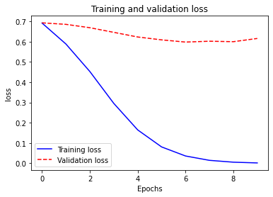
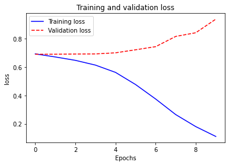
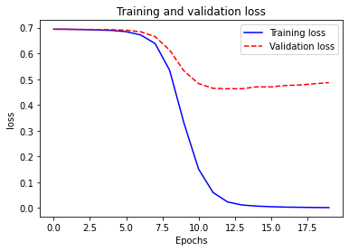

# keras의 word embedding을 이용한 문서 분류

## keras 
파이썬으로 작성된 오픈 소스 신경망 라이브러리 

### 영화리뷰 데이터 대상으로 word embedding 구현


```python
from nltk.corpus import movie_reviews
fileids = movie_reviews.fileids() #movie review data에서 file id를 가져옴
reviews = [movie_reviews.raw(fileid) for fileid in fileids] #file id를 이용해 raw text file을 가져옴
categories = [movie_reviews.categories(fileid)[0] for fileid in fileids] 
#file id를 이용해 label로 사용할 category 즉 positive와 negative 정보를 순서대로 가져옴

print('Reviews count:', len(reviews))
print('Length of the first review:', len(reviews[0])) #string의 수를 센 것으로 문자수
print('Length of the first review:', len(reviews[0].split())) #단어수 
print('Labels:', set(categories))
```

    Reviews count: 2000
    Length of the first review: 4043
    Length of the first review: 825
    Labels: {'pos', 'neg'}
    

#### 텐서플로우

다양한 작업에 대해 데이터 흐름 프로그래밍을 위한 오픈 소스 소프트웨어 라이브러리 


```python
!pip install --upgrade pip
```

    Requirement already satisfied: pip in c:\users\juhee\anaconda3\lib\site-packages (21.1.2)
    

    WARNING: Ignoring invalid distribution -umpy (c:\users\juhee\anaconda3\lib\site-packages)
    WARNING: Ignoring invalid distribution -pype1 (c:\users\juhee\anaconda3\lib\site-packages)
    WARNING: Ignoring invalid distribution -umpy (c:\users\juhee\anaconda3\lib\site-packages)
    WARNING: Ignoring invalid distribution -pype1 (c:\users\juhee\anaconda3\lib\site-packages)
    WARNING: Ignoring invalid distribution -umpy (c:\users\juhee\anaconda3\lib\site-packages)
    WARNING: Ignoring invalid distribution -pype1 (c:\users\juhee\anaconda3\lib\site-packages)
    WARNING: Ignoring invalid distribution -umpy (c:\users\juhee\anaconda3\lib\site-packages)
    WARNING: Ignoring invalid distribution -pype1 (c:\users\juhee\anaconda3\lib\site-packages)
    WARNING: Ignoring invalid distribution -umpy (c:\users\juhee\anaconda3\lib\site-packages)
    WARNING: Ignoring invalid distribution -pype1 (c:\users\juhee\anaconda3\lib\site-packages)
    


```python
pip install tensorflow
```

    Requirement already satisfied: tensorflow in c:\users\juhee\anaconda3\lib\site-packages (2.5.0)Note: you may need to restart the kernel to use updated packages.
    
    Requirement already satisfied: typing-extensions~=3.7.4 in c:\users\juhee\anaconda3\lib\site-packages (from tensorflow) (3.7.4.2)
    Requirement already satisfied: gast==0.4.0 in c:\users\juhee\anaconda3\lib\site-packages (from tensorflow) (0.4.0)
    Requirement already satisfied: astunparse~=1.6.3 in c:\users\juhee\anaconda3\lib\site-packages (from tensorflow) (1.6.3)
    Requirement already satisfied: opt-einsum~=3.3.0 in c:\users\juhee\anaconda3\lib\site-packages (from tensorflow) (3.3.0)
    Requirement already satisfied: google-pasta~=0.2 in c:\users\juhee\anaconda3\lib\site-packages (from tensorflow) (0.2.0)
    Requirement already satisfied: six~=1.15.0 in c:\users\juhee\anaconda3\lib\site-packages (from tensorflow) (1.15.0)
    Requirement already satisfied: wrapt~=1.12.1 in c:\users\juhee\anaconda3\lib\site-packages (from tensorflow) (1.12.1)
    Requirement already satisfied: protobuf>=3.9.2 in c:\users\juhee\anaconda3\lib\site-packages (from tensorflow) (3.17.1)
    Requirement already satisfied: keras-preprocessing~=1.1.2 in c:\users\juhee\anaconda3\lib\site-packages (from tensorflow) (1.1.2)
    Requirement already satisfied: grpcio~=1.34.0 in c:\users\juhee\anaconda3\lib\site-packages (from tensorflow) (1.34.1)
    Requirement already satisfied: wheel~=0.35 in c:\users\juhee\anaconda3\lib\site-packages (from tensorflow) (0.36.2)
    Requirement already satisfied: absl-py~=0.10 in c:\users\juhee\anaconda3\lib\site-packages (from tensorflow) (0.12.0)
    Requirement already satisfied: h5py~=3.1.0 in c:\users\juhee\anaconda3\lib\site-packages (from tensorflow) (3.1.0)
    Requirement already satisfied: tensorflow-estimator<2.6.0,>=2.5.0rc0 in c:\users\juhee\anaconda3\lib\site-packages (from tensorflow) (2.5.0)
    Requirement already satisfied: flatbuffers~=1.12.0 in c:\users\juhee\anaconda3\lib\site-packages (from tensorflow) (1.12)
    Requirement already satisfied: tensorboard~=2.5 in c:\users\juhee\anaconda3\lib\site-packages (from tensorflow) (2.5.0)
    Requirement already satisfied: numpy~=1.19.2 in c:\users\juhee\anaconda3\lib\site-packages (from tensorflow) (1.19.5)
    Requirement already satisfied: termcolor~=1.1.0 in c:\users\juhee\anaconda3\lib\site-packages (from tensorflow) (1.1.0)
    Requirement already satisfied: keras-nightly~=2.5.0.dev in c:\users\juhee\anaconda3\lib\site-packages (from tensorflow) (2.5.0.dev2021032900)
    Requirement already satisfied: tensorboard-plugin-wit>=1.6.0 in c:\users\juhee\anaconda3\lib\site-packages (from tensorboard~=2.5->tensorflow) (1.8.0)
    Requirement already satisfied: werkzeug>=0.11.15 in c:\users\juhee\anaconda3\lib\site-packages (from tensorboard~=2.5->tensorflow) (1.0.1)
    Requirement already satisfied: requests<3,>=2.21.0 in c:\users\juhee\anaconda3\lib\site-packages (from tensorboard~=2.5->tensorflow) (2.24.0)
    Requirement already satisfied: google-auth<2,>=1.6.3 in c:\users\juhee\anaconda3\lib\site-packages (from tensorboard~=2.5->tensorflow) (1.30.1)
    Requirement already satisfied: markdown>=2.6.8 in c:\users\juhee\anaconda3\lib\site-packages (from tensorboard~=2.5->tensorflow) (3.3.4)
    Requirement already satisfied: tensorboard-data-server<0.7.0,>=0.6.0 in c:\users\juhee\anaconda3\lib\site-packages (from tensorboard~=2.5->tensorflow) (0.6.1)
    Requirement already satisfied: google-auth-oauthlib<0.5,>=0.4.1 in c:\users\juhee\anaconda3\lib\site-packages (from tensorboard~=2.5->tensorflow) (0.4.4)
    Requirement already satisfied: setuptools>=41.0.0 in c:\users\juhee\anaconda3\lib\site-packages (from tensorboard~=2.5->tensorflow) (49.2.0.post20200714)
    Requirement already satisfied: cachetools<5.0,>=2.0.0 in c:\users\juhee\anaconda3\lib\site-packages (from google-auth<2,>=1.6.3->tensorboard~=2.5->tensorflow) (4.2.2)
    Requirement already satisfied: rsa<5,>=3.1.4 in c:\users\juhee\anaconda3\lib\site-packages (from google-auth<2,>=1.6.3->tensorboard~=2.5->tensorflow) (4.7.2)
    Requirement already satisfied: pyasn1-modules>=0.2.1 in c:\users\juhee\anaconda3\lib\site-packages (from google-auth<2,>=1.6.3->tensorboard~=2.5->tensorflow) (0.2.8)
    Requirement already satisfied: requests-oauthlib>=0.7.0 in c:\users\juhee\anaconda3\lib\site-packages (from google-auth-oauthlib<0.5,>=0.4.1->tensorboard~=2.5->tensorflow) (1.3.0)
    Requirement already satisfied: pyasn1<0.5.0,>=0.4.6 in c:\users\juhee\anaconda3\lib\site-packages (from pyasn1-modules>=0.2.1->google-auth<2,>=1.6.3->tensorboard~=2.5->tensorflow) (0.4.8)
    Requirement already satisfied: chardet<4,>=3.0.2 in c:\users\juhee\anaconda3\lib\site-packages (from requests<3,>=2.21.0->tensorboard~=2.5->tensorflow) (3.0.4)
    Requirement already satisfied: idna<3,>=2.5 in c:\users\juhee\anaconda3\lib\site-packages (from requests<3,>=2.21.0->tensorboard~=2.5->tensorflow) (2.10)
    Requirement already satisfied: certifi>=2017.4.17 in c:\users\juhee\anaconda3\lib\site-packages (from requests<3,>=2.21.0->tensorboard~=2.5->tensorflow) (2020.6.20)

    WARNING: Ignoring invalid distribution -umpy (c:\users\juhee\anaconda3\lib\site-packages)
    WARNING: Ignoring invalid distribution -pype1 (c:\users\juhee\anaconda3\lib\site-packages)
    WARNING: Ignoring invalid distribution -umpy (c:\users\juhee\anaconda3\lib\site-packages)
    WARNING: Ignoring invalid distribution -pype1 (c:\users\juhee\anaconda3\lib\site-packages)
    WARNING: Ignoring invalid distribution -umpy (c:\users\juhee\anaconda3\lib\site-packages)
    WARNING: Ignoring invalid distribution -pype1 (c:\users\juhee\anaconda3\lib\site-packages)
    WARNING: Ignoring invalid distribution -umpy (c:\users\juhee\anaconda3\lib\site-packages)
    WARNING: Ignoring invalid distribution -pype1 (c:\users\juhee\anaconda3\lib\site-packages)
    WARNING: Ignoring invalid distribution -umpy (c:\users\juhee\anaconda3\lib\site-packages)
    WARNING: Ignoring invalid distribution -pype1 (c:\users\juhee\anaconda3\lib\site-packages)
    

    
    Requirement already satisfied: urllib3!=1.25.0,!=1.25.1,<1.26,>=1.21.1 in c:\users\juhee\anaconda3\lib\site-packages (from requests<3,>=2.21.0->tensorboard~=2.5->tensorflow) (1.25.9)
    Requirement already satisfied: oauthlib>=3.0.0 in c:\users\juhee\anaconda3\lib\site-packages (from requests-oauthlib>=0.7.0->google-auth-oauthlib<0.5,>=0.4.1->tensorboard~=2.5->tensorflow) (3.1.0)
    


```python
pip install --upgrade --no-deps --force-reinstall tensorflow
```

    Collecting tensorflowNote: you may need to restart the kernel to use updated packages.
    

    WARNING: Ignoring invalid distribution -umpy (c:\users\juhee\anaconda3\lib\site-packages)
    WARNING: Ignoring invalid distribution -pype1 (c:\users\juhee\anaconda3\lib\site-packages)
    WARNING: Ignoring invalid distribution -umpy (c:\users\juhee\anaconda3\lib\site-packages)
    WARNING: Ignoring invalid distribution -pype1 (c:\users\juhee\anaconda3\lib\site-packages)
        WARNING: Ignoring invalid distribution -umpy (c:\users\juhee\anaconda3\lib\site-packages)
        WARNING: Ignoring invalid distribution -pype1 (c:\users\juhee\anaconda3\lib\site-packages)
    WARNING: Ignoring invalid distribution -umpy (c:\users\juhee\anaconda3\lib\site-packages)
    WARNING: Ignoring invalid distribution -pype1 (c:\users\juhee\anaconda3\lib\site-packages)
    WARNING: Ignoring invalid distribution -umpy (c:\users\juhee\anaconda3\lib\site-packages)
    WARNING: Ignoring invalid distribution -pype1 (c:\users\juhee\anaconda3\lib\site-packages)
    WARNING: Ignoring invalid distribution -umpy (c:\users\juhee\anaconda3\lib\site-packages)
    WARNING: Ignoring invalid distribution -pype1 (c:\users\juhee\anaconda3\lib\site-packages)
    

    
      Using cached tensorflow-2.5.0-cp38-cp38-win_amd64.whl (422.6 MB)
    Installing collected packages: tensorflow
      Attempting uninstall: tensorflow
        Found existing installation: tensorflow 2.5.0
        Uninstalling tensorflow-2.5.0:
          Successfully uninstalled tensorflow-2.5.0
    Successfully installed tensorflow-2.5.0
    


```python
import numpy as np
import tensorflow as tf
from tensorflow.keras.preprocessing.text import Tokenizer #tenserflow의 모듈 사용 
np.random.seed(7)
tf.random.set_seed(7)

max_words = 10000 #사용할 단어의 수

tokenizer = Tokenizer(num_words=max_words) # 빈도가 높은 10000개의 단어를 선택하도록 객체 생성
tokenizer.fit_on_texts(reviews) #단어 인덱스 구축

X = tokenizer.texts_to_sequences(reviews) #만들어진 단어 인덱스를 이용해 변환
# 일반적으로 0이면 unknown, 즉 전체단어의 수가 10000개 - num_words가 넘을 경우, index가 10000-1(for unknown)을 넘어가는 단어는 0으로 처리함

#시퀀스로 변환된 단어수 
print('lengths of 10 documents:', [len(doc) for doc in X[:10]])

print('num of tokens:', len(tokenizer.word_index))
```

    lengths of 10 documents: [693, 230, 472, 440, 698, 649, 520, 547, 619, 729]
    num of tokens: 43296
    


```python
print(X[1])
```

    [1, 658, 7101, 1012, 26, 465, 1571, 8, 2927, 37, 294, 2, 362, 442, 7, 14, 26, 775, 3025, 556, 3367, 3, 127, 1712, 574, 721, 14, 60, 7, 2, 67, 3865, 2, 684, 4, 2, 8, 202, 633, 2, 5280, 2041, 4080, 559, 8, 32, 2, 5, 9, 44, 36, 2562, 1, 587, 135, 19, 98, 75, 36, 118, 1, 587, 614, 159, 12, 1, 1259, 3, 1713, 19, 2, 148, 124, 470, 128, 3, 52, 1808, 137, 648, 79, 2042, 38, 2, 26, 159, 12, 35, 2158, 3, 59, 1879, 62, 120, 118, 162, 1, 684, 30, 92, 40, 7, 1, 630, 4, 1416, 62, 120, 118, 1, 4, 48, 874, 100, 1, 559, 50, 8, 2, 133, 4774, 3081, 182, 486, 1, 3, 4, 223, 62, 120, 118, 162, 3289, 3433, 6, 6793, 157, 457, 128, 37, 50, 1958, 1086, 910, 112, 101, 157, 11, 49, 4477, 1, 210, 6, 1995, 1175, 56, 28, 1, 1404, 4, 3367, 420, 43, 876, 5, 72, 2, 2562, 40, 4, 33, 139, 7, 2402, 3433, 6, 1189, 3, 1712, 77, 125, 210, 38, 2, 1712, 4, 223, 1, 153, 199, 128, 20, 8316, 2854, 1627, 49, 2654, 3, 1, 2159, 61, 1259, 405, 38, 4205, 55, 4931, 1488, 39, 51, 4477, 3, 522, 691, 92, 387, 34, 19, 1788, 169, 26, 922, 37, 271, 70, 2, 559, 4, 2, 26]
    


```python
reviews[1]
```


    'the happy bastard\'s quick movie review \ndamn that y2k bug . \nit\'s got a head start in this movie starring jamie lee curtis and another baldwin brother ( william this time ) in a story regarding a crew of a tugboat that comes across a deserted russian tech ship that has a strangeness to it when they kick the power back on . \nlittle do they know the power within . . . \ngoing for the gore and bringing on a few action sequences here and there , virus still feels very empty , like a movie going for all flash and no substance . \nwe don\'t know why the crew was really out in the middle of nowhere , we don\'t know the origin of what took over the ship ( just that a big pink flashy thing hit the mir ) , and , of course , we don\'t know why donald sutherland is stumbling around drunkenly throughout . \nhere , it\'s just " hey , let\'s chase these people around with some robots " . \nthe acting is below average , even from the likes of curtis . \nyou\'re more likely to get a kick out of her work in halloween h20 . \nsutherland is wasted and baldwin , well , he\'s acting like a baldwin , of course . \nthe real star here are stan winston\'s robot design , some schnazzy cgi , and the occasional good gore shot , like picking into someone\'s brain . \nso , if robots and body parts really turn you on , here\'s your movie . \notherwise , it\'s pretty much a sunken ship of a movie . \n'


--> X는 리뷰에서 나온 단어들의 인덱스를 모아둔 것으로 print(X[1])는 워드인덱스를 출력한 것  
예로 the 는 1번 happy는 658번 bastard\'s는 7101등으로 해석할 수 있다


```python
from tensorflow.keras.preprocessing.sequence import pad_sequences

maxlen = 500 #문서의 단어 수를 제한

# 문서의 단어 수가 500보다 작으면 0을 채우고, 크면 잘라냄
# 잘라낼 때, 앞을 자를 지, 뒤를 자를 지 선택할 수 있음. 앞을 자르고 뒷부분을 쓰고자 하면 'pre' 선택
X = pad_sequences(X, maxlen=maxlen, truncating='pre') 

print(X[1])
```

    [   0    0    0    0    0    0    0    0    0    0    0    0    0    0
        0    0    0    0    0    0    0    0    0    0    0    0    0    0
        0    0    0    0    0    0    0    0    0    0    0    0    0    0
        0    0    0    0    0    0    0    0    0    0    0    0    0    0
        0    0    0    0    0    0    0    0    0    0    0    0    0    0
        0    0    0    0    0    0    0    0    0    0    0    0    0    0
        0    0    0    0    0    0    0    0    0    0    0    0    0    0
        0    0    0    0    0    0    0    0    0    0    0    0    0    0
        0    0    0    0    0    0    0    0    0    0    0    0    0    0
        0    0    0    0    0    0    0    0    0    0    0    0    0    0
        0    0    0    0    0    0    0    0    0    0    0    0    0    0
        0    0    0    0    0    0    0    0    0    0    0    0    0    0
        0    0    0    0    0    0    0    0    0    0    0    0    0    0
        0    0    0    0    0    0    0    0    0    0    0    0    0    0
        0    0    0    0    0    0    0    0    0    0    0    0    0    0
        0    0    0    0    0    0    0    0    0    0    0    0    0    0
        0    0    0    0    0    0    0    0    0    0    0    0    0    0
        0    0    0    0    0    0    0    0    0    0    0    0    0    0
        0    0    0    0    0    0    0    0    0    0    0    0    0    0
        0    0    0    0    1  658 7101 1012   26  465 1571    8 2927   37
      294    2  362  442    7   14   26  775 3025  556 3367    3  127 1712
      574  721   14   60    7    2   67 3865    2  684    4    2    8  202
      633    2 5280 2041 4080  559    8   32    2    5    9   44   36 2562
        1  587  135   19   98   75   36  118    1  587  614  159   12    1
     1259    3 1713   19    2  148  124  470  128    3   52 1808  137  648
       79 2042   38    2   26  159   12   35 2158    3   59 1879   62  120
      118  162    1  684   30   92   40    7    1  630    4 1416   62  120
      118    1    4   48  874  100    1  559   50    8    2  133 4774 3081
      182  486    1    3    4  223   62  120  118  162 3289 3433    6 6793
      157  457  128   37   50 1958 1086  910  112  101  157   11   49 4477
        1  210    6 1995 1175   56   28    1 1404    4 3367  420   43  876
        5   72    2 2562   40    4   33  139    7 2402 3433    6 1189    3
     1712   77  125  210   38    2 1712    4  223    1  153  199  128   20
     8316 2854 1627   49 2654    3    1 2159   61 1259  405   38 4205   55
     4931 1488   39   51 4477    3  522  691   92  387   34   19 1788  169
       26  922   37  271   70    2  559    4    2   26]
    


```python
import numpy as np

# label을 0, 1의 값으로 변환
label_dict = {'pos':0, 'neg':1}
y = np.array([label_dict[c] for c in categories])
print(set(y))
```

    {0, 1}
    


```python
print(categories[1],y[1])
```

    neg 1
    


```python
from sklearn.model_selection import train_test_split #sklearn에서 제공하는 split 함수를 사용
X_train, X_test, y_train, y_test = train_test_split(X, y, test_size=0.2, random_state=10)
# sklearn의 train_test_split 함수는 먼저 data set을 shuffle하고 주어진 비율에 따라 train set과 test set을 나눠 줌
# 위에서는 reviews를 X_train과 X_test로 8:2의 비율로 나누고, categories를 y_train과 y_test로 나눔
# 이 때 X와 y의 순서는 동일하게 유지해서 각 입력값과 label이 정확하게 match되도록 함
# random_state는 shuffle에서의 seed 값으로, 지정한 경우 항상 동일한 결과로 shuffle이 됨

print('Train set count:', len(X_train))
print('Test set count:', len(X_test))
print('Test samples:', y_test[:20])
```

    Train set count: 1600
    Test set count: 400
    Test samples: [1 0 0 1 0 0 1 1 1 1 0 0 1 1 0 1 1 0 0 0]
    


```python
# 케라스 모형 생성 및 학습
from tensorflow.keras.models import Sequential
from tensorflow.keras.layers import Flatten, Dense, Embedding

model = Sequential([ #순차적 모형
    Embedding(max_words, 32, input_length=maxlen), 
    #word embedding layer 생성
    # max_words는 one-hot encoding을 할 때의 vector 크기가 됨 - 사용된 단어의 수(앞에서 만개로 지정)만큼
    # 각 단어는 32 크기의 dense vector로 embedding 됨 - 크기 32개로 줄여서 학습 
    # input_length는 한 document의 단어 수로 표현
    # 이 과정을 거치면 각 document는 (maxlen, 32)의 2차원 행렬이 됨 - 즉 word의 sequence가 됨

    Flatten(),
    # 2차원 행렬을 1차원으로 펼침

    Dense(1, activation='sigmoid') #binary logistic regression을 수행을 위해서 
])
#모형의 optimizer와 loss function 등을 지정
model.summary() #모델의 요약정보 출력
```

    Model: "sequential"
    _________________________________________________________________
    Layer (type)                 Output Shape              Param #   
    =================================================================
    embedding (Embedding)        (None, 500, 32)           320000    
    _________________________________________________________________
    flatten (Flatten)            (None, 16000)             0         
    _________________________________________________________________
    dense (Dense)                (None, 1)                 16001     
    =================================================================
    Total params: 336,001
    Trainable params: 336,001
    Non-trainable params: 0
    _________________________________________________________________
    


```python
# 학습을 수행
model.compile(optimizer='rmsprop', loss='binary_crossentropy', metrics=['acc'])
#'binary_crossentropy'을 사용하는 이유는 neg pos둘 중 하나를 선택하기 때문에 
history = model.fit(X_train, y_train, 
                    epochs=10,
                    verbose=1,
                    validation_split=0.2)
#loss는 줄어들고 val_acc는 커지는 것이 좋은 것 / acc보고 과적합 판단 
```

    Epoch 1/10
    40/40 [==============================] - 6s 47ms/step - loss: 0.6919 - acc: 0.5289 - val_loss: 0.6929 - val_acc: 0.5469
    Epoch 2/10
    40/40 [==============================] - 1s 24ms/step - loss: 0.5885 - acc: 0.9125 - val_loss: 0.6855 - val_acc: 0.5625
    Epoch 3/10
    40/40 [==============================] - 1s 19ms/step - loss: 0.4528 - acc: 0.9758 - val_loss: 0.6689 - val_acc: 0.5938
    Epoch 4/10
    40/40 [==============================] - 1s 20ms/step - loss: 0.2957 - acc: 0.9945 - val_loss: 0.6461 - val_acc: 0.6187
    Epoch 5/10
    40/40 [==============================] - 1s 24ms/step - loss: 0.1648 - acc: 0.9984 - val_loss: 0.6231 - val_acc: 0.6313
    Epoch 6/10
    40/40 [==============================] - 1s 20ms/step - loss: 0.0809 - acc: 0.9984 - val_loss: 0.6089 - val_acc: 0.6281
    Epoch 7/10
    40/40 [==============================] - 1s 18ms/step - loss: 0.0362 - acc: 1.0000 - val_loss: 0.5981 - val_acc: 0.6562
    Epoch 8/10
    40/40 [==============================] - 1s 17ms/step - loss: 0.0147 - acc: 1.0000 - val_loss: 0.6023 - val_acc: 0.6375
    Epoch 9/10
    40/40 [==============================] - 1s 17ms/step - loss: 0.0056 - acc: 1.0000 - val_loss: 0.6000 - val_acc: 0.6812
    Epoch 10/10
    40/40 [==============================] - 1s 17ms/step - loss: 0.0020 - acc: 1.0000 - val_loss: 0.6159 - val_acc: 0.6656
    


```python
%matplotlib inline
import matplotlib.pyplot as plt

def plot_results(history, metric):
    plt.plot(history.history[metric], 'b', label='Training '+metric)
    plt.plot(history.history['val_'+metric], 'r--', label='Validation '+metric)
    plt.title('Training and validation '+metric)
    plt.xlabel('Epochs')
    plt.ylabel(metric)
    plt.legend()
    plt.show()

plot_results(history, 'loss')
```





```python
#테스트 셋으로 학습된 모형의 성능을 평가
score = model.evaluate(X_test, y_test)
print(f'#Test accuracy:{score[1]:.3f}')
```

    13/13 [==============================] - 1s 10ms/step - loss: 0.5261 - acc: 0.7275
    #Test accuracy:0.728
    

72.8%의 결과 얻은 것을 확인할 수 있다. 현재 0과 1값 중 고르는 것으로 좋다고 할 수도 나쁘다고 할 수 도 없는 결과 

## 문서의 sequence 정보를 활용하기 위한 RNN 모형 구축


```python
from tensorflow.keras.layers import SimpleRNN
from tensorflow.keras.optimizers import Adam

model = Sequential([
    Embedding(max_words, 64),
    SimpleRNN(64), # 펼쳐서 flat하게 만드는 대신 RNN 모형을 사용, max_words 만큼의 시계열 데이터
    Dense(64, activation='relu'),
    Dense(1, activation='sigmoid')
])
model.summary()

adam = Adam(learning_rate=1e-4)
model.compile(optimizer=adam, loss='binary_crossentropy', metrics=['acc'])
history = model.fit(X_train, y_train, 
                    epochs=10,
                    verbose=0,
                    validation_split=0.2)

plot_results(history, 'loss')
#테스트 셋으로 학습된 모형의 성능을 평가
score = model.evaluate(X_test, y_test)
print(f'#Test accuracy:{score[1]:.3f}')
```

    Model: "sequential_3"
    _________________________________________________________________
    Layer (type)                 Output Shape              Param #   
    =================================================================
    embedding_3 (Embedding)      (None, None, 64)          640000    
    _________________________________________________________________
    simple_rnn_1 (SimpleRNN)     (None, 64)                8256      
    _________________________________________________________________
    dense_5 (Dense)              (None, 64)                4160      
    _________________________________________________________________
    dense_6 (Dense)              (None, 1)                 65        
    =================================================================
    Total params: 652,481
    Trainable params: 652,481
    Non-trainable params: 0
    _________________________________________________________________
    





    13/13 [==============================] - 2s 84ms/step - loss: 1.0069 - acc: 0.4475
    #Test accuracy:0.447
    


```python
from tensorflow.keras.layers import LSTM, Bidirectional
# Bidirectional 양방향 확인

model = Sequential([
    Embedding(max_words, 64),
    Bidirectional(LSTM(64)), # simple RNN 대신 bidirectional LSTM을 사용
    Dense(64, activation='relu'),
    Dense(1, activation='sigmoid')
])
model.summary()

model.compile(optimizer=adam, loss='binary_crossentropy', metrics=['acc'])

history = model.fit(X_train, y_train, 
                    epochs=10,
                    verbose=1,
                    validation_split=0.2)

plot_results(history, 'loss')

#테스트 셋으로 학습된 모형의 성능을 평가
score = model.evaluate(X_test, y_test)
print(f'#Test accuracy:{score[1]:.3f}')
```

    Model: "sequential_2"
    _________________________________________________________________
    Layer (type)                 Output Shape              Param #   
    =================================================================
    embedding_2 (Embedding)      (None, None, 64)          640000    
    _________________________________________________________________
    bidirectional (Bidirectional (None, 128)               66048     
    _________________________________________________________________
    dense_3 (Dense)              (None, 64)                8256      
    _________________________________________________________________
    dense_4 (Dense)              (None, 1)                 65        
    =================================================================
    Total params: 714,369
    Trainable params: 714,369
    Non-trainable params: 0
    _________________________________________________________________
    Epoch 1/10
    40/40 [==============================] - 65s 1s/step - loss: 0.6926 - acc: 0.5172 - val_loss: 0.6925 - val_acc: 0.5188
    Epoch 2/10
    40/40 [==============================] - 42s 1s/step - loss: 0.6872 - acc: 0.5570 - val_loss: 0.6906 - val_acc: 0.5250
    Epoch 3/10
    40/40 [==============================] - 41s 1s/step - loss: 0.6547 - acc: 0.6570 - val_loss: 0.6573 - val_acc: 0.6375
    Epoch 4/10
    40/40 [==============================] - 44s 1s/step - loss: 0.5779 - acc: 0.8039 - val_loss: 0.5528 - val_acc: 0.7125
    Epoch 5/10
    40/40 [==============================] - 41s 1s/step - loss: 0.4068 - acc: 0.8305 - val_loss: 0.4514 - val_acc: 0.8062
    Epoch 6/10
    40/40 [==============================] - 51s 1s/step - loss: 0.2286 - acc: 0.9367 - val_loss: 0.4417 - val_acc: 0.8156
    Epoch 7/10
    40/40 [==============================] - 45s 1s/step - loss: 0.1539 - acc: 0.9531 - val_loss: 0.4753 - val_acc: 0.7969
    Epoch 8/10
    40/40 [==============================] - 45s 1s/step - loss: 0.0902 - acc: 0.9734 - val_loss: 0.5203 - val_acc: 0.7844
    Epoch 9/10
    40/40 [==============================] - 46s 1s/step - loss: 0.0561 - acc: 0.9875 - val_loss: 0.4885 - val_acc: 0.7875
    Epoch 10/10
    40/40 [==============================] - 45s 1s/step - loss: 0.0457 - acc: 0.9883 - val_loss: 0.5055 - val_acc: 0.7937
    


    13/13 [==============================] - 8s 255ms/step - loss: 0.5316 - acc: 0.8000
    #Test accuracy:0.800
    

문제점: train set의 크기가 너무 작다  
해결방안: train set을 충분히 늘리거나, Word2Vec, GloVe, Elmo와 같은 pre-trained embedding vector를 사용

## CNN을 이용한 sequence 정보 활용


```python
from tensorflow.keras.layers import Conv1D, GlobalMaxPooling1D, MaxPooling1D, Embedding, Dropout

model = Sequential([
    Embedding(max_words, 64, input_length=maxlen), #word embedding layer 생성
    Conv1D(32, #the number of output filters 
            5, #the length of the 1D convolution window
            padding='valid', # "no padding"
            activation='relu',
            strides=1), # the stride length of the convolution
    Dropout(0.2),
    MaxPooling1D(pool_size=4),
    Conv1D(64, 5, padding='valid', activation='relu', strides=1),
    Dropout(0.2),
    MaxPooling1D(pool_size=4),
    Conv1D(128, 5, padding='valid', activation='relu', strides=1),
    Dropout(0.2),
    GlobalMaxPooling1D(),
    Dense(64, activation='relu'),
    Dense(1, activation='sigmoid') #binary logistic regression을 수행
])
model.summary()

model.compile(optimizer=adam, loss='binary_crossentropy', metrics=['acc'])
history = model.fit(X_train, y_train, 
                    epochs=20,
                    verbose=1,
                    validation_split=0.2)

plot_results(history, 'loss')
#테스트 셋으로 학습된 모형의 성능을 평가
score = model.evaluate(X_test, y_test)
print(f'#Test accuracy:{score[1]:.3f}')
```

    Model: "sequential_4"
    _________________________________________________________________
    Layer (type)                 Output Shape              Param #   
    =================================================================
    embedding_4 (Embedding)      (None, 500, 64)           640000    
    _________________________________________________________________
    conv1d (Conv1D)              (None, 496, 32)           10272     
    _________________________________________________________________
    dropout (Dropout)            (None, 496, 32)           0         
    _________________________________________________________________
    max_pooling1d (MaxPooling1D) (None, 124, 32)           0         
    _________________________________________________________________
    conv1d_1 (Conv1D)            (None, 120, 64)           10304     
    _________________________________________________________________
    dropout_1 (Dropout)          (None, 120, 64)           0         
    _________________________________________________________________
    max_pooling1d_1 (MaxPooling1 (None, 30, 64)            0         
    _________________________________________________________________
    conv1d_2 (Conv1D)            (None, 26, 128)           41088     
    _________________________________________________________________
    dropout_2 (Dropout)          (None, 26, 128)           0         
    _________________________________________________________________
    global_max_pooling1d (Global (None, 128)               0         
    _________________________________________________________________
    dense_7 (Dense)              (None, 64)                8256      
    _________________________________________________________________
    dense_8 (Dense)              (None, 1)                 65        
    =================================================================
    Total params: 709,985
    Trainable params: 709,985
    Non-trainable params: 0
    _________________________________________________________________
    Epoch 1/20
    40/40 [==============================] - 14s 249ms/step - loss: 0.6941 - acc: 0.4930 - val_loss: 0.6933 - val_acc: 0.4969
    Epoch 2/20
    40/40 [==============================] - 10s 243ms/step - loss: 0.6935 - acc: 0.5016 - val_loss: 0.6930 - val_acc: 0.5031
    Epoch 3/20
    40/40 [==============================] - 9s 219ms/step - loss: 0.6924 - acc: 0.5211 - val_loss: 0.6928 - val_acc: 0.5125
    Epoch 4/20
    40/40 [==============================] - 10s 250ms/step - loss: 0.6906 - acc: 0.5320 - val_loss: 0.6924 - val_acc: 0.5156
    Epoch 5/20
    40/40 [==============================] - 10s 248ms/step - loss: 0.6891 - acc: 0.5828 - val_loss: 0.6918 - val_acc: 0.5031
    Epoch 6/20
    40/40 [==============================] - 10s 241ms/step - loss: 0.6841 - acc: 0.5930 - val_loss: 0.6898 - val_acc: 0.6219
    Epoch 7/20
    40/40 [==============================] - 9s 232ms/step - loss: 0.6717 - acc: 0.7320 - val_loss: 0.6839 - val_acc: 0.5625
    Epoch 8/20
    40/40 [==============================] - 10s 245ms/step - loss: 0.6381 - acc: 0.7312 - val_loss: 0.6649 - val_acc: 0.7156
    Epoch 9/20
    40/40 [==============================] - 9s 226ms/step - loss: 0.5349 - acc: 0.8508 - val_loss: 0.6129 - val_acc: 0.7312
    Epoch 10/20
    40/40 [==============================] - 9s 234ms/step - loss: 0.3282 - acc: 0.9133 - val_loss: 0.5312 - val_acc: 0.7500
    Epoch 11/20
    40/40 [==============================] - 9s 235ms/step - loss: 0.1516 - acc: 0.9648 - val_loss: 0.4829 - val_acc: 0.7844
    Epoch 12/20
    40/40 [==============================] - 9s 222ms/step - loss: 0.0605 - acc: 0.9937 - val_loss: 0.4645 - val_acc: 0.7906
    Epoch 13/20
    40/40 [==============================] - 9s 221ms/step - loss: 0.0239 - acc: 1.0000 - val_loss: 0.4627 - val_acc: 0.7969
    Epoch 14/20
    40/40 [==============================] - 9s 226ms/step - loss: 0.0120 - acc: 1.0000 - val_loss: 0.4631 - val_acc: 0.7937
    Epoch 15/20
    40/40 [==============================] - 10s 251ms/step - loss: 0.0078 - acc: 1.0000 - val_loss: 0.4701 - val_acc: 0.7937
    Epoch 16/20
    40/40 [==============================] - 9s 219ms/step - loss: 0.0054 - acc: 1.0000 - val_loss: 0.4702 - val_acc: 0.7969
    Epoch 17/20
    40/40 [==============================] - 11s 274ms/step - loss: 0.0039 - acc: 1.0000 - val_loss: 0.4753 - val_acc: 0.7906
    Epoch 18/20
    40/40 [==============================] - 9s 225ms/step - loss: 0.0031 - acc: 1.0000 - val_loss: 0.4774 - val_acc: 0.7969
    Epoch 19/20
    40/40 [==============================] - 9s 222ms/step - loss: 0.0025 - acc: 1.0000 - val_loss: 0.4823 - val_acc: 0.7937
    Epoch 20/20
    40/40 [==============================] - 10s 240ms/step - loss: 0.0020 - acc: 1.0000 - val_loss: 0.4863 - val_acc: 0.7937
    





    13/13 [==============================] - 1s 59ms/step - loss: 0.4244 - acc: 0.8025
    #Test accuracy:0.803
    
