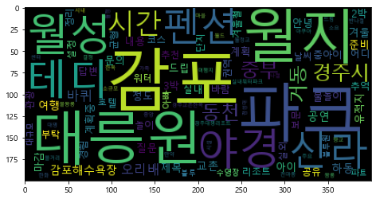

## 텍스트 분석 순서 
1. 문장
2. 단어
3. 키워드 
4. 필터링
5. 집계
6. 순서화


```python
from konlpy.tag import Kkma
import matplotlib.pyplot as plt
from matplotlib import font_manager,rc
from wordcloud import WordCloud

from collections import Counter
import numpy as np
kkma = Kkma()
```


```python
# 파일 불러오기 

data1 = open('경주여행_지식인_2016_2.txt').read()
data1
data2 = kkma.nouns(data1)
data3 = Counter(data2) #언급 빈도별 단어 집계 적용 
```


```python
# 불용어 제거 

stop_words = open('stop_words.txt').read()
#우리 가지 번역 만큼 답글 경주 무엇 출발 하나 가 들어있는 텍스트 파일 
data3 = [each_word 
         for each_word in data2 
         if each_word not in stop_words]
data3

data4 =[]
for i in range(0,len(data3)):
    #글자수 파악해서 설정한 거 초과나 미만이면 제거 
    if len(data3[i]) >=2 | len(data3[i]) <=10:
        data4.append(data3[i])
```


```python
data5 =  Counter(data4)
data6 = data5.most_common(100) #가장 많이 사용된 1000개 단어만 
tmp_data = dict(data6)
```


```python
print(tmp_data,end='')
```

    {'감포': 3, '파크': 2, '대릉원': 2, '월지': 2, '월성': 2, '야경': 2, '테디': 2, '신라': 2, '펜션': 2, '시간': 2, '경주시': 2, '중부': 2, '동천': 2, '거동': 2, '오리배': 2, '바퀴': 2, '감포해수욕장': 2, '하동': 2, '교촌': 2, '공연': 2, '제목': 1, '여행': 1, '문의': 1, '드립': 1, '질문': 1, '마감': 1, '내용': 1, '안녕': 1, '겨울': 1, '아이': 1, '준비': 1, '2박': 1, '3박': 1, '정도': 1, '계획': 1, '계획중': 1, '유적지': 1, '물놀이': 1, '놀이': 1, '호텔': 1, '리조트': 1, '중아이': 1, '실내': 1, '워터': 1, '어디': 1, '추천': 1, '부탁': 1, '답변': 1, '아빠': 1, '추억': 1, '바람': 1, '경험': 1, '공유': 1, '겨울철': 1, '날씨': 1, '실외': 1, '균형': 1, '코스': 1, '설정': 1, '권역': 1, '정리': 1, '보문': 1, '관광': 1, '단지': 1, '수영장': 1, '파트': 1, '블루': 1, '블루원': 1, '대규모': 1, '실내워터파크': 1, '월드': 1, '아쿠아': 1, '시설': 1, '경주대명리조트': 1, '대명': 1, '소규모': 1, '한화': 1, '드림': 1, '센터': 1, '여행지': 1, '주요': 1, '만약': 1, '결정': 1, '중앙': 1, '시내': 1, '볼거리': 1, '반나절': 1, '나절': 1, '소요': 1, '경주교촌한옥': 1, '한옥': 1, '마을': 1, '월정': 1, '월정교': 1, '향교': 1, '물왕릉': 1, '왕릉': 1, '가족': 1, '천마총': 1, '첨성대': 1}


```python
font_path = 'c:/Windows/Fonts/malgun.ttf'

wordcloud = WordCloud(font_path = font_path,
                     relative_scaling =0.2,
                     background_color='black').generate_from_frequencies(tmp_data)
plt.figure(figsize=(8,4))
plt.imshow(wordcloud)
plt.axis('on')
plt.show()
```





```python
#한글 폰트 지정
from matplotlib import font_manager, rc
font_name = font_manager.FontProperties(fname="c:/Windows/Fonts/malgun.ttf").get_name()
rc('font', family=font_name)

import nltk 
plt.figure(figsize=(20,4))

from nltk.probability import FreqDist #많이 언급된 단어 빈도 뽑아내기 
g_data4 = FreqDist(data4)

g_data4.plot(50);
```


