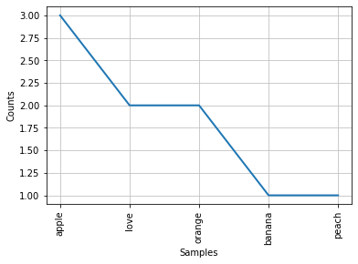
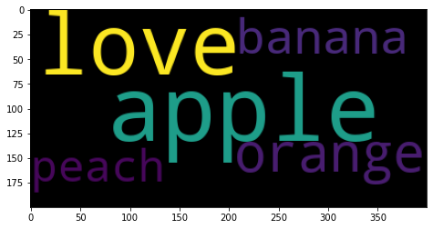
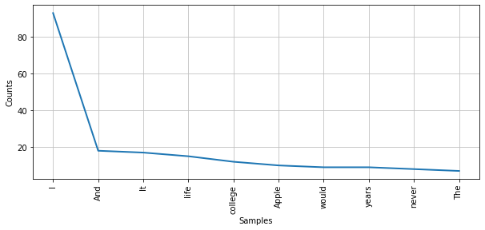
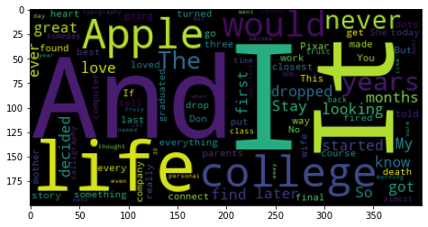
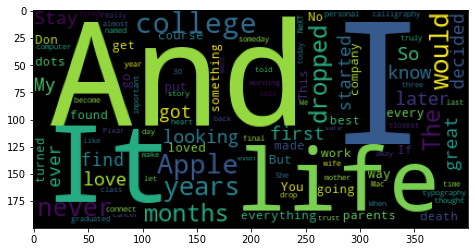
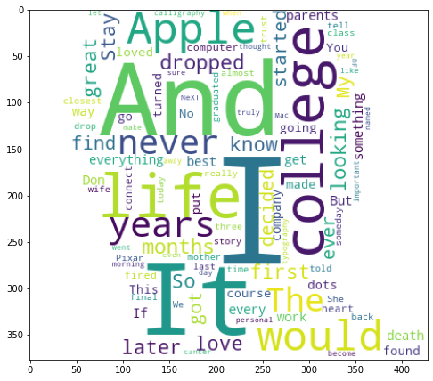

```python
import nltk

from nltk.corpus import brown
brown.words()

from nltk.corpus import stopwords
from nltk.tokenize import RegexpTokenizer
```


```python
data1 = ''' i love apple, apple, apple and orange, orange and banana.
        i don't love peach'''
data1
```


    " i love apple, apple, apple and orange, orange and banana.\n        i don't love peach"


```python
#토큰화 하기  = 단어별로 짤라내기 

#word_tokenize는 축약형 단어 제대로 분류할 수 없음  
data2 = nltk.word_tokenize(data1)
print(data2)

#WordPunctTokenizer는 축약형 단어 분류 가능 
from nltk.tokenize import WordPunctTokenizer
tokenizer = WordPunctTokenizer()
new_data2 = tokenizer.tokenize(data1)
print(new_data2)

#축약형 경우 원한다면 정규식 사용 
from nltk.tokenize.regexp import RegexpTokenizer
tokenizer = RegexpTokenizer('[\w]+')
new_data3 = tokenizer.tokenize(data1)
print(new_data3)
```

    ['i', 'love', 'apple', ',', 'apple', ',', 'apple', 'and', 'orange', ',', 'orange', 'and', 'banana', '.', 'i', 'do', "n't", 'love', 'peach']
    ['i', 'love', 'apple', ',', 'apple', ',', 'apple', 'and', 'orange', ',', 'orange', 'and', 'banana', '.', 'i', 'don', "'", 't', 'love', 'peach']
    ['i', 'love', 'apple', 'apple', 'apple', 'and', 'orange', 'orange', 'and', 'banana', 'i', 'don', 't', 'love', 'peach']
    


```python
# 불용어 제거 
data4 = [word  for word in new_data3
         if word not in stopwords.words()]
print(data4,end='')
```

    ['love', 'apple', 'apple', 'apple', 'orange', 'orange', 'banana', 'love', 'peach']


```python
#단어별 언급빈도 집계
from collections import Counter
data5 =Counter(data4)
print(data5,end='')
```

    Counter({'apple': 3, 'love': 2, 'orange': 2, 'banana': 1, 'peach': 1})


```python
data6 = data5.most_common(100)
print(data6,end='')
```

    [('apple', 3), ('love', 2), ('orange', 2), ('banana', 1), ('peach', 1)]


```python
data7 = dict(data6)
print(data7)
```

    {'apple': 3, 'love': 2, 'orange': 2, 'banana': 1, 'peach': 1}
    


```python
#집계된 단어 그래프 그리기 
g_data4 = nltk.Text(data4,name='다빈도 단어출력')
g_data4.plot(10)
```





```python
#워드 클라우드 그리기 
from wordcloud import WordCloud
import matplotlib.pyplot as plt

wordcloud = WordCloud(relative_scaling =0.2,
                     background_color='black').generate_from_frequencies(data7)

plt.figure(figsize=(10,4))
plt.imshow(wordcloud);
```





```python
data1 = open('steve.txt').read()

from nltk.tokenize import WordPunctTokenizer
tokenizer = WordPunctTokenizer()
new_data2 = tokenizer.tokenize(data1)
print(new_data2[:100])

#축약형 경우 원한다면 정규식 사용 
from nltk.tokenize.regexp import RegexpTokenizer
tokenizer = RegexpTokenizer('[\w]+')
new_data3 = tokenizer.tokenize(data1)
print(new_data3[:100])
```

    ["'", 'You', "'", 've', 'got', 'to', 'find', 'what', 'you', 'love', ",'", 'Jobs', 'says', 'This', 'is', 'the', 'text', 'of', 'the', 'Commencement', 'address', 'by', 'Steve', 'Jobs', ',', 'CEO', 'of', 'Apple', 'Computer', 'and', 'of', 'Pixar', 'Animation', 'Studios', ',', 'delivered', 'on', 'June', '12', ',', '2005', '.', 'I', 'am', 'honored', 'to', 'be', 'with', 'you', 'today', 'at', 'your', 'commencement', 'from', 'one', 'of', 'the', 'finest', 'universities', 'in', 'the', 'world', '.', 'I', 'never', 'graduated', 'from', 'college', '.', 'Truth', 'be', 'told', ',', 'this', 'is', 'the', 'closest', 'I', "'", 've', 'ever', 'gotten', 'to', 'a', 'college', 'graduation', '.', 'Today', 'I', 'want', 'to', 'tell', 'you', 'three', 'stories', 'from', 'my', 'life', '.', 'That']
    ['You', 've', 'got', 'to', 'find', 'what', 'you', 'love', 'Jobs', 'says', 'This', 'is', 'the', 'text', 'of', 'the', 'Commencement', 'address', 'by', 'Steve', 'Jobs', 'CEO', 'of', 'Apple', 'Computer', 'and', 'of', 'Pixar', 'Animation', 'Studios', 'delivered', 'on', 'June', '12', '2005', 'I', 'am', 'honored', 'to', 'be', 'with', 'you', 'today', 'at', 'your', 'commencement', 'from', 'one', 'of', 'the', 'finest', 'universities', 'in', 'the', 'world', 'I', 'never', 'graduated', 'from', 'college', 'Truth', 'be', 'told', 'this', 'is', 'the', 'closest', 'I', 've', 'ever', 'gotten', 'to', 'a', 'college', 'graduation', 'Today', 'I', 'want', 'to', 'tell', 'you', 'three', 'stories', 'from', 'my', 'life', 'That', 's', 'it', 'No', 'big', 'deal', 'Just', 'three', 'stories', 'The', 'first', 'story', 'is', 'about']
    


```python
# 불용어 제거 
data4 = [word  for word in new_data3
         if word not in stopwords.words()]
print(data4[:100],end='')
```

    ['You', 'got', 'find', 'love', 'Jobs', 'says', 'This', 'text', 'Commencement', 'address', 'Steve', 'Jobs', 'CEO', 'Apple', 'Computer', 'Pixar', 'Animation', 'Studios', 'delivered', 'June', '12', '2005', 'I', 'honored', 'today', 'commencement', 'finest', 'universities', 'world', 'I', 'never', 'graduated', 'college', 'Truth', 'told', 'closest', 'I', 'ever', 'gotten', 'college', 'graduation', 'Today', 'I', 'tell', 'three', 'stories', 'life', 'That', 'No', 'big', 'deal', 'Just', 'three', 'stories', 'The', 'first', 'story', 'connecting', 'dots', 'I', 'dropped', 'Reed', 'College', 'first', '6', 'months', 'stayed', 'around', 'drop', 'another', '18', 'months', 'I', 'really', 'quit', 'So', 'I', 'drop', 'It', 'started', 'I', 'born', 'My', 'biological', 'mother', 'young', 'unwed', 'college', 'graduate', 'student', 'decided', 'put', 'adoption', 'She', 'felt', 'strongly', 'I', 'adopted', 'college', 'graduates']


```python
#단어별 언급빈도 집계
from collections import Counter
data5 =Counter(data4)
data6 = data5.most_common(100)
data7 = dict(data6)
print(data7,end='')
```

    {'I': 93, 'And': 18, 'It': 17, 'life': 15, 'college': 12, 'Apple': 10, 'would': 9, 'years': 9, 'never': 8, 'The': 7, 'dropped': 7, 'months': 7, 'looking': 7, 'love': 6, 'first': 6, 'So': 6, 'later': 6, 'great': 6, 'know': 6, 'Stay': 6, 'got': 5, 'find': 5, 'ever': 5, 'started': 5, 'My': 5, 'decided': 5, 'everything': 5, 'parents': 5, 'But': 5, 'work': 5, 'best': 5, 'every': 5, 'get': 5, 'way': 5, 'If': 5, 'something': 5, 'company': 5, 'Don': 5, 'death': 5, 'You': 4, 'This': 4, 'No': 4, 'dots': 4, 'put': 4, 'course': 4, 'found': 4, 'go': 4, 'going': 4, 'made': 4, 'loved': 4, 'turned': 4, 'computer': 4, 'connect': 4, 'fired': 4, 'heart': 4, 'Pixar': 3, 'today': 3, 'graduated': 3, 'told': 3, 'closest': 3, 'tell': 3, 'three': 3, 'story': 3, 'drop': 3, 'really': 3, 'mother': 3, 'She': 3, 'wife': 3, 'last': 3, 'We': 3, 'final': 3, 'someday': 3, 'almost': 3, 'class': 3, 'trust': 3, 'time': 3, 'back': 3, 'calligraphy': 3, 'typography': 3, 'even': 3, 'Mac': 3, 'personal': 3, 'let': 3, 'year': 3, '30': 3, 'thought': 3, 'went': 3, 'When': 3, 'away': 3, 'sure': 3, 'named': 3, 'NeXT': 3, 'become': 3, 'truly': 3, 'like': 3, 'day': 3, 'morning': 3, 'important': 3, 'make': 3, 'cancer': 3}


```python
#집계된 단어를 그래프로 표시 
plt.figure(figsize=(10,4))
g_data4 = nltk.Text(data4,name='다빈도 단어출력')
g_data4.plot(10)
```





```python
#워드 클라우드 그리기 
from wordcloud import WordCloud
import matplotlib.pyplot as plt

wordcloud = WordCloud(relative_scaling =0.2,
                     background_color='black').generate_from_frequencies(data7)

plt.figure(figsize=(10,4))
plt.imshow(wordcloud);
```





```python
#추가 불용어 사전 사용
stop_words = open('eng_stop_word.txt').read()
new_data4 = [word for word in data4
             if word not in stop_words]

new_data4

new_data5 = []
for i in range(0,len(new_data4)):
    if (len(new_data4[i])>=2 | len(new_data4[i])<=10):
        new_data5.append(new_data4[i])
        
data5 =Counter(data4)
data6 = data5.most_common(100)
data7 = dict(data6)

wordcloud = WordCloud(relative_scaling =0.2,
                     background_color='black').generate_from_frequencies(data7)

plt.figure(figsize=(10,4))
plt.imshow(wordcloud);
```





```python
import numpy as np
from PIL import Image
from wordcloud import ImageColorGenerator

steve_mask = np.array(Image.open('steve.jpg'))
wc = WordCloud(relative_scaling =0.4,
               mask=steve_mask,
               background_color='white',
               min_font_size = 1,
               max_words=2000,).generate_from_frequencies(data7)

plt.figure(figsize=(8,8))
plt.imshow(wc);
```





```python
#집계된 단어를 그래프로 표시 
plt.figure(figsize=(10,4))
g_data4 = nltk.Text(data4,name='다빈도 단어출력')
g_data4.plot(10)
```


