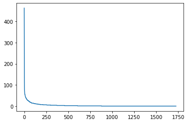
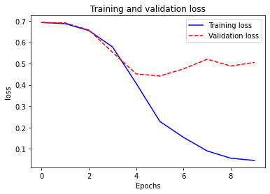
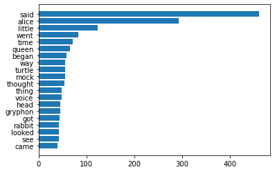
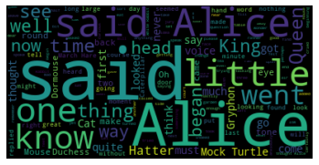
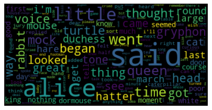
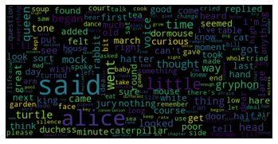
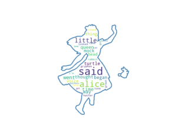
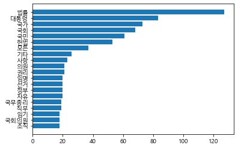
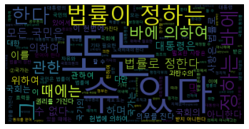
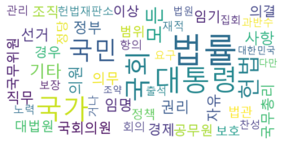

# 그래프와 워드클라우드

텍스트 분석에서 가장 많이 접하게 되는 것은 빈도를 바탕으로 한 그래프와 워드클라우드인데, 하나 혹은 여러 개의 문서에서 가장 많이 사용된 단어 파악하여 단어 빈도를 그래프로 표현한 것이 워드클라우드 

## 단어 빈도 그래프

gutenberg.open()을 이용하면 파일제목(fileid)로 해당 파일의 내용을 읽을 수 있다


```python
import nltk
nltk.download('gutenberg')

from nltk.corpus import gutenberg
file_names = gutenberg.fileids() #파일 제목을 읽어온다.
print(file_names)
```

    ['austen-emma.txt', 'austen-persuasion.txt', 'austen-sense.txt', 'bible-kjv.txt', 'blake-poems.txt', 'bryant-stories.txt', 'burgess-busterbrown.txt', 'carroll-alice.txt', 'chesterton-ball.txt', 'chesterton-brown.txt', 'chesterton-thursday.txt', 'edgeworth-parents.txt', 'melville-moby_dick.txt', 'milton-paradise.txt', 'shakespeare-caesar.txt', 'shakespeare-hamlet.txt', 'shakespeare-macbeth.txt', 'whitman-leaves.txt']
    

    [nltk_data] Downloading package gutenberg to
    [nltk_data]     C:\Users\juhee\AppData\Roaming\nltk_data...
    [nltk_data]   Package gutenberg is already up-to-date!
    


```python
doc_alice = gutenberg.open('carroll-alice.txt').read()
print('#Num of characters used:', len(doc_alice)) #사용된 문자의 수
print('#Text sample:')
print(doc_alice[:500]) #앞의 500자만 출력
```

    #Num of characters used: 144395
    #Text sample:
    [Alice's Adventures in Wonderland by Lewis Carroll 1865]
    
    CHAPTER I. Down the Rabbit-Hole
    
    Alice was beginning to get very tired of sitting by her sister on the
    bank, and of having nothing to do: once or twice she had peeped into the
    book her sister was reading, but it had no pictures or conversations in
    it, 'and what is the use of a book,' thought Alice 'without pictures or
    conversation?'
    
    So she was considering in her own mind (as well as she could, for the
    hot day made her feel very sleepy an
    


```python
from nltk.tokenize import word_tokenize

tokens_alice = word_tokenize(doc_alice) #토큰화 실행
print('#Num of tokens used:', len(tokens_alice))
print('#Token sample:')
print(tokens_alice[:20])
```

    #Num of tokens used: 33493
    #Token sample:
    ['[', 'Alice', "'s", 'Adventures', 'in', 'Wonderland', 'by', 'Lewis', 'Carroll', '1865', ']', 'CHAPTER', 'I', '.', 'Down', 'the', 'Rabbit-Hole', 'Alice', 'was', 'beginning']
    

포터스터머 이용하여 스테밍하기 


```python
from nltk.stem import PorterStemmer
stemmer = PorterStemmer()

stem_tokens_alice = [stemmer.stem(token) for token in tokens_alice] #모든 토큰에 대해 스테밍 실행
print('#Num of tokens after stemming:', len(stem_tokens_alice))
print('#Token sample:')
print(stem_tokens_alice[:20])
```

    #Num of tokens after stemming: 33493
    #Token sample:
    ['[', 'alic', "'s", 'adventur', 'in', 'wonderland', 'by', 'lewi', 'carrol', '1865', ']', 'chapter', 'I', '.', 'down', 'the', 'rabbit-hol', 'alic', 'wa', 'begin']
    

WordNetLemmatizer를 이용하여 표제어 추출


```python
from nltk.stem import WordNetLemmatizer
lemmatizer = WordNetLemmatizer()

lem_tokens_alice = [lemmatizer.lemmatize(token) for token in tokens_alice] #모든 토큰에 대해 스테밍 실행
print('#Num of tokens after lemmatization:', len(lem_tokens_alice))
print('#Token sample:')
print(lem_tokens_alice[:20])
```

    #Num of tokens after lemmatization: 33493
    #Token sample:
    ['[', 'Alice', "'s", 'Adventures', 'in', 'Wonderland', 'by', 'Lewis', 'Carroll', '1865', ']', 'CHAPTER', 'I', '.', 'Down', 'the', 'Rabbit-Hole', 'Alice', 'wa', 'beginning']
    

위의 둘 결과를 비교해 보았을 때, 어간추출이든 표제어추출이든 토큰의 수는 변하지 않음


```python
from nltk.tokenize import RegexpTokenizer
tokenizer = RegexpTokenizer("[\w']{3,}") 

reg_tokens_alice = tokenizer.tokenize(doc_alice.lower())
print('#Num of tokens with RegexpTokenizer:', len(reg_tokens_alice))
print('#Token sample:')
print(reg_tokens_alice[:20])
```

    #Num of tokens with RegexpTokenizer: 21616
    #Token sample:
    ["alice's", 'adventures', 'wonderland', 'lewis', 'carroll', '1865', 'chapter', 'down', 'the', 'rabbit', 'hole', 'alice', 'was', 'beginning', 'get', 'very', 'tired', 'sitting', 'her', 'sister']
    

WordTokenizer를 사용한 결과를 보면 '[',']'와 같은 부호 사라져서 토큰의 수 줄어든 것을 확인할 수 있음. 포함과 제외여부는 사용자의 몫. 

이번 실습에선 RegexpTokenizer의 결과로 수행  
  
불용어 제거하고 분석의 목적이 그래프 이용한 시각화임으로 단어 알아보기 쉽도록 스테밍 수행하지 않기로 함


```python
from nltk.corpus import stopwords #일반적으로 분석대상이 아닌 단어들
english_stops = set(stopwords.words('english')) #반복이 되지 않도록 set으로 변환

result_alice = [word for word in reg_tokens_alice if word not in english_stops] #stopwords를 제외한 단어들만으로 list를 생성

print('#Num of tokens after stopword elimination:', len(result_alice))
print('#Token sample:')
print(result_alice[:20])
```

    #Num of tokens after stopword elimination: 12999
    #Token sample:
    ["alice's", 'adventures', 'wonderland', 'lewis', 'carroll', '1865', 'chapter', 'rabbit', 'hole', 'alice', 'beginning', 'get', 'tired', 'sitting', 'sister', 'bank', 'nothing', 'twice', 'peeped', 'book']
    

텍스트 전처리 완료 후 단어별로 빈도 계산하기 


```python
alice_word_count = dict()
for word in result_alice:
    alice_word_count[word] = alice_word_count.get(word, 0) + 1

print('#Num of used words:', len(alice_word_count))

sorted_word_count = sorted(alice_word_count, key=alice_word_count.get, reverse=True)

print("#Top 20 high frequency words:")
for key in sorted_word_count[:20]: #빈도수 상위 20개의 단어를 출력
    print(f'{repr(key)}: {alice_word_count[key]}', end=', ')
```

    #Num of used words: 2687
    #Top 20 high frequency words:
    'said': 462, 'alice': 385, 'little': 128, 'one': 98, 'know': 88, 'like': 85, 'went': 83, 'would': 78, 'could': 77, 'thought': 74, 'time': 71, 'queen': 68, 'see': 67, 'king': 61, 'began': 58, 'turtle': 57, "'and": 56, 'way': 56, 'mock': 56, 'quite': 55, 

'would', 'could', 'and'와 같은 단어는 중요하지 않아보임으로 품사 태깅 이용해서 의미 있는 것으로 생각되는 명사, 형용사,동사만 추출하기


```python
my_tag_set = ['NN', 'VB', 'VBD', 'JJ'] #불러올 품사 설정
my_words = [word for word, tag in nltk.pos_tag(result_alice) if tag in my_tag_set]
#print(my_words)

alice_word_count = dict()
for word in my_words:
    alice_word_count[word] = alice_word_count.get(word, 0) + 1

print('#Num of used words:', len(alice_word_count))

sorted_word_count = sorted(alice_word_count, key=alice_word_count.get, reverse=True)

print("#Top 20 high frequency words:")
for key in sorted_word_count[:20]: #빈도수 상위 20개의 단어를 출력
    print(f'{repr(key)}: {alice_word_count[key]}', end=', ') 
```

    #Num of used words: 1726
    #Top 20 high frequency words:
    'said': 462, 'alice': 293, 'little': 124, 'went': 83, 'time': 71, 'queen': 66, 'began': 58, 'way': 56, 'turtle': 56, 'mock': 55, 'thought': 54, 'thing': 49, 'voice': 48, 'head': 46, 'gryphon': 45, 'got': 44, 'rabbit': 42, 'looked': 42, 'see': 42, 'came': 40, 

그래프 이용해 시각화하기 


```python
import matplotlib.pyplot as plt
%matplotlib inline

w = [alice_word_count[key] for key in sorted_word_count] #정렬된 단어 리스트에 대해 빈도수를 가져와서 리스트 생성
plt.plot(w)
plt.show()
```





확인해본 결과 어떤 단어가 많이 사용되었는지 확인할 수 없음.  
그래프의 모양은 빈도수에 따라 정렬된 단어의 순위와 빈도수가 극단적으로 반비례하는 것을 보여줌  --> 지프의 법칙   
이를 통해 주로 사용하는 단어만 쓰는 경향을 알 수 있음

### Tips: 지프의 법칙


```python
n = sorted_word_count[:20] #빈도수 상위 20개의 단어만 추출
w = [alice_word_count[key] for key in n] #추출된 단어에 대해 빈도를 추출

print(n) 
print(w)

# 같은 그래프 결과 나옴
# plt.bar(n,w,tick_label=n)
# plt.show()

plt.bar(range(len(n)),w,tick_label=n) #막대그래프를 그림
plt.show()
```

    ['said', 'alice', 'little', 'went', 'time', 'queen', 'began', 'way', 'turtle', 'mock', 'thought', 'thing', 'voice', 'head', 'gryphon', 'got', 'rabbit', 'looked', 'see', 'came']
    [462, 293, 124, 83, 71, 66, 58, 56, 56, 55, 54, 49, 48, 46, 45, 44, 42, 42, 42, 40]
    





일반 막대그래프로 그리면 단어가 겹쳐서 알아볼 수 없음.  
매개변수를 조정하여 막대 사이 벌릴 수 있으나, 수평 막대그래프 사용 권장 아래와 같이 사용


```python
n = sorted_word_count[:20][::-1] #빈도수 상위 20개의 단어를 추출하여 역순으로 정렬
w = [alice_word_count[key] for key in n]
plt.barh(range(len(n)),w,tick_label=n) #수평 막대그래프
plt.show()
```





## 2. 워드클라우드 

텍스트 분석 결과 보여주는 시각화 도구 중 가장 많이 사용되는 방법으로 빈도가 높은 단어는 크게, 낮은 단어는 작게 보여줌으로 한 눈에 전체적인 현황 파악 가능


```python
pip install wordcloud
```

    Requirement already satisfied: wordcloud in c:\users\juhee\anaconda3\lib\site-packages (1.8.1)
    Requirement already satisfied: numpy>=1.6.1 in c:\users\juhee\anaconda3\lib\site-packages (from wordcloud) (1.18.5)
    Requirement already satisfied: pillow in c:\users\juhee\anaconda3\lib\site-packages (from wordcloud) (7.2.0)
    Requirement already satisfied: matplotlib in c:\users\juhee\anaconda3\lib\site-packages (from wordcloud) (3.2.2)
    Note: you may need to restart the kernel to use updated packages.Requirement already satisfied: kiwisolver>=1.0.1 in c:\users\juhee\anaconda3\lib\site-packages (from matplotlib->wordcloud) (1.2.0)
    Requirement already satisfied: pyparsing!=2.0.4,!=2.1.2,!=2.1.6,>=2.0.1 in c:\users\juhee\anaconda3\lib\site-packages (from matplotlib->wordcloud) (2.4.7)
    Requirement already satisfied: cycler>=0.10 in c:\users\juhee\anaconda3\lib\site-packages (from matplotlib->wordcloud) (0.10.0)
    Requirement already satisfied: python-dateutil>=2.1 in c:\users\juhee\anaconda3\lib\site-packages (from matplotlib->wordcloud) (2.8.1)
    Requirement already satisfied: six in c:\users\juhee\anaconda3\lib\site-packages (from cycler>=0.10->matplotlib->wordcloud) (1.15.0)
    
    

### Tips: plt.imshow()

데이터를 이미지 형태로 출력 


```python
from wordcloud import WordCloud

# Generate a word cloud image
# 원본을 먼저 사용
wordcloud = WordCloud().generate(doc_alice)

plt.axis("off")
plt.imshow(wordcloud, interpolation='bilinear') #이미지를 출력
plt.show()
```





```python
#이미지 사이즈 출력
wordcloud.to_array().shape
```


    (200, 400, 3)


```python
#전처리한 결과를 가지고 이미지로
wordcloud = WordCloud(max_font_size=60).generate_from_frequencies(alice_word_count)
plt.figure()
plt.axis("off")
plt.imshow(wordcloud, interpolation="bilinear")
plt.show()
```





```python
# 넓이와 높이 새로 설정
wordcloud = WordCloud(max_font_size=60,width=600,height=300)
wordcloud.generate_from_frequencies(alice_word_count)
plt.figure()
plt.axis("off")
plt.imshow(wordcloud, interpolation="bilinear")
plt.show()
```





Q.두번째 그림 넓이와 높이 설정했는데 왜 우리가 보는 것은 다른 것이 없어보이는가?  
A. 두번째 그림이 첫번째 만든 그림보다 큰 것이 맞음. 텍스트 사이즈 같은 값으로 설정해서 같은 것이 맞지만, ``imshow``가 이미지를 줄여서 출력해줄 뿐


```python
import numpy as np
from PIL import Image

#객체 먼저 생성
alice_mask = np.array(Image.open("alice_mask.png")) # 배경이미지를 불러와서 numpy array로 변환
wc = WordCloud(background_color="white", # 배경색 지정
               max_words=30, # 출력할 최대 단어 수
               mask=alice_mask, # 배경으로 사용할 이미지
               contour_width=3,  # 테두리선의 크기
               contour_color='steelblue') # 테두리선의 색

#생성한 객체 불러서 실행
wc.generate_from_frequencies(alice_word_count) # 워드 클라우드 생성

wc.to_file("alice.png") # 결과를 이미지 파일로 저장

# 화면에 결과를 출력
plt.figure()
plt.axis("off")
plt.imshow(wc, interpolation='bilinear')
plt.show()
```





## 3. 한글문서에 대한 그래프와 워드클라우드 

 KoNLPy의 말뭉치(corpus)를 사용해서 불러오기 


```python
from konlpy.corpus import kolaw
const_doc = kolaw.open('constitution.txt').read()

print(type(const_doc)) #가져온 데이터의 type을 확인
print(len(const_doc))
print(const_doc[:600])
```

    <class 'str'>
    18884
    대한민국헌법
    
    유구한 역사와 전통에 빛나는 우리 대한국민은 3·1운동으로 건립된 대한민국임시정부의 법통과 불의에 항거한 4·19민주이념을 계승하고, 조국의 민주개혁과 평화적 통일의 사명에 입각하여 정의·인도와 동포애로써 민족의 단결을 공고히 하고, 모든 사회적 폐습과 불의를 타파하며, 자율과 조화를 바탕으로 자유민주적 기본질서를 더욱 확고히 하여 정치·경제·사회·문화의 모든 영역에 있어서 각인의 기회를 균등히 하고, 능력을 최고도로 발휘하게 하며, 자유와 권리에 따르는 책임과 의무를 완수하게 하여, 안으로는 국민생활의 균등한 향상을 기하고 밖으로는 항구적인 세계평화와 인류공영에 이바지함으로써 우리들과 우리들의 자손의 안전과 자유와 행복을 영원히 확보할 것을 다짐하면서 1948년 7월 12일에 제정되고 8차에 걸쳐 개정된 헌법을 이제 국회의 의결을 거쳐 국민투표에 의하여 개정한다.
    
           제1장 총강
      제1조 ① 대한민국은 민주공화국이다.
    ②대한민국의 주권은 국민에게 있고, 모든 권력은 국민으로부터 나온다.
      제2조 ① 대한민국의 국민이 되는 요건은 법률로 정한다.
    ②국가는 법률이 정하는 바에 의하여 재외국민을 보호할 의무를 진다.
      제3조 대한민
    

KoNLPy를 import해서 읽어온 헌법 텍스트에 대해 형태소 분석을 실시하고, 결과 살펴보기 


```python
from konlpy.tag import Okt
t = Okt() #트위터 사용 - 속도가 가장 빠름 
tokens_const = t.morphs(const_doc) #형태소 단위로 tokenize

print('#토큰의 수:', len(tokens_const))
print('#앞 100개의 토큰')
print(tokens_const[:100])
```

    #토큰의 수: 8796
    #앞 100개의 토큰
    ['대한민국', '헌법', '\n\n', '유구', '한', '역사', '와', '전통', '에', '빛나는', '우리', '대', '한', '국민', '은', '3', '·', '1', '운동', '으로', '건립', '된', '대한민국', '임시정부', '의', '법', '통과', '불의', '에', '항거', '한', '4', '·', '19', '민주', '이념', '을', '계승', '하고', ',', '조국', '의', '민주', '개혁', '과', '평화', '적', '통일', '의', '사명', '에', '입', '각하', '여', '정의', '·', '인도', '와', '동포', '애', '로써', '민족', '의', '단결', '을', '공고', '히', '하고', ',', '모든', '사회', '적', '폐습', '과', '불의', '를', '타파', '하며', ',', '자율', '과', '조화', '를', '바탕', '으로', '자유민주', '적', '기', '본', '질서', '를', '더욱', '확고히', '하여', '정치', '·', '경제', '·', '사회', '·']
    

'\n\n'을 비롯한 기호를 비롯해서 3, 1과 같은 숫자 그리고 '와', '에', '은' 등은 딱히 그 수를 세는 것은 의미가 없어보여 명사만 불러오도록 다시 실시


```python
tokens_const = t.nouns(const_doc) #형태소 단위로 tokenize 후 명사만 추출
print('#토큰의 수:', len(tokens_const))
print('#앞 100개의 토큰')
print(tokens_const[:100])
```

    #토큰의 수: 3882
    #앞 100개의 토큰
    ['대한민국', '헌법', '유구', '역사', '전통', '우리', '국민', '운동', '건립', '대한민국', '임시정부', '법', '통과', '불의', '항거', '민주', '이념', '계승', '조국', '민주', '개혁', '평화', '통일', '사명', '입', '각하', '정의', '인도', '동포', '애', '로써', '민족', '단결', '공고', '모든', '사회', '폐습', '불의', '타파', '자율', '조화', '바탕', '자유민주', '질서', '더욱', '정치', '경제', '사회', '문화', '모든', '영역', '각인', '기회', '능력', '최고', '도로', '발휘', '자유', '권리', '책임', '의무', '완수', '안', '국민', '생활', '향상', '기하', '밖', '항구', '세계', '평화', '인류', '공영', '이바지', '함', '우리', '우리', '자손', '안전', '자유', '행복', '확보', '것', '다짐', '제정', '차', '개정', '헌법', '이제', '국회', '의결', '국민투표', '개정', '제', '장', '강', '제', '대한민국', '민주공화국', '대한민국']
    

명사라고는 해도 '애', '것', '함', '제', '장'과 같은 1자로 된 명사는 의미 부여할 필요 없다 생각하고, 1자로 된 명사는 삭제하고 결과 다시 살펴보기


```python
tokens_const = [token for token in tokens_const if len(token) > 1]
print('#토큰의 수:', len(tokens_const))
print('#앞 100개의 토큰')
print(tokens_const[:100])
```

    #토큰의 수: 3013
    #앞 100개의 토큰
    ['대한민국', '헌법', '유구', '역사', '전통', '우리', '국민', '운동', '건립', '대한민국', '임시정부', '통과', '불의', '항거', '민주', '이념', '계승', '조국', '민주', '개혁', '평화', '통일', '사명', '각하', '정의', '인도', '동포', '로써', '민족', '단결', '공고', '모든', '사회', '폐습', '불의', '타파', '자율', '조화', '바탕', '자유민주', '질서', '더욱', '정치', '경제', '사회', '문화', '모든', '영역', '각인', '기회', '능력', '최고', '도로', '발휘', '자유', '권리', '책임', '의무', '완수', '국민', '생활', '향상', '기하', '항구', '세계', '평화', '인류', '공영', '이바지', '우리', '우리', '자손', '안전', '자유', '행복', '확보', '다짐', '제정', '개정', '헌법', '이제', '국회', '의결', '국민투표', '개정', '대한민국', '민주공화국', '대한민국', '주권', '국민', '모든', '권력', '국민', '대한민국', '국민', '요건', '법률', '국가', '법률', '재외국민']
    


```python
#한글 폰트 지정
from matplotlib import font_manager, rc
font_name = font_manager.FontProperties(fname="c:/Windows/Fonts/malgun.ttf").get_name()
rc('font', family=font_name)

#빈도수 세주기  
const_cnt = {}
for word in tokens_const:
    const_cnt[word] = const_cnt.get(word, 0) + 1

def word_graph(cnt, max_words=10):
    
    sorted_w = sorted(cnt.items(), key=lambda kv: kv[1]) 
    # cnt.items()은 (워드,빈도수)로 튜플로 생성
    print(sorted_w[-max_words:]) #역순으로 설정하는 새로운 방법
    n, w = zip(*sorted_w[-max_words:])

    #plt.barh(range(len(n)),w,tick_label=n)
    plt.barh(n,w,tick_label=n)
    #plt.savefig('bar.png')  # 필요한 경우, 그래프를 이미지 파일로 저장한다.
    plt.show()

word_graph(const_cnt, max_words=20)
```

    [('조직', 18), ('국회의원', 18), ('임기', 18), ('직무', 19), ('국무총리', 19), ('자유', 20), ('정부', 20), ('선거', 20), ('임명', 20), ('권리', 21), ('의원', 21), ('사항', 23), ('기타', 26), ('모든', 37), ('헌법', 53), ('국민', 61), ('국회', 68), ('국가', 73), ('대통령', 83), ('법률', 127)]
    





```python
font_path = 'c:/Windows/Fonts/malgun.ttf'
wordcloud = WordCloud(font_path = font_path).generate(const_doc)

plt.axis("off")
plt.imshow(wordcloud, interpolation='bilinear')
plt.show()
```





```python
wordcloud = WordCloud(
    font_path = font_path,
    max_font_size = 100,
    width = 800, #이미지 너비 지정
    height = 400, #이미지 높이 지정
    background_color='white', #이미지 배경색 지정
    max_words=50)

wordcloud.generate_from_frequencies(const_cnt) #원문이 아닌 형태소 분석 결과로부터 워드클라우드를 생성
wordcloud.to_file("const.png") #생성한 이미지를 파일로 저장

plt.axis("off")
plt.imshow(wordcloud, interpolation='bilinear')
plt.show()
```




